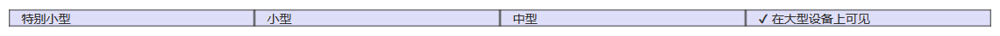

# Bootstrap 响应式实用工具

Bootstrap 提供了一些帮助器类，以便更快地实现对移动设备友好的开发。这些可以通过媒体查询结合大型、小型和中型设备，实现内容对设备的显示和隐藏。

需要谨慎使用这些工具，避免在同一个站点创建完全不同的版本。**响应式实用工具目前只适用于块和表切换。**

| Class | 设备 |
| --- | --- |
| .visible-xs | 额外的小设备（小于 768px）_可见_ |
| .visible-sm | 小型设备（768 px 起）_可见_ |
| .visible-md | 中型设备（768 px 到 991 px）_可见_ |
| .visible-lg | 大型设备（992 px 及以上）_可见_ |
| .hidden-xs | 额外的小设备（小于 768px）_隐藏_ |
| .hidden-sm | 小型设备（768 px 起）_隐藏_ |
| .hidden-md | 中型设备（768 px 到 991 px）_隐藏_ |
| .hidden-lg | 大型设备（992 px 及以上）_隐藏_ |

## 打印类

下表列出了打印类。使用这些切换打印内容。

| Class | 打印 |
| --- | --- |
| .visible-print | 可见，可打印 |
| .hidden-print | 只对浏览器可见，不可打印 |

## 实例

下面的实例演示了上面所列举的帮助器类的用法。调整浏览器的窗口大小，或者在不同的设备上加载实例，测试响应式实用工具类。

```
<!DOCTYPE html>
<html>
<head>
   <title>Bootstrap 实例 - 响应式实用工具</title>
   <link href="/bootstrap/css/bootstrap.min.css" rel="stylesheet">
   <script src="/scripts/jquery.min.js"></script>
   <script src="/bootstrap/js/bootstrap.min.js"></script>
</head>
<body>

<div class="container" style="padding: 40px;">
   <div class="row visible-on">
      <div class="col-xs-6 col-sm-3" style="background-color: #dedef8;
         box-shadow: inset 1px -1px 1px #444, inset -1px 1px 1px #444;">
         <span class="hidden-xs">特别小型</span>
         <span class="visible-xs">? 在特别小型设备上可见</span>
      </div>
      <div class="col-xs-6 col-sm-3" style="background-color: #dedef8;
         box-shadow: inset 1px -1px 1px #444, inset -1px 1px 1px #444;">
         <span class="hidden-sm">小型</span>
         <span class="visible-sm">? 在小型设备上可见</span>
      </div>
      <div class="clearfix visible-xs"></div>
      <div class="col-xs-6 col-sm-3" style="background-color: #dedef8;
         box-shadow: inset 1px -1px 1px #444, inset -1px 1px 1px #444;">
         <span class="hidden-md">中型</span>
         <span class="visible-md">? 在中型设备上可见</span>
      </div>
      <div class="col-xs-6 col-sm-3" style="background-color: #dedef8;
         box-shadow: inset 1px -1px 1px #444, inset -1px 1px 1px #444;">
         <span class="hidden-lg">大型</span>
         <span class="visible-lg">? 在大型设备上可见</span>
      </div>
</div>

</body>
</html>

```

[](/try/tryit.php?filename=bootstrap3-resonsive-utilies)

结果如下所示：



**勾号（?）** 表示元素在当前视口中可见。

