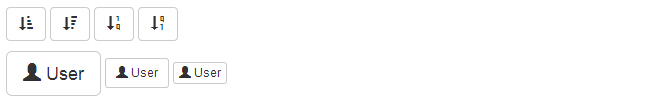
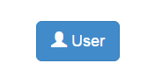
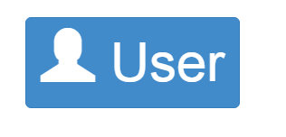
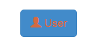
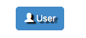

# Bootstrap 字形图标（Glyphicons）

本章将讲解字形图标（Glyphicons），并通过一些实例了解它的使用。Bootstrap 捆绑了 200 多种字体格式的自行。首先让我们先来理解一下什么是字形图标（Glyphicons）。

## 什么是字形图标（Glyphicons）？

字形图标（Glyphicons）是在 Web 项目中使用的图标字体。虽然，[Glyphicons Halflings](//glyphicons.com/) 需要商业许可，但是您可以通过基于项目的 Bootstrap 来免费使用这些图标。

为了表示对图标作者的感谢，希望您在使用时加上 GLYPHICONS 网站的链接。

## 获取字形图标（Glyphicons）

我们已经在 [环境安装](bootstrap-environment-setup.html) 章节下载了 Bootstrap 3.x 版本，并理解了它的目录结构。在 _fonts_ 文件夹内可以找到字形图标（Glyphicons），它包含了下列这些文件：

*   glyphicons-halflings-regular.eot
*   glyphicons-halflings-regular.svg
*   glyphicons-halflings-regular.ttf
*   glyphicons-halflings-regular.woff

相关的 CSS 规则写在 _dist_ 文件夹内的 css 文件夹内的 _bootstrap.css_ 和 _bootstrap-min.css_ 文件上。

### 字形图标（Glyphicons）列表

[点击这里，查看可用的字形图标（Glyphicons）列表。](/try/demo_source/bootstrap3-glyph-icons.htm)

## CSS 规则解释

下面的 CSS 规则构成 glyphicon class。

```
@font-face {
  font-family: 'Glyphicons Halflings';
  src: url('../fonts/glyphicons-halflings-regular.eot');
  src: url('../fonts/glyphicons-halflings-regular.eot?#iefix') format('embedded-opentype'), url('../fonts/glyphicons-halflings-regular.woff') format('woff'), url('../fonts/glyphicons-halflings-regular.ttf') format('truetype'), url('../fonts/glyphicons-halflings-regular.svg#glyphicons_halflingsregular') format('svg');
}

.glyphicon {
  position: relative;
  top: 1px;
  display: inline-block;
  font-family: 'Glyphicons Halflings';
  -webkit-font-smoothing: antialiased;
  font-style: normal;
  font-weight: normal;
  line-height: 1;
  -moz-osx-font-smoothing: grayscale;
}

```

所以 font-face 规则实际上是在找到 glyphicons 地方声明 font-family 和位置。

_.glyphicon_ class 声明一个从顶部偏移 1px 的相对位置，呈现为 inline-block，声明字体，规定 font-style 和 font-weight 为 normal，设置行高为 1。除此之外，使用 _-webkit-font-smoothing: antialiased_ 和 _-moz-osx-font-smoothing: grayscale;_ 获得跨浏览器的一致性。

然后，这里的

```
.glyphicon:empty {
  width: 1em;
}

```

是空的 glyphicon。

这里有 200 个 class，每个 class 针对一个图标。这些 class 的常见格式如下：

```
.glyphicon-keyword:before {
  content: "hexvalue";
}

```

比如，使用的 user 图标，它的 class 如下：

```
.glyphicon-user:before {
  content: "\e008";
}

```

## 用法

如需使用图标，只需要简单地使用下面的代码即可。请在图标和文本之间保留适当的空间。

```
<span class="glyphicon glyphicon-search"></span>

```

下面的实例演示了如何使用字形图标（Glyphicons）：

```
<!DOCTYPE html>
<html>
<head>
   <title>Bootstrap 实例 - 如何使用字形图标（Glyphicons）</title>
   <link href="/bootstrap/css/bootstrap.min.css" rel="stylesheet">
   <script src="/scripts/jquery.min.js"></script>
   <script src="/bootstrap/js/bootstrap.min.js"></script>
</head>
<body>

<p>
   <button type="button" class="btn btn-default">
      <span class="glyphicon glyphicon-sort-by-attributes"></span>
   </button>
   <button type="button" class="btn btn-default">
      <span class="glyphicon glyphicon-sort-by-attributes-alt"></span>
   </button>
   <button type="button" class="btn btn-default">
      <span class="glyphicon glyphicon-sort-by-order"></span>
   </button>
   <button type="button" class="btn btn-default">
      <span class="glyphicon glyphicon-sort-by-order-alt"></span>
   </button>
</p>
<button type="button" class="btn btn-default btn-lg">
  <span class="glyphicon glyphicon-user"></span> User
</button>
<button type="button" class="btn btn-default btn-sm">
  <span class="glyphicon glyphicon-user"></span> User
</button>
<button type="button" class="btn btn-default btn-xs">
  <span class="glyphicon glyphicon-user"></span> User
</button>

</body>
</html>

```

[](/try/tryit.php?filename=bootstrap3-glyphicons)

结果如下所示：



## 带有导航栏的字形图标（Glyphicons）

```
<!DOCTYPE html>
<html>
  <head>
    <title>导航栏的字形图标</title>
    <meta name="viewport" content="width=device-width, initial-scale=1.0">
    <!-- Bootstrap -->
    <link href="http://apps.bdimg.com/libs/bootstrap/3.2.0/css/bootstrap.min.css" rel="stylesheet">
    <style>
    body {
    padding-top: 50px;
    padding-left: 50px;
    }
    </style>
    <!--[if lt IE 9]>
      <script src="http://apps.bdimg.com/libs/html5shiv/3.7/html5shiv.min.js"></script>
    <![endif]-->
  </head>
  <body>
    <div class="navbar navbar-fixed-top navbar-inverse" role="navigation">
      <div class="container">
        <div class="navbar-header">
          <button type="button" class="navbar-toggle" data-toggle="collapse" data-target=".navbar-collapse">
            <span class="sr-only">Toggle navigation</span>
            <span class="icon-bar"></span>
            <span class="icon-bar"></span>
            <span class="icon-bar"></span>
          </button>
          <a class="navbar-brand" href="#">Project name</a>
        </div>
        <div class="collapse navbar-collapse">
          <ul class="nav navbar-nav">
            <li class="active"><a href="#"><span class="glyphicon glyphicon-home">Home</span></a></li>
            <li><a href="#shop"><span class="glyphicon glyphicon-shopping-cart">Shop</span></a></li>
            <li><a href="#support"><span class="glyphicon glyphicon-headphones">Support</span></a></li>
          </ul>
        </div><!-- /.nav-collapse -->
      </div><!-- /.container -->
    </div>
    <!-- jQuery (Bootstrap 插件需要引入) -->
    <script src="http://apps.bdimg.com/libs/jquery/2.1.1/jquery.min.js"></script>
    <!-- 包含了所有编译插件 -->
    <script src="http://apps.bdimg.com/libs/bootstrap/3.2.0/js/bootstrap.min.js"></script>
  </body>
</html>		

```

[](/try/tryit.php?filename=bootstrap-using-glyphicons-navbar)

## 定制字形图标（Glyphicons）

我们已经看到如何使用字形图标（Glyphicons），接下来我们看看如何定制字形图标（Glyphicons）。

我们将以上面的实例开始，并通过改变字体尺寸、颜色和应用文本阴影来进行定制图标。

下面是开始的代码：

```
<button type="button" class="btn btn-primary btn-lg">
  <span class="glyphicon glyphicon-user"></span> User
</button>

```

效果如下所示：



### 定制字体尺寸

通过增加或减少图标的字体尺寸，您可以让图标看起来更大或更小。

```
<button type="button" class="btn btn-primary btn-lg" style="font-size: 60px">
  <span class="glyphicon glyphicon-user"></span> User
</button>

```



### 定制字体颜色

```
<button type="button" class="btn btn-primary btn-lg" style="color: rgb(212, 106, 64);">
  <span class="glyphicon glyphicon-user"></span> User
</button>

```



### 应用文本阴影

```
<button type="button" class="btn btn-primary btn-lg" style="text-shadow: black 5px 3px 3px;">
  <span class="glyphicon glyphicon-user"></span> User
</button>

```



### 在线定制字形图标（Glyphicons）

[点击这里，在线定制字形图标（Glyphicons）。](/try/demo_source/bootstrap-glyph-customization.htm)

