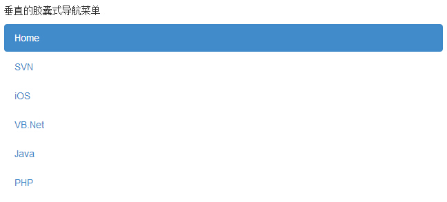
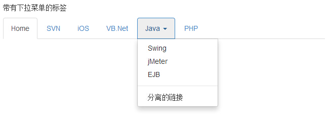
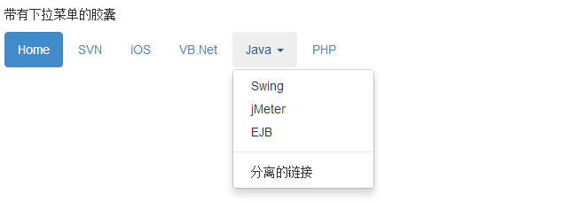

# Bootstrap 导航元素

本章我们将讲解 Bootstrap 提供的用于定义导航元素的一些选项。它们使用相同的标记和基类 **.nav**。Bootstrap 也提供了一个用于共享标记和状态的帮助器类。改变修饰的 class，可以在不同的样式间进行切换。

## 表格导航或标签

创建一个标签式的导航菜单：

*   以一个带有 class **.nav** 的无序列表开始。
*   添加 class **.nav-tabs**。

下面的实例演示了这点：

```
<!DOCTYPE html>
<html>
<head>
   <title>Bootstrap 实例 - 标签式的导航菜单</title>
   <link href="/bootstrap/css/bootstrap.min.css" rel="stylesheet">
   <script src="/scripts/jquery.min.js"></script>
   <script src="/bootstrap/js/bootstrap.min.js"></script>
</head>
<body>

<p>标签式的导航菜单</p>
<ul class="nav nav-tabs">
   <li class="active"><a href="#">Home</a></li>
   <li><a href="#">SVN</a></li>
   <li><a href="#">iOS</a></li>
   <li><a href="#">VB.Net</a></li>
   <li><a href="#">Java</a></li>
   <li><a href="#">PHP</a></li>
</ul>

</body>
</html>

```

[](/try/tryit.php?filename=bootstrap3-navigation-tabs)

结果如下所示：


## 胶囊式的导航菜单

### 基本的胶囊式导航菜单

如果需要把标签改成胶囊的样式，只需要使用 class **.nav-pills** 代替 **.nav-tabs** 即可，其他的步骤与上面相同。

下面的实例演示了这点：

```
<!DOCTYPE html>
<html>
<head>
   <title>Bootstrap 实例 - 基本的胶囊式导航菜单</title>
   <link href="/bootstrap/css/bootstrap.min.css" rel="stylesheet">
   <script src="/scripts/jquery.min.js"></script>
   <script src="/bootstrap/js/bootstrap.min.js"></script>
</head>
<body>

<p>基本的胶囊式导航菜单</p>
<ul class="nav nav-pills">
   <li class="active"><a href="#">Home</a></li>
   <li><a href="#">SVN</a></li>
   <li><a href="#">iOS</a></li>
   <li><a href="#">VB.Net</a></li>
   <li><a href="#">Java</a></li>
   <li><a href="#">PHP</a></li>
</ul>

</body>
</html>

```

[](/try/tryit.php?filename=bootstrap3-navigation-basicpills)

结果如下所示：


### 垂直的胶囊式导航菜单

您可以在使用 class **.nav、.nav-pills** 的同时使用 class **.nav-stacked**，让胶囊垂直堆叠。

下面的实例演示了这点：

```
<!DOCTYPE html>
<html>
<head>
   <title>Bootstrap 实例 - 垂直的胶囊式导航菜单</title>
   <link href="/bootstrap/css/bootstrap.min.css" rel="stylesheet">
   <script src="/scripts/jquery.min.js"></script>
   <script src="/bootstrap/js/bootstrap.min.js"></script>
</head>
<body>

<p>垂直的胶囊式导航菜单</p>
<ul class="nav nav-pills nav-stacked">
   <li class="active"><a href="#">Home</a></li>
   <li><a href="#">SVN</a></li>
   <li><a href="#">iOS</a></li>
   <li><a href="#">VB.Net</a></li>
   <li><a href="#">Java</a></li>
   <li><a href="#">PHP</a></li>
</ul>

</body>
</html>

```

[](/try/tryit.php?filename=bootstrap3-navigation-verticalpills)

结果如下所示：



## 两端对齐的导航

您可以在屏幕宽度大于 768px 时，通过在分别使用 **.nav、.nav-tabs** 或 **.nav、.nav-pills** 的同时使用 class **.nav-justified**，让标签式或胶囊式导航菜单与父元素等宽。在更小的屏幕上，导航链接会堆叠。

下面的实例演示了这点：

```
<!DOCTYPE html>
<html>
<head>
   <title>Bootstrap 实例 - 两端对齐的导航元素</title>
   <link href="/bootstrap/css/bootstrap.min.css" rel="stylesheet">
   <script src="/scripts/jquery.min.js"></script>
   <script src="/bootstrap/js/bootstrap.min.js"></script>
</head>
<body>

<p>两端对齐的导航元素</p>
<ul class="nav nav-pills nav-justified">
   <li class="active"><a href="#">Home</a></li>
   <li><a href="#">SVN</a></li>
   <li><a href="#">iOS</a></li>
   <li><a href="#">VB.Net</a></li>
   <li><a href="#">Java</a></li>
   <li><a href="#">PHP</a></li>
</ul><br><br><br>

<ul class="nav nav-tabs nav-justified">
   <li class="active"><a href="#">Home</a></li>
   <li><a href="#">SVN</a></li>
   <li><a href="#">iOS</a></li>
   <li><a href="#">VB.Net</a></li>
   <li><a href="#">Java</a></li>
   <li><a href="#">PHP</a></li>
</ul>

</body>
</html>

```

[](/try/tryit.php?filename=bootstrap3-navigation-justifiednav)

结果如下所示：


## 禁用链接

对每个 **.nav** class，如果添加了 **.disabled** class，则会创建一个灰色的链接，同时禁用了该链接的 **:hover** 状态，如下面的实例所示：

```
<!DOCTYPE html>
<html>
<head>
   <title>Bootstrap 实例 - 导航元素中的禁用链接</title>
   <link href="/bootstrap/css/bootstrap.min.css" rel="stylesheet">
   <script src="/scripts/jquery.min.js"></script>
   <script src="/bootstrap/js/bootstrap.min.js"></script>
</head>
<body>

<p>导航元素中的禁用链接</p>
<ul class="nav nav-pills">
   <li class="active"><a href="#">Home</a></li>
   <li><a href="#">SVN</a></li>
   <li class="disabled"><a href="#">iOS（禁用链接）</a></li>
   <li><a href="#">VB.Net</a></li>
   <li><a href="#">Java</a></li>
   <li><a href="#">PHP</a></li>
</ul><br><br>

<ul class="nav nav-tabs">
   <li class="active"><a href="#">Home</a></li>
   <li><a href="#">SVN</a></li>
   <li><a href="#">iOS</a></li>
   <li  class="disabled"><a href="#">VB.Net（禁用链接）</a></li>
   <li><a href="#">Java</a></li>
   <li><a href="#">PHP</a></li>
</ul>

</body>
</html>

```

[](/try/tryit.php?filename=bootstrap3-navigation-disabledlinksnav)

结果如下所示：


> 该 class 只会改变 &lt;a&gt; 的外观，不会改变它的功能。在这里，您需要使用自定义的 JavaScript 来禁用链接。

## 下拉菜单

导航菜单与下拉菜单使用相似的语法。默认情况下，列表项的锚与一些数据属性协同合作来触发带有 **.dropdown-menu** class 的无序列表。

### 带有下拉菜单的标签

向标签添加下拉菜单的步骤如下：

*   以一个带有 class **.nav** 的无序列表开始。
*   添加 class **.nav-tabs**。
*   添加带有 **.dropdown-menu** class 的无序列表。

```
<!DOCTYPE html>
<html>
<head>
   <title>Bootstrap 实例 - 带有下拉菜单的标签</title>
   <link href="/bootstrap/css/bootstrap.min.css" rel="stylesheet">
   <script src="/scripts/jquery.min.js"></script>
   <script src="/bootstrap/js/bootstrap.min.js"></script>
</head>
<body>

<p>带有下拉菜单的标签</p>
<ul class="nav nav-tabs">
   <li class="active"><a href="#">Home</a></li>
   <li><a href="#">SVN</a></li>
   <li><a href="#">iOS</a></li>
   <li><a href="#">VB.Net</a></li>
   <li class="dropdown">
      <a class="dropdown-toggle" data-toggle="dropdown" href="#">
         Java <span class="caret"></span>
      </a>
      <ul class="dropdown-menu">
         <li><a href="#">Swing</a></li>
         <li><a href="#">jMeter</a></li>
         <li><a href="#">EJB</a></li>
         <li class="divider"></li>
         <li><a href="#">分离的链接</a></li>
      </ul>
   </li>
   <li><a href="#">PHP</a></li>
</ul>

</body>
</html>

```

[](/try/tryit.php?filename=bootstrap3-navigation-tabsdropdown)

结果如下所示：



### 带有下拉菜单的胶囊

步骤与创建带有下拉菜单的标签相同，只是需要把 **.nav-tabs** class 改为 **.nav-pills**，如下面的实例所示：

```
<!DOCTYPE html>
<html>
<head>
   <title>Bootstrap 实例 - 带有下拉菜单的胶囊</title>
   <link href="/bootstrap/css/bootstrap.min.css" rel="stylesheet">
   <script src="/scripts/jquery.min.js"></script>
   <script src="/bootstrap/js/bootstrap.min.js"></script>
</head>
<body>

<p>带有下拉菜单的胶囊</p>
<ul class="nav nav-pills">
   <li class="active"><a href="#">Home</a></li>
   <li><a href="#">SVN</a></li>
   <li><a href="#">iOS</a></li>
   <li><a href="#">VB.Net</a></li>
   <li class="dropdown">
      <a class="dropdown-toggle" data-toggle="dropdown" href="#">
         Java <span class="caret"></span>
      </a>
      <ul class="dropdown-menu">
         <li><a href="#">Swing</a></li>
         <li><a href="#">jMeter</a></li>
         <li><a href="#">EJB</a></li>
         <li class="divider"></li>
         <li><a href="#">分离的链接</a></li>
      </ul>
   </li>
   <li><a href="#">PHP</a></li>
</ul>

</body>
</html>

```

[](/try/tryit.php?filename=bootstrap3-navigation-pillsdropdown)

结果如下所示：


