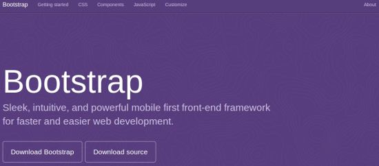

# Bootstrap 环境安装

Bootstrap 安装是非常容易的。本章将讲解如何下载并安装 Bootstrap，讨论 Bootstrap 文件结构，并通过一个实例演示它的用法。

## 下载 Bootstrap

您可以从 [http://getbootstrap.com/](//getbootstrap.com/) 上下载 Bootstrap 的最新版本。当您点击这个链接时，您将看到如下所示的网页：



您会看到两个按钮：

*   _Download Bootstrap_：下载 Bootstrap。点击该按钮，您可以下载 Bootstrap CSS、JavaScript 和字体的预编译的压缩版本。不包含文档和最初的源代码文件。
*   _Download Source_：下载源代码。点击该按钮，您可以直接从 from 上得到最新的 Bootstrap LESS 和 JavaScript 源代码。

如果您使用的是未编译的源代码，您需要编译 LESS 文件来生成可重用的 CSS 文件。对于编译 LESS 文件，Bootstrap 官方只支持 [Recess](//twitter.github.io/recess/)，这是 Twitter 的基于 [less.js](//lesscss.org/) 的 CSS 提示。

为了更好的了解和更方便的使用，我们将在本教程中使用 Bootstrap 的预编译版本。

由于文件是被编译过和压缩过的，在独立的功能开发中，您不必每次都包含这些独立的文件。

本教程编写时，使用的是最新版（Bootstrap 3）。

## 文件结构

### 预编译的 Bootstrap

当您下载了 Bootstrap 的已编译的版本，解压缩 ZIP 文件，您将看到下面的文件/目录结构：


如上图所示，可以看到已编译的 CSS 和 JS（bootstrap.*），以及已编译压缩的 CSS 和 JS（bootstrap.min.*）。同时也包含了 Glyphicons 的字体，这是一个可选的 Bootstrap 主题。

### Bootstrap 源代码

如果您下载了 Bootstrap 源代码，那么文件结构将如下所示：


*   _less/_、_js/_ 和 _fonts/_ 下的文件分别是 Bootstrap CSS、JS 和图标字体的源代码。
*   _dist/_ 文件夹包含了上面预编译下载部分中所列的文件和文件夹。
*   _docs-assets/_、_examples/_ 和所有的 _*.html_ 文件是 Bootstrap 文档。

## HTML 模板

一个使用了 Bootstrap 的基本的 HTML 模板如下所示：

```
<!DOCTYPE html>
<html>
   <head>
      <title>Bootstrap 模板</title>
      <meta name="viewport" content="width=device-width, initial-scale=1.0">
      <!-- 引入 Bootstrap -->
      <link href="css/bootstrap.min.css" rel="stylesheet">

      <!-- HTML5 Shim 和 Respond.js 用于让 IE8 支持 HTML5元素和媒体查询 -->
      <!-- 注意： 如果通过 file://  引入 Respond.js 文件，则该文件无法起效果 -->
      <!--[if lt IE 9]>
         <script src="https://oss.maxcdn.com/libs/html5shiv/3.7.0/html5shiv.js"></script>
         <script src="https://oss.maxcdn.com/libs/respond.js/1.3.0/respond.min.js"></script>
      <![endif]-->
   </head>
   <body>
      <h1>Hello, world!</h1>

      <!-- jQuery (Bootstrap 的 JavaScript 插件需要引入 jQuery) -->
      <script src="https://code.jquery.com/jquery.js"></script>
      <!-- 包括所有已编译的插件 -->
      <script src="js/bootstrap.min.js"></script>
   </body>
</html>

```

在这里，您可以看到包含了 **jquery.js**、**bootstrap.min.js** 和 **bootstrap.min.css** 文件，用于让一个常规的 HTML 文件变为使用了 Bootstrap 的模板。

有关上面代码段中每个元素的细节将在 [Bootstrap CSS 概览](bootstrap-css-overview.html) 章节详细讲解。

## 实例

现在让我们尝试使用使用Bootstrap输出"Hello, world!"：

```
<!DOCTYPE html>
<html>
<head>
   <title>在线尝试 Bootstrap 实例</title>
   <link href="/bootstrap/css/bootstrap.min.css" rel="stylesheet">
   <script src="/scripts/jquery.min.js"></script>
   <script src="/bootstrap/js/bootstrap.min.js"></script>
</head>
<body>

      <h1>Hello, world!</h1>

</body>
</html>

```

[](/try/tryit.php?filename=bootstrap3-environment-setup)

## Bootstrap CDN推荐

本站实例采用的是百度的静态资源库([http://cdn.code.baidu.com/](//cdn.code.baidu.com/))上的Bootstrap资源。

百度的静态资源库的 CDN 服务，访问速度更快、加速效果更明显、没有速度和带宽限制、永久免费,引入代码如下：

```
<!-- 新 Bootstrap 核心 CSS 文件 -->
<link href="http://apps.bdimg.com/libs/bootstrap/3.0.3/css/bootstrap.min.css" rel="stylesheet">

<!-- 可选的Bootstrap主题文件（一般不使用） -->
<script src="http://apps.bdimg.com/libs/bootstrap/3.0.3/css/bootstrap-theme.min.css"></script>

<!-- jQuery文件。务必在bootstrap.min.js 之前引入 -->
<script src="http://apps.bdimg.com/libs/jquery/2.0.0/jquery.min.js"></script>

<!-- 最新的 Bootstrap 核心 JavaScript 文件 -->
<script src="http://apps.bdimg.com/libs/bootstrap/3.0.3/js/bootstrap.min.js"></script>

```

