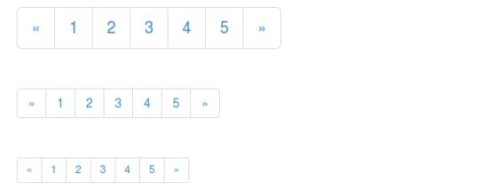

# Bootstrap 分页

本章将讲解 Bootstrap 支持的分页特性。分页（Pagination），是一种无序列表，Bootstrap 像处理其他界面元素一样处理分页。

## 分页（Pagination）

下表列出了 Bootstrap 提供的处理分页的 class。

### .pagination 

添加该 class 来在页面上显示分页。

```
&lt;ul class="pagination"&gt;
  &lt;li&gt;&lt;a href="#"&gt;&laquo;&lt;/a&gt;&lt;/li&gt;
  &lt;li&gt;&lt;a href="#"&gt;1&lt;/a&gt;&lt;/li&gt;
  .......
&lt;/ul&gt;

```

### .disabled, .active 

您可以自定义链接，通过使用 **.disabled** 来定义不可点击的链接，通过使用 **.active** 来指示当前的页面。 

```
&lt;ul class="pagination"&gt;
  &lt;li class="disabled"&gt;&lt;a href="#"&gt;&laquo;&lt;/a&gt;&lt;/li&gt;
  &lt;li class="active"&gt;&lt;a href="#"&gt;1&lt;span class="sr-only"&gt;(current)&lt;/span&gt;&lt;/a&gt;&lt;/li&gt;
  .......
&lt;/ul&gt;

```

### .pagination-lg, .pagination-sm

 使用这些 class 来获取不同大小的项。 

```
&lt;ul class="pagination pagination-lg"&gt;...&lt;/ul&gt;
&lt;ul class="pagination"&gt;...&lt;/ul&gt;
&lt;ul class="pagination pagination-sm"&gt;...&lt;/ul&gt;

```


### 默认的分页

下面的实例演示了上表中所讨论的 class **.pagination** 的用法：

```
<!DOCTYPE html>
<html>
<head>
   <title>Bootstrap 实例 - 默认的分页</title>
   <link href="/bootstrap/css/bootstrap.min.css" rel="stylesheet">
   <script src="/scripts/jquery.min.js"></script>
   <script src="/bootstrap/js/bootstrap.min.js"></script>
</head>
<body>

<ul class="pagination">
  <li><a href="#">&laquo;</a></li>
  <li><a href="#">1</a></li>
  <li><a href="#">2</a></li>
  <li><a href="#">3</a></li>
  <li><a href="#">4</a></li>
  <li><a href="#">5</a></li>
  <li><a href="#">&raquo;</a></li>
</ul>

</body>
</html>

```

[](/try/tryit.php?filename=bootstrap3-pagination)

结果如下所示：


### 分页的状态

下面的实例演示了上表中所讨论的 class **.disabled、.active** 的用法：

```
<!DOCTYPE html>
<html>
<head>
   <title>Bootstrap 实例 - 分页的状态</title>
   <link href="/bootstrap/css/bootstrap.min.css" rel="stylesheet">
   <script src="/scripts/jquery.min.js"></script>
   <script src="/bootstrap/js/bootstrap.min.js"></script>
</head>
<body>

<ul class="pagination">
  <li><a href="#">&laquo;</a></li>
  <li class="active"><a href="#">1</a></li>
  <li class="disabled"><a href="#">2</a></li>
  <li><a href="#">3</a></li>
  <li><a href="#">4</a></li>
  <li><a href="#">5</a></li>
  <li><a href="#">&raquo;</a></li>
</ul>

</body>
</html>

```

[](/try/tryit.php?filename=bootstrap3-pagination-state)

结果如下所示：


### 分页的大小

下面的实例演示了上表中所讨论的 class **.pagination-*** 的用法：

```
<!DOCTYPE html>
<html>
<head>
   <title>Bootstrap 实例 - 分页的大小</title>
   <link href="/bootstrap/css/bootstrap.min.css" rel="stylesheet">
   <script src="/scripts/jquery.min.js"></script>
   <script src="/bootstrap/js/bootstrap.min.js"></script>
</head>
<body>

<ul class="pagination pagination-lg">
  <li><a href="#">&laquo;</a></li>
  <li><a href="#">1</a></li>
  <li><a href="#">2</a></li>
  <li><a href="#">3</a></li>
  <li><a href="#">4</a></li>
  <li><a href="#">5</a></li>
  <li><a href="#">&raquo;</a></li>
</ul><br>
<ul class="pagination">
  <li><a href="#">&laquo;</a></li>
  <li><a href="#">1</a></li>
  <li><a href="#">2</a></li>
  <li><a href="#">3</a></li>
  <li><a href="#">4</a></li>
  <li><a href="#">5</a></li>
  <li><a href="#">&raquo;</a></li>
</ul><br>
<ul class="pagination pagination-sm">
 <li><a href="#">&laquo;</a></li>
  <li><a href="#">1</a></li>
  <li><a href="#">2</a></li>
  <li><a href="#">3</a></li>
  <li><a href="#">4</a></li>
  <li><a href="#">5</a></li>
  <li><a href="#">&raquo;</a></li>
</ul>

</body>
</html>

```

[](/try/tryit.php?filename=bootstrap3-pagination-size)

结果如下所示：



## 翻页（Pager）

如果您想要创建一个简单的分页链接为用户提供导航，可通过翻页来实现。与分页链接一样，翻页也是无序列表。默认情况下，链接是居中显示。下表列出了 Bootstrap 处理翻页的 class。

### .pager 

 添加该 class 来获得翻页链接。

```
&lt;ul class="pager"&gt;
  &lt;li&gt;&lt;a href="#"&gt;Previous&lt;/a&gt;&lt;/li&gt;
  &lt;li&gt;&lt;a href="#"&gt;Next&lt;/a&gt;&lt;/li&gt;
&lt;/ul&gt;

```

### .previous, .next 

使用 class **.previous** 把链接向左对齐，使用 **.next** 把链接向右对齐。 

```
&lt;ul class="pager"&gt;
  &lt;li class="previous"&gt;&lt;a href="#"&gt;&larr; Older&lt;/a&gt;&lt;/li&gt;
  &lt;li class="next"&gt;&lt;a href="#"&gt;Newer &rarr;&lt;/a&gt;&lt;/li&gt;
&lt;/ul&gt;

```

### .disabled 

添加该 class 来获得一个颜色变淡的外观。

```
&lt;ul class="pager"&gt;
  &lt;li class="previous disabled"&gt;&lt;a href="#"&gt;&larr; Older&lt;/a&gt;&lt;/li&gt;
  &lt;li class="next"&gt;&lt;a href="#"&gt;Newer &rarr;&lt;/a&gt;&lt;/li&gt;
&lt;/ul&gt;

```


### 默认的翻页

下面的实例演示了上表中所讨论的 class **.pager** 的用法：

```
<!DOCTYPE html>
<html>
<head>
   <title>Bootstrap 实例 - 默认的翻页</title>
   <link href="/bootstrap/css/bootstrap.min.css" rel="stylesheet">
   <script src="/scripts/jquery.min.js"></script>
   <script src="/bootstrap/js/bootstrap.min.js"></script>
</head>
<body>

<ul class="pager">
  <li><a href="#">Previous</a></li>
  <li><a href="#">Next</a></li>
</ul>

</body>
</html>

```

[](/try/tryit.php?filename=bootstrap3-pager)

结果如下所示：


### 对齐的链接

下面的实例演示了上表中所讨论的 class **.previous、.next** 的用法：

```
<!DOCTYPE html>
<html>
<head>
   <title>Bootstrap 实例 - 翻页中对齐的链接</title>
   <link href="/bootstrap/css/bootstrap.min.css" rel="stylesheet">
   <script src="/scripts/jquery.min.js"></script>
   <script src="/bootstrap/js/bootstrap.min.js"></script>
</head>
<body>

<ul class="pager">
  <li class="previous"><a href="#">&larr; Older</a></li>
  <li class="next"><a href="#">Newer &rarr;</a></li>
</ul>

</body>
</html>

```

[](/try/tryit.php?filename=bootstrap3-pager-align)

结果如下所示：


### 翻页的状态

下面的实例演示了上表中所讨论的 class **.disabled** 的用法：

```
<!DOCTYPE html>
<html>
<head>
   <title>Bootstrap 实例 - 翻页的状态</title>
   <link href="/bootstrap/css/bootstrap.min.css" rel="stylesheet">
   <script src="/scripts/jquery.min.js"></script>
   <script src="/bootstrap/js/bootstrap.min.js"></script>
</head>
<body>

<ul class="pager">
  <li class="previous disabled"><a href="#">&larr; Older</a></li>
  <li class="next"><a href="#">Newer &rarr;</a></li>
</ul>

</body>
</html>

```

[](/try/tryit.php?filename=bootstrap3-pager-state)

结果如下所示：

