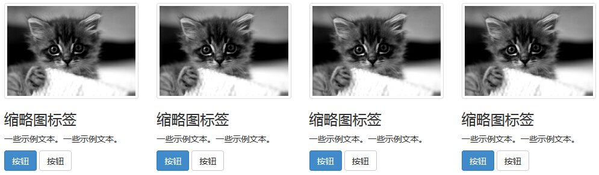

# Bootstrap 缩略图

本章将讲解 Bootstrap 缩略图。大多数站点都需要在网格中布局图像、视频、文本等。Bootstrap 通过缩略图为此提供了一种简便的方式。使用 Bootstrap 创建缩略图的步骤如下：

*   在图像周围添加带有 class **.thumbnail** 的 &lt;a&gt; 标签。
*   这会添加四个像素的内边距（padding）和一个灰色的边框。
*   当鼠标悬停在图像上时，会动画显示出图像的轮廓。

下面的实例演示了默认的缩略图：

```
<!DOCTYPE html>
<html>
<head>
   <title>Bootstrap 实例 - 缩略图</title>
   <link href="/bootstrap/css/bootstrap.min.css" rel="stylesheet">
   <script src="/scripts/jquery.min.js"></script>
   <script src="/bootstrap/js/bootstrap.min.js"></script>
</head>
<body>

<div class="row">
   <div class="col-sm-6 col-md-3">
      <a href="#" class="thumbnail">
         
      </a>
   </div>
   <div class="col-sm-6 col-md-3">
      <a href="#" class="thumbnail">
         
      </a>
   </div>
   <div class="col-sm-6 col-md-3">
      <a href="#" class="thumbnail">
         
      </a>
   </div>
   <div class="col-sm-6 col-md-3">
      <a href="#" class="thumbnail">
         
      </a>
   </div>
</div>

</body>
</html>

```

[](/try/tryit.php?filename=bootstrap3-thumbnail)

结果如下所示：


## 添加自定义的内容

现在我们有了一个基本的缩略图，我们可以向缩略图添加各种 HTML 内容，比如标题、段落或按钮。具体步骤如下：

*   把带有 class **.thumbnail** 的 &lt;a&gt; 标签改为 &lt;div&gt;。
*   在该 &lt;div&gt; 内，您可以添加任何您想要添加的东西。由于这是一个 &lt;div&gt;，我们可以使用默认的基于 span 的命名规则来调整大小。
*   如果您想要给多个图像进行分组，请把它们放置在一个无序列表中，且每个列表项向左浮动。

下面的实例演示了这点：

```
<!DOCTYPE html>
<html>
<head>
   <title>Bootstrap 实例 - 自定义缩略图</title>
   <link href="/bootstrap/css/bootstrap.min.css" rel="stylesheet">
   <script src="/scripts/jquery.min.js"></script>
   <script src="/bootstrap/js/bootstrap.min.js"></script>
</head>
<body>

<div class="row">
   <div class="col-sm-6 col-md-3">
      <div class="thumbnail">
         
      </div>
      <div class="caption">
         <h3>缩略图标签</h3>
         <p>一些示例文本。一些示例文本。</p>
         <p>
            <a href="#" class="btn btn-primary" role="button">
               按钮
            </a> 
            <a href="#" class="btn btn-default" role="button">
               按钮
            </a>
         </p>
      </div>
   </div>
   <div class="col-sm-6 col-md-3">
      <div class="thumbnail">
         
      </div>
      <div class="caption">
         <h3>缩略图标签</h3>
         <p>一些示例文本。一些示例文本。</p>
         <p>
            <a href="#" class="btn btn-primary" role="button">
               按钮
            </a> 
            <a href="#" class="btn btn-default" role="button">
               按钮
            </a>
         </p>
      </div>
   </div>
   <div class="col-sm-6 col-md-3">
      <div class="thumbnail">
         
      </div>
      <div class="caption">
         <h3>缩略图标签</h3>
         <p>一些示例文本。一些示例文本。</p>
         <p>
            <a href="#" class="btn btn-primary" role="button">
               按钮
            </a> 
            <a href="#" class="btn btn-default" role="button">
               按钮
            </a>
         </p>
      </div>
   </div>
   <div class="col-sm-6 col-md-3">
      <div class="thumbnail">
         
      </div>
      <div class="caption">
         <h3>缩略图标签</h3>
         <p>一些示例文本。一些示例文本。</p>
         <p>
            <a href="#" class="btn btn-primary" role="button">
               按钮
            </a> 
            <a href="#" class="btn btn-default" role="button">
               按钮
            </a>
         </p>
      </div>
   </div>
</div>

</body>
</html>

```

[](/try/tryit.php?filename=bootstrap3-thumbnail-custom)

结果如下所示：

