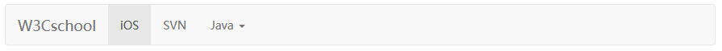

# Bootstrap 下拉菜单（Dropdown）插件

[Bootstrap 下拉菜单](bootstrap-dropdowns.html) 这一章讲解了下拉菜单，但是没有涉及到交互部分，本章将具体讲解下拉菜单的交互。使用下拉菜单（Dropdown）插件，您可以向任何组件（比如导航栏、标签页、胶囊式导航菜单、按钮等）添加下拉菜单。

如果您想要单独引用该插件的功能，那么您需要引用 **dropdown.js**。或者，正如 [Bootstrap 插件概览](bootstrap-plugins-overview.html) 一章中所提到，您可以引用 _bootstrap.js_ 或压缩版的 _bootstrap.min.js_。

## 用法

您可以切换下拉菜单（Dropdown）插件的隐藏内容：

*   **通过 data 属性**：向链接或按钮添加 **data-toggle="dropdown"** 来切换下拉菜单，如下所示：

    ```
    &lt;div class="dropdown"&gt;
      &lt;a data-toggle="dropdown" href="#"&gt;下拉菜单（Dropdown）触发器&lt;/a&gt;
      &lt;ul class="dropdown-menu" role="menu" aria-labelledby="dLabel"&gt;
        ...
      &lt;/ul&gt;
    &lt;/div&gt;

    ```

    如果您需要保持链接完整（在浏览器不启用 JavaScript 时有用），请使用 **data-target** 属性代替 **href="#"**：

    ```
    &lt;div class="dropdown"&gt;
      &lt;a id="dLabel" role="button" data-toggle="dropdown" data-target="#" href="/page.html"&gt;
        下拉菜单（Dropdown） &lt;span class="caret"&gt;&lt;/span&gt;
      &lt;/a&gt;

      &lt;ul class="dropdown-menu" role="menu" aria-labelledby="dLabel"&gt;
        ...
      &lt;/ul&gt;
    &lt;/div&gt;

    ```

*   **通过 JavaScript**：通过 JavaScript 调用下拉菜单切换，请使用下面的方法：

    ```
    $('.dropdown-toggle').dropdown()

    ```

### 实例

#### 在导航栏内

下面的实例演示了在导航栏内的下拉菜单的用法：

```
<!DOCTYPE html>
<html>
<head>
   <title>Bootstrap 实例 - 默认的导航栏</title>
   <link href="/bootstrap/css/bootstrap.min.css" rel="stylesheet">
   <script src="/scripts/jquery.min.js"></script>
   <script src="/bootstrap/js/bootstrap.min.js"></script>
</head>
<body>

<nav class="navbar navbar-default" role="navigation">
   <div class="navbar-header">
      <a class="navbar-brand" href="#">W3Cschool</a>
   </div>
   <div>
      <ul class="nav navbar-nav">
         <li class="active"><a href="#">iOS</a></li>
         <li><a href="#">SVN</a></li>
         <li class="dropdown">
            <a href="#" class="dropdown-toggle" data-toggle="dropdown">
               Java 
               <b class="caret"></b>
            </a>
            <ul class="dropdown-menu">
               <li><a href="#">jmeter</a></li>
               <li><a href="#">EJB</a></li>
               <li><a href="#">Jasper Report</a></li>
               <li class="divider"></li>
               <li><a href="#">分离的链接</a></li>
               <li class="divider"></li>
               <li><a href="#">另一个分离的链接</a></li>
            </ul>
         </li>
      </ul>
   </div>
</nav>

</body>
</html>

```

[](/try/tryit.php?filename=bootstrap3-plugin-dropdown-defaultnavbar)

结果如下所示：



#### 在标签页内

下面的实例演示了在标签页内的下拉菜单的用法：

```
<!DOCTYPE html>
<html>
<head>
   <title>Bootstrap 实例 - 带有下拉菜单的标签页</title>
   <link href="/bootstrap/css/bootstrap.min.css" rel="stylesheet">
   <script src="/scripts/jquery.min.js"></script>
   <script src="/bootstrap/js/bootstrap.min.js"></script>
</head>
<body>

<p>带有下拉菜单的标签页</p>
<ul class="nav nav-tabs">
   <li class="active"><a href="#">Home</a></li>
   <li><a href="#">SVN</a></li>
   <li><a href="#">iOS</a></li>
   <li><a href="#">VB.Net</a></li>
   <li class="dropdown">
      <a class="dropdown-toggle" data-toggle="dropdown" href="#">
         Java <span class="caret"></span>
      </a>
      <ul class="dropdown-menu">
         <li><a href="#">Swing</a></li>
         <li><a href="#">jMeter</a></li>
         <li><a href="#">EJB</a></li>
         <li class="divider"></li>
         <li><a href="#">分离的链接</a></li>
      </ul>
   </li>
   <li><a href="#">PHP</a></li>
</ul>

</body>
</html>

```

[](/try/tryit.php?filename=bootstrap3-plugin-dropdown-tabsdropdown)

结果如下所示：


## 选项

_没有选项。_

## 方法

下拉菜单切换有一个简单的方法用来显示或隐藏下拉菜单。

```
$().dropdown('toggle')

```

### 实例

下面的实例演示了下拉菜单（Dropdown）插件方法的用法：

```
<!DOCTYPE html>
<html>
<head>
   <title>Bootstrap 实例 - 下拉菜单（Dropdown）插件方法</title>
   <link href="/bootstrap/css/bootstrap.min.css" rel="stylesheet">
   <script src="/scripts/jquery.min.js"></script>
   <script src="/bootstrap/js/bootstrap.min.js"></script>
</head>
<body>

<nav class="navbar navbar-default" role="navigation">
   <div class="navbar-header">
      <a class="navbar-brand" href="#">W3Cschool</a>
   </div>

   <div id="myexample">
      <ul class="nav navbar-nav">
         <li class="active"><a href="#">iOS</a></li>
         <li><a href="#">SVN</a></li>
         <li class="dropdown">
            <a href="#" class="dropdown-toggle">Java <b 
               class="caret"></b></a>
               <ul class="dropdown-menu">
                  <li><a id="action-1" href="#">
                     jmeter</a>
                  </li>
                  <li><a href="#">EJB</a></li>
                  <li><a href="#">Jasper Report</a></li>
                  <li class="divider"></li>
                  <li><a href="#">分离的链接</a></li>
                  <li class="divider"></li>
                  <li><a href="#">另一个分离的链接</a></li>
               </ul>
            </li>
         </ul>
      </div>
   </nav>
</div>
<script>
   $(function(){
      $(".dropdown-toggle").dropdown('toggle');
      }); 
</script>

</body>
</html>

```

[](/try/tryit.php?filename=bootstrap3-plugin-dropdown-method)

结果如下所示：

