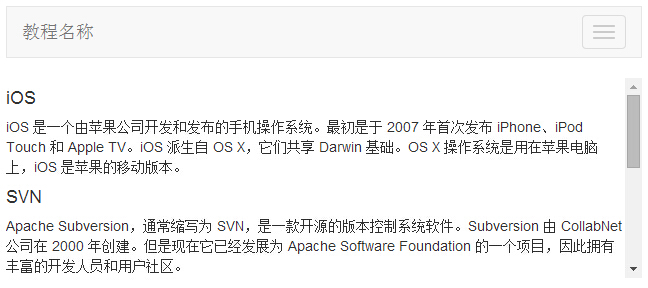
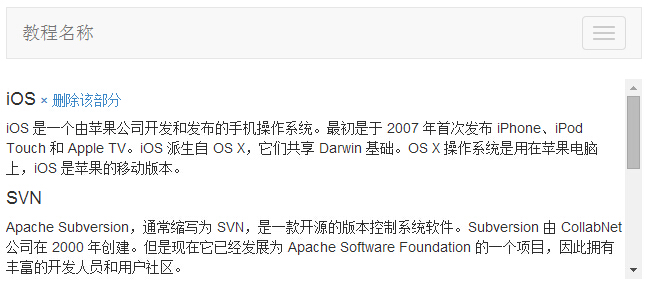
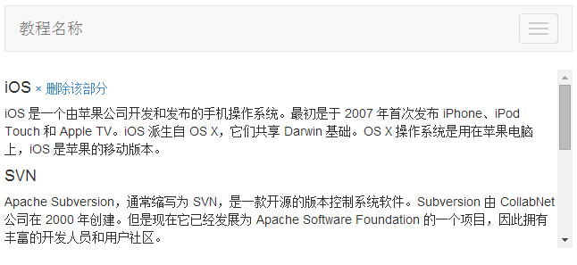

# Bootstrap 滚动监听（Scrollspy）插件

滚动监听（Scrollspy）插件，即自动更新导航插件，会根据滚动条的位置自动更新对应的导航目标。其基本的实现是随着您的滚动，基于滚动条的位置向导航栏添加 **.active** class。

如果您想要单独引用该插件的功能，那么您需要引用 **scrollspy.js**。或者，正如 [Bootstrap 插件概览](bootstrap-plugins-overview.html) 一章中所提到，您可以引用 _bootstrap.js_ 或压缩版的 _bootstrap.min.js_。

## 用法

您可以向顶部导航添加滚动监听行为：

*   **通过 data 属性**：向您想要监听的元素（通常是 body）添加 **data-spy="scroll"**。然后添加带有 Bootstrap **.nav** 组件的父元素的 ID 或 class 的属性 **data-target**。为了它能正常工作，您必须确保页面主体中有匹配您所要监听链接的 ID 的元素存在。

    ```
    &lt;body data-spy="scroll" data-target=".navbar-example"&gt;
      ...
      &lt;div class="navbar-example"&gt;
        &lt;ul class="nav nav-tabs"&gt;
          ...
        &lt;/ul&gt;
      &lt;/div&gt;
      ...
    &lt;/body&gt;

    ```

*   **通过 JavaScript**：您可以通过 JavaScript 调用滚动监听，选取要监听的元素，然后调用 **.scrollspy()** 函数：

    ```
    $('body').scrollspy({ target: '.navbar-example' })

    ```

### 实例

下面的实例演示了通过 data 属性使用滚动监听（Scrollspy）插件：

```
<!DOCTYPE html>
<html>
<head>
   <title>Bootstrap 实例 - 滚动监听（Scrollspy）插件</title>
   <link href="/bootstrap/css/bootstrap.min.css" rel="stylesheet">
   <script src="/scripts/jquery.min.js"></script>
   <script src="/bootstrap/js/bootstrap.min.js"></script>
</head>
<body>

<nav id="navbar-example" class="navbar navbar-default navbar-static" role="navigation">
   <div class="navbar-header">
      <button class="navbar-toggle" type="button" data-toggle="collapse"
         data-target=".bs-js-navbar-scrollspy">
         <span class="sr-only">切换导航</span>
         <span class="icon-bar"></span>
         <span class="icon-bar"></span>
         <span class="icon-bar"></span>
      </button>
      <a class="navbar-brand" href="#">教程名称</a>
   </div>
   <div class="collapse navbar-collapse bs-js-navbar-scrollspy">
      <ul class="nav navbar-nav">
         <li><a href="#ios">iOS</a></li>
         <li><a href="#svn">SVN</a></li>
         <li class="dropdown">
            <a href="#" id="navbarDrop1" class="dropdown-toggle"
               data-toggle="dropdown">Java
               <b class="caret"></b>
            </a>
            <ul class="dropdown-menu" role="menu"
               aria-labelledby="navbarDrop1">
               <li><a href="#jmeter" tabindex="-1">jmeter</a></li>
               <li><a href="#ejb" tabindex="-1">ejb</a></li>
               <li class="divider"></li>
               <li><a href="#spring" tabindex="-1">spring</a></li>
            </ul>
         </li>
      </ul>
   </div>
</nav>
<div data-spy="scroll" data-target="#navbar-example" data-offset="0"
   style="height:200px;overflow:auto; position: relative;">
   <h4 id="ios">iOS</h4>
   <p>iOS 是一个由苹果公司开发和发布的手机操作系统。最初是于 2007 年首次发布 iPhone、iPod Touch 和 Apple
      TV。iOS 派生自 OS X，它们共享 Darwin 基础。OS X 操作系统是用在苹果电脑上，iOS 是苹果的移动版本。
   </p>
   <h4 id="svn">SVN</h4>
   <p>Apache Subversion，通常缩写为 SVN，是一款开源的版本控制系统软件。Subversion 由 CollabNet 公司在 2000 年创建。但是现在它已经发展为 Apache Software Foundation 的一个项目，因此拥有丰富的开发人员和用户社区。
   </p>
   <h4 id="jmeter">jMeter</h4>
   <p>jMeter 是一款开源的测试软件。它是 100% 纯 Java 应用程序，用于负载和性能测试。
   </p>
   <h4 id="ejb">EJB</h4>
   <p>Enterprise Java Beans（EJB）是一个创建高度可扩展性和强大企业级应用程序的开发架构，部署在兼容应用程序服务器（比如 JBOSS、Web Logic 等）的 J2EE 上。
   </p>
   <h4 id="spring">Spring</h4>
   <p>Spring 框架是一个开源的 Java 平台，为快速开发功能强大的 Java 应用程序提供了完备的基础设施支持。
   </p>
   <p>Spring 框架最初是由 Rod Johnson 编写的，在 2003 年 6 月首次发布于 Apache 2.0 许可证下。
   </p>
</div>

</body>
</html>

```

[](/try/tryit.php?filename=bootstrap3-plugin-scrollspy)

结果如下所示：



## 选项

通过 data 属性或 JavaScript 来传递。下表列出了这些选项：

| 选项名称 | 类型/默认值 | Data 属性名称 | 描述 |
| --- | --- | --- | --- |
| offset | number _默认值：10_ | data-offset | 当计算滚动位置时，距离顶部的偏移像素。 |

## 方法

**.scrollspy('refresh')**：当通过 JavaScript 调用 scrollspy 方法时，您需要调用 **.refresh** 方法来更新 DOM。这在 DOM 的任意元素发生变更（即，您添加或移除了某些元素）时非常有用。下面是使用该方法的语法。

```
$('[data-spy="scroll"]').each(function () {
  var $spy = $(this).scrollspy('refresh')
})

```

### 实例

下面的实例演示了 **.scrollspy('refresh')** 方法的用法：

```
<!DOCTYPE html>
<html>
<head>
   <title>Bootstrap 实例 - 滚动监听（Scrollspy）插件方法</title>
   <link href="/bootstrap/css/bootstrap.min.css" rel="stylesheet">
   <script src="/scripts/jquery.min.js"></script>
   <script src="/bootstrap/js/bootstrap.min.js"></script>
</head>
<body>

<nav id="myScrollspy" class="navbar navbar-default navbar-static" role="navigation">
   <div class="navbar-header">
      <button class="navbar-toggle" type="button" data-toggle="collapse"
         data-target=".bs-js-navbar-scrollspy">
         <span class="sr-only">切换导航</span>
         <span class="icon-bar"></span>
         <span class="icon-bar"></span>
         <span class="icon-bar"></span>
      </button>
      <a class="navbar-brand" href="#">教程名称</a>
   </div>
   <div class="collapse navbar-collapse bs-js-navbar-scrollspy">
      <ul class="nav navbar-nav">
         <li class="active"><a href="#ios">iOS</a></li>
         <li><a href="#svn">SVN</a></li>
         <li class="dropdown">
            <a href="#" id="navbarDrop1" class="dropdown-toggle"
               data-toggle="dropdown">Java
               <b class="caret"></b>
            </a>
            <ul class="dropdown-menu" role="menu"
               aria-labelledby="navbarDrop1">
               <li><a href="#jmeter" tabindex="-1">jmeter</a></li>
               <li><a href="#ejb" tabindex="-1">ejb</a></li>
               <li class="divider"></li>
               <li><a href="#spring" tabindex="-1">spring</a></li>
            </ul>
         </li>
      </ul>
   </div>
</nav>
<div data-spy="scroll" data-target="#myScrollspy" data-offset="0"
   style="height:200px;overflow:auto; position: relative;">
   <div class="section">
      <h4 id="ios">iOS<small><a href="#" onclick="removeSection(this);">
         &times; 删除该部分</a></small>
      </h4>
      <p>iOS 是一个由苹果公司开发和发布的手机操作系统。最初是于 2007 年首次发布 iPhone、iPod Touch 和 Apple
      TV。iOS 派生自 OS X，它们共享 Darwin 基础。OS X 操作系统是用在苹果电脑上，iOS 是苹果的移动版本。</p>
   </div>
   <div class="section">
      <h4 id="svn">SVN<small></small></h4>
      <p>Apache Subversion，通常缩写为 SVN，是一款开源的版本控制系统软件。Subversion 由 CollabNet 公司在 2000 年创建。但是现在它已经发展为 Apache Software Foundation 的一个项目，因此拥有丰富的开发人员和用户社区。</p>
   </div>
   <div class="section">
      <h4 id="jmeter">jMeter<small><a href="#" onclick="removeSection(this);">
      &times; 删除该部分</a></small>
      </h4>
      <p>jMeter 是一款开源的测试软件。它是 100% 纯 Java 应用程序，用于负载和性能测试。</p>
   </div>
   <div class="section">
      <h4 id="ejb">EJB</h4>
      <p>Enterprise Java Beans（EJB）是一个创建高度可扩展性和强大企业级应用程序的开发架构，部署在兼容应用程序服务器（比如 JBOSS、Web Logic 等）的 J2EE 上。</p>
   </div>
   <div class="section">
      <h4 id="spring">Spring</h4>
      <p>Spring 框架是一个开源的 Java 平台，为快速开发功能强大的 Java 应用程序提供了完备的基础设施支持。</p>
      <p>Spring 框架最初是由 Rod Johnson 编写的，在 2003 年 6 月首次发布于 Apache 2.0 许可证下。</p>
   </div>
</div>
<script type="text/javascript">
   $(function(){
   removeSection = function(e) {
      $(e).parents(".section").remove();
      $('[data-spy="scroll"]').each(function () {
         var $spy = $(this).scrollspy('refresh')
      });
   }
   $("#myScrollspy").scrollspy();
});
</script>

</body>
</html>

```

[](/try/tryit.php?filename=bootstrap3-plugin-scrollspy-method)

结果如下所示：



## 事件

下表列出了滚动监听中要用到事件。这些事件可在函数中当钩子使用。

| 事件 | 描述 | 实例 |
| --- | --- | --- |
| activate.bs.scrollspy | 每当一个新项目被滚动监听激活时，触发该事件。 | `$('#myScrollspy').on('activate.bs.scrollspy', function () {/* 执行一些动作...*/})` |

### 实例

下面的实例演示了 **activate.bs.scrollspy** 事件的用法：

```
<!DOCTYPE html>
<html>
<head>
   <title>Bootstrap 实例 - 滚动监听（Scrollspy）插件事件</title>
   <link href="/bootstrap/css/bootstrap.min.css" rel="stylesheet">
   <script src="/scripts/jquery.min.js"></script>
   <script src="/bootstrap/js/bootstrap.min.js"></script>
</head>
<body>

<nav id="myScrollspy" class="navbar navbar-default navbar-static" role="navigation">
   <div class="navbar-header">
      <button class="navbar-toggle" type="button" data-toggle="collapse"
         data-target=".bs-js-navbar-scrollspy">
         <span class="sr-only">切换导航</span>
         <span class="icon-bar"></span>
         <span class="icon-bar"></span>
         <span class="icon-bar"></span>
      </button>
      <a class="navbar-brand" href="#">教程名称</a>
   </div>
   <div class="collapse navbar-collapse bs-js-navbar-scrollspy">
      <ul class="nav navbar-nav">
         <li class="active"><a href="#ios">iOS</a></li>
         <li><a href="#svn">SVN</a></li>
         <li class="dropdown">
            <a href="#" id="navbarDrop1" class="dropdown-toggle"
               data-toggle="dropdown">
               Java <b class="caret"></b>
            </a>
            <ul class="dropdown-menu" role="menu"
               aria-labelledby="navbarDrop1">
               <li><a href="#jmeter" tabindex="-1">jmeter</a></li>
               <li><a href="#ejb" tabindex="-1">ejb</a></li>
               <li class="divider"></li>
               <li><a href="#spring" tabindex="-1">spring</a></li>
            </ul>
         </li>
      </ul>
   </div>
</nav>
<div data-spy="scroll" data-target="#myScrollspy" data-offset="0"
   style="height:200px;overflow:auto; position: relative;">
   <div class="section">
      <h4 id="ios">iOS<small><a href="#" onclick="removeSection(this);">
         &times; 删除该部分</a></small>
      </h4>
      <p>iOS 是一个由苹果公司开发和发布的手机操作系统。最初是于 2007 年首次发布 iPhone、iPod Touch 和 Apple
      TV。iOS 派生自 OS X，它们共享 Darwin 基础。OS X 操作系统是用在苹果电脑上，iOS 是苹果的移动版本。</p>
   </div>
   <div class="section">
      <h4 id="svn">SVN<small></small></h4>
      <p>Apache Subversion，通常缩写为 SVN，是一款开源的版本控制系统软件。Subversion 由 CollabNet 公司在 2000 年创建。但是现在它已经发展为 Apache Software Foundation 的一个项目，因此拥有丰富的开发人员和用户社区。</p>
   </div>
   <div class="section">
      <h4 id="jmeter">jMeter<small><a href="#" onclick="removeSection(this);">
         &times; 删除该部分</a></small>
      </h4>
      <p>jMeter 是一款开源的测试软件。它是 100% 纯 Java 应用程序，用于负载和性能测试。</p>
   </div>
   <div class="section">
      <h4 id="ejb">EJB</h4>
      <p>Enterprise Java Beans（EJB）是一个创建高度可扩展性和强大企业级应用程序的开发架构，部署在兼容应用程序服务器（比如 JBOSS、Web Logic 等）的 J2EE 上。</p>
   </div>
   <div class="section">
      <h4 id="spring">Spring</h4>
      <p>Spring 框架是一个开源的 Java 平台，为快速开发功能强大的 Java 应用程序提供了完备的基础设施支持。</p>
      <p>Spring 框架最初是由 Rod Johnson 编写的，在 2003 年 6 月首次发布于 Apache 2.0 许可证下。</p>
   </div>
</div>
<script type="text/javascript">
   $(function(){
      removeSection = function(e) {
      $(e).parents(".section").remove();
      $('[data-spy="scroll"]').each(function () {
          var $spy = $(this).scrollspy('refresh')
      });
   }
   $("#myScrollspy").scrollspy();
   $('#myScrollspy').on('activate.bs.scrollspy', function () {
      var currentItem = $(".nav li.active > a").text();
      $("#activeitem").html("目前您正在查看 - " + currentItem);
   })
});
</script>

</body>
</html>

```

[](/try/tryit.php?filename=bootstrap3-plugin-scrollspy-event)

结果如下所示：


