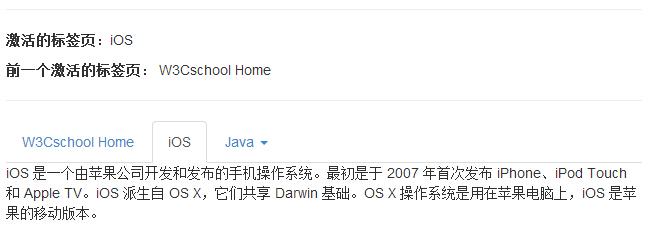

# Bootstrap 标签页（Tab）插件

标签页（Tab）在 [Bootstrap 导航元素](bootstrap-navigation-elements.html) 一章中介绍过。通过结合一些 data 属性，您可以轻松地创建一个标签页界面。通过这个插件您可以把内容放置在标签页或者是胶囊式标签页甚至是下拉菜单标签页中。

> 如果您想要单独引用该插件的功能，那么您需要引用 **tab.js**。或者，正如 [Bootstrap 插件概览](bootstrap-plugins-overview.html) 一章中所提到，您可以引用 _bootstrap.js_ 或压缩版的 _bootstrap.min.js_。

## 用法

您可以通过以下两种方式启用标签页：

*   **通过 data 属性**：您需要添加 **data-toggle="tab"** 或 **data-toggle="pill"** 到锚文本链接中。

    添加 **nav** 和 **nav-tabs** 类到 **ul** 中，将会应用 Bootstrap [标签样式](bootstrap-navigation-elements.html)，添加 **nav** 和 **nav-pills** 类到 **ul** 中，将会应用 Bootstrap [胶囊式样式](bootstrap-navigation-elements.html)。

    ```
    &lt;ul class="nav nav-tabs"&gt;
       &lt;li&gt;&lt;a href="#identifier" data-toggle="tab"&gt;Home&lt;/a&gt;&lt;/li&gt;
    ...
    &lt;/ul&gt;

    ```

*   **通过 JavaScript**：您可以使用 Javscript 来启用标签页，如下所示：

    ```
    $('#myTab a').click(function (e) {
      e.preventDefault()
      $(this).tab('show')
    })

    ```

    下面的实例演示了以不同的方式来激活各个标签页：

    ```
    // 通过名称选取标签页
    $('#myTab a[href="#profile"]').tab('show')

    // 选取第一个标签页
    $('#myTab a:first').tab('show')

    // 选取最后一个标签页
    $('#myTab a:last').tab('show')

    // 选取第三个标签页（从 0 开始索引）
    $('#myTab li:eq(2) a').tab('show')

    ```

## 淡入淡出效果

如果需要为标签页设置淡入淡出效果，请添加 **.fade** 到每个 **.tab-pane** 后面。第一个标签页必须添加 **.in** 类，以便淡入显示初始内容，如下面实例所示：

```
<div class="tab-content">
  <div class="tab-pane fade in active" id="home">...</div>
  <div class="tab-pane fade" id="svn">...</div>
  <div class="tab-pane fade" id="ios">...</div>
  <div class="tab-pane fade" id="java">...</div>
</div>

```

### 实例

下面的实例演示了使用 data 属性的标签页（Tab）插件及其淡入淡出的效果：

```
<!DOCTYPE html>
<html>
<head>
   <title>Bootstrap 实例 - 标签页（Tab）插件</title>
   <link href="/bootstrap/css/bootstrap.min.css" rel="stylesheet">
   <script src="/scripts/jquery.min.js"></script>
   <script src="/bootstrap/js/bootstrap.min.js"></script>
</head>
<body>

<ul id="myTab" class="nav nav-tabs">
   <li class="active">
      <a href="#home" data-toggle="tab">
         W3Cschool Home
      </a>
   </li>
   <li><a href="#ios" data-toggle="tab">iOS</a></li>
   <li class="dropdown">
      <a href="#" id="myTabDrop1" class="dropdown-toggle"
         data-toggle="dropdown">Java
         <b class="caret"></b>
      </a>
      <ul class="dropdown-menu" role="menu" aria-labelledby="myTabDrop1">
         <li><a href="#jmeter" tabindex="-1" data-toggle="tab">jmeter</a></li>
         <li><a href="#ejb" tabindex="-1" data-toggle="tab">ejb</a></li>
      </ul>
   </li>
</ul>
<div id="myTabContent" class="tab-content">
   <div class="tab-pane fade in active" id="home">
      <p>W3Cschoool菜鸟教程是一个提供最新的web技术站点，本站免费提供了建站相关的技术文档，帮助广大web技术爱好者快速入门并建立自己的网站。菜鸟先飞早入行——学的不仅是技术，更是梦想。</p>
   </div>
   <div class="tab-pane fade" id="ios">
      <p>iOS 是一个由苹果公司开发和发布的手机操作系统。最初是于 2007 年首次发布 iPhone、iPod Touch 和 Apple
      TV。iOS 派生自 OS X，它们共享 Darwin 基础。OS X 操作系统是用在苹果电脑上，iOS 是苹果的移动版本。</p>
   </div>
   <div class="tab-pane fade" id="jmeter">
      <p>jMeter 是一款开源的测试软件。它是 100% 纯 Java 应用程序，用于负载和性能测试。</p>
   </div>
   <div class="tab-pane fade" id="ejb">
      <p>Enterprise Java Beans（EJB）是一个创建高度可扩展性和强大企业级应用程序的开发架构，部署在兼容应用程序服务器（比如 JBOSS、Web Logic 等）的 J2EE 上。
      </p>
   </div>
</div>

</body>
</html>

```

[](/try/tryit.php?filename=bootstrap3-plugin-tab)

结果如下所示：


## 方法

**.$().tab**：该方法可以激活标签页元素和内容容器。标签页需要用一个 **data-target** 或者一个指向 DOM 中容器节点的 **href**。

```
<ul class="nav nav-tabs" id="myTab">
  <li class="active"><a href="#identifier" data-toggle="tab">Home</a></li>
  .....
</ul>
<div class="tab-content">
  <div class="tab-pane active" id="home">...</div>
  .....
</div>
<script>
  $(function () {
    $('#myTab a:last').tab('show')
  })
</script>

```

### 实例

下面的实例演示了标签页（Tab）插件方法 **.tab** 的用法。在本实例中，第二个标签页 _iOS_ 是激活的：

```
<!DOCTYPE html>
<html>
<head>
   <title>Bootstrap 实例 - 标签页（Tab）插件方法</title>
   <link href="/bootstrap/css/bootstrap.min.css" rel="stylesheet">
   <script src="/scripts/jquery.min.js"></script>
   <script src="/bootstrap/js/bootstrap.min.js"></script>
</head>
<body>

<ul id="myTab" class="nav nav-tabs">
   <li class="active"><a href="#home" data-toggle="tab">
      W3Cschool Home</a>
   </li>
   <li><a href="#ios" data-toggle="tab">iOS</a></li>
   <li class="dropdown">
      <a href="#" id="myTabDrop1" class="dropdown-toggle"
         data-toggle="dropdown">Java <b class="caret"></b>
      </a>
      <ul class="dropdown-menu" role="menu" aria-labelledby="myTabDrop1">
         <li><a href="#jmeter" tabindex="-1" data-toggle="tab">
            jmeter</a>
         </li>
         <li><a href="#ejb" tabindex="-1" data-toggle="tab">
            ejb</a>
         </li>
      </ul>
   </li>
</ul>
<div id="myTabContent" class="tab-content">
   <div class="tab-pane fade in active" id="home">
      <p>W3Cschoool菜鸟教程是一个提供最新的web技术站点，本站免费提供了建站相关的技术文档，帮助广大web技术爱好者快速入门并建立自己的网站。菜鸟先飞早入行——学的不仅是技术，更是梦想。</p>
   </div>
   <div class="tab-pane fade" id="ios">
      <p>iOS 是一个由苹果公司开发和发布的手机操作系统。最初是于 2007 年首次发布 iPhone、iPod Touch 和 Apple
      TV。iOS 派生自 OS X，它们共享 Darwin 基础。OS X 操作系统是用在苹果电脑上，iOS 是苹果的移动版本。</p>
   </div>
   <div class="tab-pane fade" id="jmeter">
      <p>jMeter 是一款开源的测试软件。它是 100% 纯 Java 应用程序，用于负载和性能测试。</p>
   </div>
   <div class="tab-pane fade" id="ejb">
      <p>Enterprise Java Beans（EJB）是一个创建高度可扩展性和强大企业级应用程序的开发架构，部署在兼容应用程序服务器（比如 JBOSS、Web Logic 等）的 J2EE 上。
      </p>
   </div>
</div>
<script>
   $(function () {
      $('#myTab li:eq(1) a').tab('show');
   });
</script>

</body>
</html>

```

[](/try/tryit.php?filename=bootstrap3-plugin-tab-method)

结果如下所示：


## 事件

下表列出了标签页（Tab）插件中要用到的事件。这些事件可在函数中当钩子使用。

| 事件 | 描述 | 实例 |
| --- | --- | --- |
| show.bs.tab | 该事件在标签页显示时触发，但是必须在新标签页被显示之前。分别使用 **event.target** 和 **event.relatedTarget** 来定位到激活的标签页和前一个激活的标签页。 | `$('a[data-toggle="tab"]').on('show.bs.tab', function (e) {e.target /* 激活的标签页*/ e.relatedTarget /* 前一个激活的标签页*/})` |
| shown.bs.tab | 该事件在标签页显示时触发，但是必须在某个标签页已经显示之后。分别使用 **event.target** 和 **event.relatedTarget** 来定位到激活的标签页和前一个激活的标签页。 | `$('a[data-toggle="tab"]').on('shown.bs.tab', function (e) {e.target /* 激活的标签页*/ e.relatedTarget /* 前一个激活的标签页*/})` |

### 实例

下面的实例演示了标签页（Tab）插件事件的用法。在本实例中，将显示当前和前一个访问过的标签页：

```
<!DOCTYPE html>
<html>
<head>
   <title>Bootstrap 实例 - 标签页（Tab）插件事件</title>
   <link href="/bootstrap/css/bootstrap.min.css" rel="stylesheet">
   <script src="/scripts/jquery.min.js"></script>
   <script src="/bootstrap/js/bootstrap.min.js"></script>
</head>
<body>

<hr>
   <p class="active-tab"><strong>激活的标签页</strong>：<span></span></p>
   <p class="previous-tab"><strong>前一个激活的标签页</strong>：<span></span></p>
<hr>
<ul id="myTab" class="nav nav-tabs">
   <li class="active"><a href="#home" data-toggle="tab">
      W3Cschool Home</a></li>
   <li><a href="#ios" data-toggle="tab">iOS</a></li>
   <li class="dropdown">
      <a href="#" id="myTabDrop1" class="dropdown-toggle"
         data-toggle="dropdown">
         Java <b class="caret"></b></a>
      <ul class="dropdown-menu" role="menu" aria-labelledby="myTabDrop1">
         <li><a href="#jmeter" tabindex="-1" data-toggle="tab">jmeter</a></li>
         <li><a href="#ejb" tabindex="-1" data-toggle="tab">ejb</a></li>
      </ul>
   </li>
</ul>
<div id="myTabContent" class="tab-content">
   <div class="tab-pane fade in active" id="home">
      <p>W3Cschoool菜鸟教程是一个提供最新的web技术站点，本站免费提供了建站相关的技术文档，帮助广大web技术爱好者快速入门并建立自己的网站。菜鸟先飞早入行——学的不仅是技术，更是梦想。</p>
   </div>
   <div class="tab-pane fade" id="ios">
      <p>iOS 是一个由苹果公司开发和发布的手机操作系统。最初是于 2007 年首次发布 iPhone、iPod Touch 和 Apple
      TV。iOS 派生自 OS X，它们共享 Darwin 基础。OS X 操作系统是用在苹果电脑上，iOS 是苹果的移动版本。</p>
   </div>
   <div class="tab-pane fade" id="jmeter">
      <p>jMeter 是一款开源的测试软件。它是 100% 纯 Java 应用程序，用于负载和性能测试。</p>
   </div>
   <div class="tab-pane fade" id="ejb">
      <p>Enterprise Java Beans（EJB）是一个创建高度可扩展性和强大企业级应用程序的开发架构，部署在兼容应用程序服务器（比如 JBOSS、Web Logic 等）的 J2EE 上。
      </p>
   </div>
</div>
<script>
   $(function(){
      $('a[data-toggle="tab"]').on('shown.bs.tab', function (e) {
      // 获取已激活的标签页的名称
      var activeTab = $(e.target).text();
      // 获取前一个激活的标签页的名称
      var previousTab = $(e.relatedTarget).text();
      $(".active-tab span").html(activeTab);
      $(".previous-tab span").html(previousTab);
   });
});
</script>

</body>
</html>

```

[](/try/tryit.php?filename=bootstrap3-plugin-tab-event)

结果如下所示：


