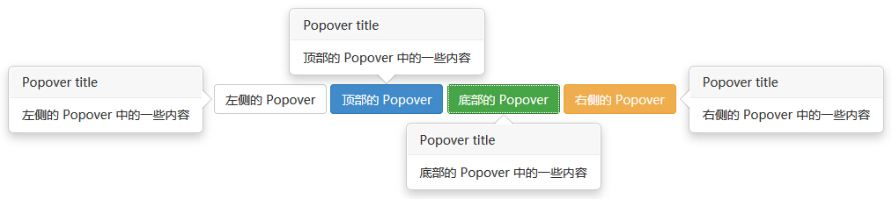
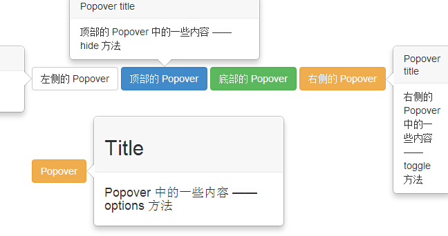
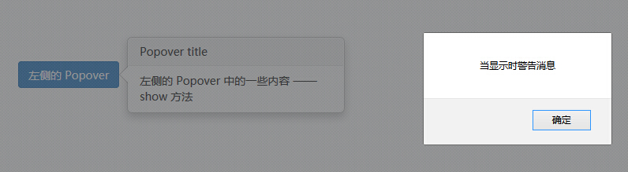

# Bootstrap 弹出框（Popover）插件

弹出框（Popover）与工具提示（Tooltip）类似，提供了一个扩展的视图。如需激活弹出框，用户只需把鼠标悬停在元素上即可。弹出框的内容完全可使用 Bootstrap 数据 API（Bootstrap Data API）来填充。该方法依赖于工具提示（tooltip）。

如果您想要单独引用该插件的功能，那么您需要引用 **popover.js**，它依赖于 [工具提示（Tooltip）插件](bootstrap-tooltip-plugin.html)。或者，正如 [Bootstrap 插件概览](bootstrap-plugins-overview.html) 一章中所提到，您可以引用 _bootstrap.js_ 或压缩版的 _bootstrap.min.js_。

## 用法

弹出框（Popover）插件根据需求生成内容和标记，默认情况下是把弹出框（popover）放在它们的触发元素后面。您可以有以下两种方式添加弹出框（popover）：

*   **通过 data 属性**：如需添加一个弹出框（popover），只需向一个锚/按钮标签添加 **data-toggle="popover"** 即可。锚的 title 即为弹出框（popover）的文本。默认情况下，插件把弹出框（popover）设置在顶部。

    ```
    &lt;a href="#" data-toggle="popover" title="Example popover"&gt;
       请悬停在我的上面
    &lt;/a&gt;

    ```

*   **通过 JavaScript：**通过 JavaScript 启用弹出框（popover）：

    ```
    $('#identifier').popover(options)

    ```

弹出框（Popover）插件不像之前所讨论的下拉菜单及其他插件那样，它不是纯 CSS 插件。如需使用该插件，您必须使用 jquery 激活它（读取 javascript）。使用下面的脚本来启用页面中的所有的弹出框（popover）：

```
$(function () { $("[data-toggle='popover']").popover(); });

```

### 实例

下面的实例演示了通过 data 属性使用弹出框（Popover）插件的用法。

```
<!DOCTYPE html>
<html>
<head>
   <title>Bootstrap 实例 - 弹出框（Popover）插件</title>
   <link href="/bootstrap/css/bootstrap.min.css" rel="stylesheet">
   <script src="/scripts/jquery.min.js"></script>
   <script src="/bootstrap/js/bootstrap.min.js"></script>
</head>
<body>

<div class="container" style="padding: 100px 50px 10px;" >
   <button type="button" class="btn btn-default" title="Popover title"  
      data-container="body" data-toggle="popover" data-placement="left"
      data-content="左侧的 Popover 中的一些内容">
      左侧的 Popover
   </button>
   <button type="button" class="btn btn-primary" title="Popover title"  
      data-container="body" data-toggle="popover" data-placement="top"
      data-content="顶部的 Popover 中的一些内容">
      顶部的 Popover
   </button>
   <button type="button" class="btn btn-success" title="Popover title"  
      data-container="body" data-toggle="popover" data-placement="bottom"
      data-content="底部的 Popover 中的一些内容">
      底部的 Popover
   </button>
   <button type="button" class="btn btn-warning" title="Popover title"  
      data-container="body" data-toggle="popover" data-placement="right"
      data-content="右侧的 Popover 中的一些内容">
      右侧的 Popover
   </button>
   </div>

   <script>$(function ()
      { $("[data-toggle='popover']").popover();
      });
   </script>
</div>

</body>
</html>

```

[](/try/tryit.php?filename=bootstrap3-plugin-popover)

结果如下所示：



## 选项

有一些选项是通过 Bootstrap 数据 API（Bootstrap Data API）添加或通过 JavaScript 调用的。下表列出了这些选项：

| 选项名称 | 类型/默认值 | Data 属性名称 | 描述 |
| --- | --- | --- | --- |
| animation | boolean _默认值：true_ | data-animation | 向弹出框应用 CSS 褪色过渡效果。 |
| html | boolean _默认值：false_ | data-html | 向弹出框插入 HTML。如果为 false，jQuery 的 text 方法将被用于向 dom 插入内容。如果您担心 XSS 攻击，请使用 text。 |
| placement | string&#124;function _默认值：top_ | data-placement | 规定如何定位弹出框（即 top&#124;bottom&#124;left&#124;right&#124;auto）。当指定为 _auto_ 时，会动态调整弹出框。例如，如果 placement 是 "auto left"，弹出框将会尽可能显示在左边，在情况不允许的情况下它才会显示在右边。 |
| selector | string _默认值：false_ | data-selector | 如果提供了一个选择器，弹出框对象将被委派到指定的目标。 |
| title | string &#124; function _默认值：''_ | data-title | 如果未指定 _title_ 属性，则 title 选项是默认的 title 值。 |
| trigger | string _默认值：'hover focus'_ | data-trigger | 定义如何触发弹出框： **click&#124; hover &#124; focus &#124; manual**。您可以传递多个触发器，每个触发器之间用空格分隔。 |
| delay | number &#124; object _默认值：0_ | data-delay | 延迟显示和隐藏弹出框的毫秒数 - 对 manual 手动触发类型不适用。如果提供的是一个数字，那么延迟将会应用于显示和隐藏。如果提供的是对象，结构如下所示：`delay:{ show: 500, hide: 100 }` |
| container | string &#124; false _默认值：false_ | data-container | 向指定元素追加弹出框。实例： container: 'body' |

## 方法

下面是一些弹出框（Popover）插件中有用的方法：

| 方法 | 描述 | 实例 |
| --- | --- | --- |
| **Options:** .popover(options) | 向元素集合附加弹出框句柄。 |`$().popover(options)` |
| **Toggle:** .popover('toggle') | 切换显示/隐藏元素的弹出框。 |`$('#element').popover('toggle')` |
| **Show:** .popover('show') | 显示元素的弹出框。 |`$('#element').popover('show')` |
| **Hide:** .popover('hide') | 隐藏元素的弹出框。 |`$('#element').popover('hide')` |
| **Destroy:** .popover('destroy') | 隐藏并销毁元素的弹出框。 |`$('#element').popover('destroy')` |

### 实例

下面的实例演示了弹出框（Popover）插件的方法：

```
<!DOCTYPE html>
<html>
<head>
   <title>Bootstrap 实例 - 弹出框（Popover）插件方法</title>
   <link href="/bootstrap/css/bootstrap.min.css" rel="stylesheet">
   <script src="/scripts/jquery.min.js"></script>
   <script src="/bootstrap/js/bootstrap.min.js"></script>
</head>
<body>

<div class="container" style="padding: 100px 50px 10px;" >
   <button type="button" class="btn btn-default popover-show"
      title="Popover title" data-container="body"
      data-toggle="popover" data-placement="left"
      data-content="左侧的 Popover 中的一些内容 —— show 方法">
      左侧的 Popover
   </button>
   <button type="button" class="btn btn-primary popover-hide"
      title="Popover title" data-container="body"
      data-toggle="popover" data-placement="top"
      data-content="顶部的 Popover 中的一些内容 —— hide 方法">
      顶部的 Popover
   </button>
   <button type="button" class="btn btn-success popover-destroy"
      title="Popover title" data-container="body"
      data-toggle="popover" data-placement="bottom"
      data-content="底部的 Popover 中的一些内容 —— destroy 方法">
      底部的 Popover
   </button>
   <button type="button" class="btn btn-warning popover-toggle"
      title="Popover title" data-container="body"
      data-toggle="popover" data-placement="right"
      data-content="右侧的 Popover 中的一些内容 —— toggle 方法">
      右侧的 Popover
   </button><br><br><br><br><br><br>
   <p class="popover-options">
      <a href="#" type="button" class="btn btn-warning" title="<h2>Title</h2>"  
         data-container="body" data-toggle="popover" data-content="
         <h4>Popover 中的一些内容 —— options 方法</h4>">
         Popover
      </a>
   </p>
   <script>
      $(function () { $('.popover-show').popover('show');});
      $(function () { $('.popover-hide').popover('hide');});
      $(function () { $('.popover-destroy').popover('destroy');});
      $(function () { $('.popover-toggle').popover('toggle');});
     $(function () { $(".popover-options a").popover({html : true });});
   </script>
</div>

</body>
</html>

```

[](/try/tryit.php?filename=bootstrap3-plugin-popover-method)

结果如下所示：



## 事件

下表列出了弹出框（Popover）插件中要用到的事件。这些事件可在函数中当钩子使用。

| 事件 | 描述 | 实例 |
| --- | --- | --- |
| show.bs.popover | 当调用 show 实例方法时立即触发该事件。 |`$('#mypopover').on('show.bs.popover', function () {  /* 执行一些动作...*/})` |
| shown.bs.popover | 当弹出框对用户可见时触发该事件（将等待 CSS 过渡效果完成）。 |`$('#mypopover').on('shown.bs.popover', function () {  /* 执行一些动作...*/})` |
| hide.bs.popover | 当调用 hide 实例方法时立即触发该事件。 |`$('#mypopover').on('hide.bs.popover', function () {  /* 执行一些动作...*/})` |
| hidden.bs.popover | 当工具提示对用户隐藏时触发该事件（将等待 CSS 过渡效果完成）。 |`$('#mypopover').on('hidden.bs.popover', function () {  /* 执行一些动作...*/})` |

### 实例

下面的实例演示了弹出框（Popover）插件的事件：

```
<!DOCTYPE html>
<html>
<head>
   <title>Bootstrap 实例 - 弹出框（Popover）插件事件</title>
   <link href="/bootstrap/css/bootstrap.min.css" rel="stylesheet">
   <script src="/scripts/jquery.min.js"></script>
   <script src="/bootstrap/js/bootstrap.min.js"></script>
</head>
<body>

<div clas="container" style="padding: 100px 50px 10px;" >
   <button type="button" class="btn btn-primary popover-show"
      title="Popover title" data-container="body"
      data-toggle="popover"
      data-content="左侧的 Popover 中的一些内容 —— show 方法">
      左侧的 Popover
   </button>

   </div>
   <script>
      $(function () { $('.popover-show').popover('show');});
      $(function () { $('.popover-show').on('shown.bs.popover', function () {
      alert("当显示时警告消息");
   })});
   </script>
</div>

</body>
</html>

```

[](/try/tryit.php?filename=bootstrap3-plugin-popover-event)

结果如下所示：


