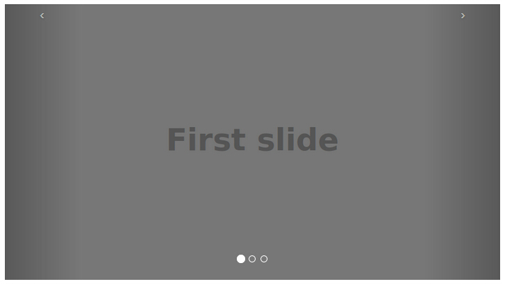
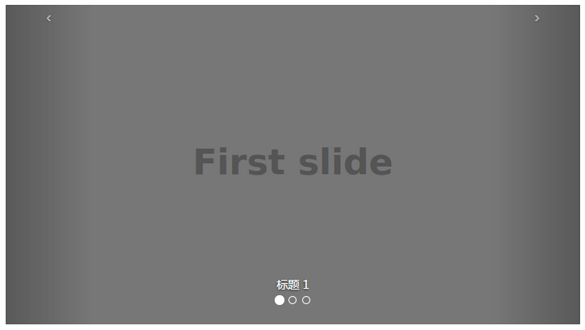
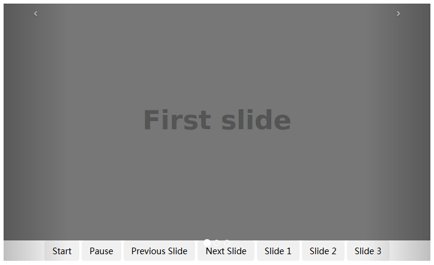
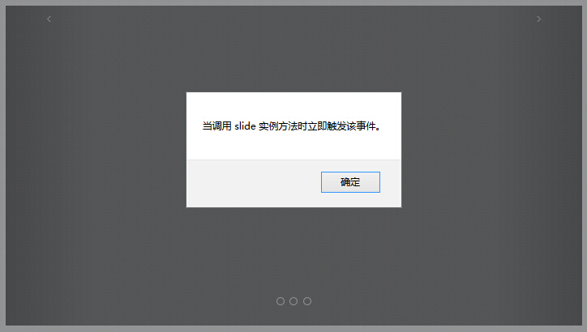

# Bootstrap 轮播（Carousel）插件

Bootstrap 轮播（Carousel）插件是一种灵活的响应式的向站点添加滑块的方式。除此之外，内容也是足够灵活的，可以是图像、内嵌框架、视频或者其他您想要放置的任何类型的内容。

> 如果您想要单独引用该插件的功能，那么您需要引用 **carousel.js**。或者，正如 [Bootstrap 插件概览](bootstrap-plugins-overview.html) 一章中所提到，您可以引用 _bootstrap.js_ 或压缩版的 _bootstrap.min.js_。

## 实例

下面是一个简单的幻灯片，使用 Bootstrap 轮播（Carousel）插件显示了一个循环播放元素的通用组件。为了实现轮播，您只需要添加带有该标记的代码即可。不需要使用 data 属性，只需要简单的基于 class 的开发即可。

```
<!DOCTYPE html>
<html>
<head>
   <title>Bootstrap 实例 - 简单的轮播（Carousel）插件</title>
   <link href="/bootstrap/css/bootstrap.min.css" rel="stylesheet">
   <script src="/scripts/jquery.min.js"></script>
   <script src="/bootstrap/js/bootstrap.min.js"></script>
</head>
<body>

<div id="myCarousel" class="carousel slide">
   <!-- 轮播（Carousel）指标 -->
   <ol class="carousel-indicators">
      <li data-target="#myCarousel" data-slide-to="0" class="active"></li>
      <li data-target="#myCarousel" data-slide-to="1"></li>
      <li data-target="#myCarousel" data-slide-to="2"></li>
   </ol>   
   <!-- 轮播（Carousel）项目 -->
   <div class="carousel-inner">
      <div class="item active">
         
      </div>
      <div class="item">
         
      </div>
      <div class="item">
         
      </div>
   </div>
   <!-- 轮播（Carousel）导航 -->
   <a class="carousel-control left" href="#myCarousel"
      data-slide="prev">&lsaquo;</a>
   <a class="carousel-control right" href="#myCarousel"
      data-slide="next">&rsaquo;</a>
</div>

</body>
</html>

```

[](/try/tryit.php?filename=bootstrap3-plugin-carousal-simple)

结果如下所示：



### 可选的标题

您可以通过 **.item** 内的 **.carousel-caption** 元素向幻灯片添加标题。只需要在该处放置任何可选的 HTML 即可，它会自动对齐并格式化。下面的实例演示了这点：

```
<!DOCTYPE html>
<html>
<head>
   <title>Bootstrap 实例 - 轮播（Carousel）插件的标题</title>
   <link href="/bootstrap/css/bootstrap.min.css" rel="stylesheet">
   <script src="/scripts/jquery.min.js"></script>
   <script src="/bootstrap/js/bootstrap.min.js"></script>
</head>
<body>

<div id="myCarousel" class="carousel slide">
   <!-- 轮播（Carousel）指标 -->
   <ol class="carousel-indicators">
      <li data-target="#myCarousel" data-slide-to="0" class="active"></li>
      <li data-target="#myCarousel" data-slide-to="1"></li>
      <li data-target="#myCarousel" data-slide-to="2"></li>
   </ol>   
   <!-- 轮播（Carousel）项目 -->
   <div class="carousel-inner">
      <div class="item active">
         
         <div class="carousel-caption">标题 1</div>
      </div>
      <div class="item">
         
         <div class="carousel-caption">标题 2</div>
      </div>
      <div class="item">
         
         <div class="carousel-caption">标题 3</div>
      </div>
   </div>
   <!-- 轮播（Carousel）导航 -->
   <a class="carousel-control left" href="#myCarousel"
      data-slide="prev">&lsaquo;</a>
   <a class="carousel-control right" href="#myCarousel"
      data-slide="next">&rsaquo;</a>
</div>

</body>
</html>

```

[](/try/tryit.php?filename=bootstrap3-plugin-carousal-caption)

结果如下所示：



## 用法

*   **通过 data 属性**：使用 data 属性可以很容易控制轮播（Carousel）的位置。
    *   属性 **data-slide** 接受关键字 _prev_ 或 _next_，用来改变幻灯片相对于当前位置的位置。
    *   使用 **data-slide-to** 来向轮播床底一个原始滑动索引，**data-slide-to="2"** 将把滑块移动到一个特定的索引，索引从 0 开始计数。
    *   **data-ride="carousel"** 属性用于标记轮播在页面加载时就开始动画播放。
*   **通过 JavaScript**：轮播（Carousel）可通过 JavaScript 手动调用，如下所示：

    ```
    $('.carousel').carousel()

    ```

## 选项

有一些选项是通过 data 属性或 JavaScript 来传递的。下表列出了这些选项：

| 选项名称 | 类型/默认值 | Data 属性名称 | 描述 |
| --- | --- | --- | --- |
| interval | number _默认值：5000_ | data-interval | 自动循环每个项目之间延迟的时间量。如果为 false，轮播将不会自动循环。 |
| pause | string _默认值："hover"_ | data-pause | 鼠标进入时暂停轮播循环，鼠标离开时恢复轮播循环。 |
| wrap | boolean _默认值：true_ | data-wrap | 轮播是否连续循环。 |

## 方法

下面是一些轮播（Carousel）插件中有用的方法：

| 方法 | 描述 | 实例 |
| --- | --- | --- |
| .carousel(options) | 初始化轮播为可选的 options 对象，并开始循环项目。 |`$('#identifier').carousel({  interval: 2000})` |
| .carousel('cycle') | 从左到右循环轮播项目。 |`$('#identifier').carousel('cycle')` |
| .carousel('pause') | 停止轮播循环项目。 |`$('#identifier')..carousel('pause')` |
| .carousel(number) | 循环轮播到某个特定的帧（从 0 开始计数，与数组类似）。 |`$('#identifier').carousel(number)` |
| .carousel('prev') | 循环轮播到上一个项目。 |`$('#identifier').carousel('prev')` |
| .carousel('next') | 循环轮播到下一个项目。 |`$('#identifier').carousel('next')` |

### 实例

下面的实例演示了方法的用法：

```
<!DOCTYPE html>
<html>
<head>
   <title>Bootstrap 实例 - 轮播（Carousel）插件方法</title>
   <link href="/bootstrap/css/bootstrap.min.css" rel="stylesheet">
   <script src="/scripts/jquery.min.js"></script>
   <script src="/bootstrap/js/bootstrap.min.js"></script>
</head>
<body>

<div id="myCarousel" class="carousel slide">
   <!-- 轮播（Carousel）指标 -->
   <ol class="carousel-indicators">
      <li data-target="#myCarousel" data-slide-to="0"
         class="active"></li>
      <li data-target="#myCarousel" data-slide-to="1"></li>
      <li data-target="#myCarousel" data-slide-to="2"></li>
   </ol>   
   <!-- 轮播（Carousel）项目 -->
   <div class="carousel-inner">
      <div class="item active">
         
      </div>
      <div class="item">
         
      </div>
      <div class="item">
         
      </div>
   </div>
   <!-- 轮播（Carousel）导航 -->
   <a class="carousel-control left" href="#myCarousel"
      data-slide="prev">&lsaquo;</a>
   <a class="carousel-control right" href="#myCarousel"
      data-slide="next">&rsaquo;</a>
   <!-- 控制按钮 -->
   <div style="text-align:center;">
      <input type="button" class="btn start-slide" value="Start">
      <input type="button" class="btn pause-slide" value="Pause">
      <input type="button" class="btn prev-slide" value="Previous Slide">
      <input type="button" class="btn next-slide" value="Next Slide">
      <input type="button" class="btn slide-one" value="Slide 1">
      <input type="button" class="btn slide-two" value="Slide 2">            
      <input type="button" class="btn slide-three" value="Slide 3">
   </div>
</div>
<script>
   $(function(){
      // 初始化轮播
      $(".start-slide").click(function(){
         $("#myCarousel").carousel('cycle');
      });
      // 停止轮播
      $(".pause-slide").click(function(){
         $("#myCarousel").carousel('pause');
      });
      // 循环轮播到上一个项目
      $(".prev-slide").click(function(){
         $("#myCarousel").carousel('prev');
      });
      // 循环轮播到下一个项目
      $(".next-slide").click(function(){
         $("#myCarousel").carousel('next');
      });
      // 循环轮播到某个特定的帧
      $(".slide-one").click(function(){
         $("#myCarousel").carousel(0);
      });
      $(".slide-two").click(function(){
         $("#myCarousel").carousel(1);
      });
      $(".slide-three").click(function(){
         $("#myCarousel").carousel(2);
      });
   });
</script>

</body>
</html>

```

[](/try/tryit.php?filename=bootstrap3-plugin-carousal-method)

结果如下所示：



## 事件

下表列出了轮播（Carousel）插件中要用到的事件。这些事件可在函数中当钩子使用。

| 事件 | 描述 | 实例 |
| --- | --- | --- |
| slide.bs.carousel | 当调用 slide 实例方法时立即触发该事件。 |`$('#identifier').on('slide.bs.carousel', function () {  /* 执行一些动作...*/})` |
| slid.bs.carousel | 当轮播完成幻灯片过渡效果时触发该事件。 |`$('#identifier').on('slid.bs.carousel', function () {  /* 执行一些动作...*/})` |

### 实例

下面的实例演示了事件的用法：

```
<!DOCTYPE html>
<html>
<head>
   <title>Bootstrap 实例 - 轮播（Carousel）插件事件</title>
   <link href="/bootstrap/css/bootstrap.min.css" rel="stylesheet">
   <script src="/scripts/jquery.min.js"></script>
   <script src="/bootstrap/js/bootstrap.min.js"></script>
</head>
<body>

<div id="myCarousel" class="carousel slide">
   <!-- 轮播（Carousel）指标 -->
   <ol class="carousel-indicators">
      <li data-target="#myCarousel" data-slide-to="0"
         class="active"></li>
      <li data-target="#myCarousel" data-slide-to="1"></li>
      <li data-target="#myCarousel" data-slide-to="2"></li>
   </ol>   
   <!-- 轮播（Carousel）项目 -->
   <div class="carousel-inner">
      <div class="item active">
         
      </div>
      <div class="item">
         
      </div>
      <div class="item">
         
      </div>
   </div>
   <!-- 轮播（Carousel）导航 -->
   <a class="carousel-control left" href="#myCarousel"
      data-slide="prev">&lsaquo;</a>
   <a class="carousel-control right" href="#myCarousel"
      data-slide="next">&rsaquo;</a>
</div>
<script>
   $(function(){
      $('#myCarousel').on('slide.bs.carousel', function () {
         alert("当调用 slide 实例方法时立即触发该事件。");
      });
   });
</script>

</body>
</html>

```

[](/try/tryit.php?filename=bootstrap3-plugin-carousal-event)

结果如下所示：


