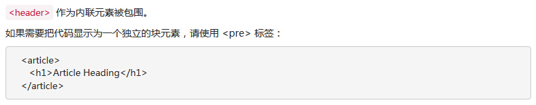

# Bootstrap 代码

Bootstrap 允许您以两种方式显示代码：

*   第一种是 &lt;code&gt; 标签。如果您想要内联显示代码，那么您应该使用 &lt;code&gt; 标签。
*   第二种是 &lt;pre&gt; 标签。如果代码需要被显示为一个独立的块元素或者代码有多行，那么您应该使用 &lt;pre&gt; 标签。

请确保当您使用 &lt;pre&gt; 和 &lt;code&gt; 标签时，开始和结束标签使用了 unicode 变体： **&lt;** 和 **&gt;**。

让我们来看看下面的实例：

## 实例

```
<!DOCTYPE html>
<html>
<head>
  <title>Bootstrap 实例 - 代码</title>
  <link href="/bootstrap/css/bootstrap.min.css" rel="stylesheet">
  <script src="/scripts/jquery.min.js"></script>
  <script src="/bootstrap/js/bootstrap.min.js"></script>
</head>
<body>

<p><code>&lt;header&gt;</code> 作为内联元素被包围。</p>
<p>如果需要把代码显示为一个独立的块元素，请使用 <pre> 标签：</p>
<pre>
  &lt;article&gt;
    &lt;h1&gt;Article Heading&lt;/h1&gt;
  &lt;/article&gt;
</pre>
</body>
</html>
```

实例展示如下图：

