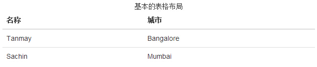
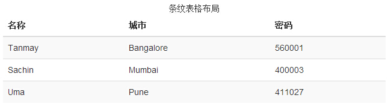
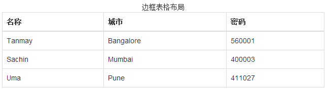
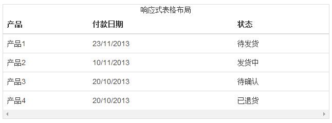

# Bootstrap 表格

Bootstrap 提供了一个清晰的创建表格的布局。下表列出了 Bootstrap 支持的一些表格元素：

| 标签 | 描述 |
| --- | --- |
| &lt;table&gt; | 容纳以表格形式显示数据的元素。 |
| &lt;thead&gt; | 表格标题行的容器元素（&lt;tr&gt;），用来标识表格列。 |
| &lt;tbody&gt; | 表格主体中的表格行的容器元素（&lt;tr&gt;）。 |
| &lt;tr&gt; | 一组出现在单行上的表格单元格的容器元素（&lt;td&gt; 或 &lt;th&gt;）。 |
| &lt;td&gt; | 默认的表格单元格。 |
| &lt;th&gt; | 特殊的表格单元格，用来标识列或行（取决于范围和位置）。必须在 &lt;thead&gt; 内使用。 |
| &lt;caption&gt; | 关于表格存储内容的描述或总结。 |

## 基本的表格

如果您想要一个只带有内边距（padding）和水平分割的基本表，请添加 class _.table_，如下面实例所示：

```
<!DOCTYPE html>
<html>
<head>
   <title>Bootstrap 实例 - 基本的表格</title>
   <link href="/bootstrap/css/bootstrap.min.css" rel="stylesheet">
   <script src="/scripts/jquery.min.js"></script>
   <script src="/bootstrap/js/bootstrap.min.js"></script>
</head>
<body>

<table class="table">
   <caption>基本的表格布局</caption>
   <thead>
      <tr>
         <th>名称</th>
         <th>城市</th>
      </tr>
   </thead>
   <tbody>
      <tr>
         <td>Tanmay</td>
         <td>Bangalore</td>
      </tr>
      <tr>
         <td>Sachin</td>
         <td>Mumbai</td>
      </tr>
   </tbody>
</table>

</body>
</html>

```

[](/try/tryit.php?filename=bootstrap3-table-basic)

结果如下所示：



## 可选的表格类

除了基本的表格标记和 .table class，还有一些可以用来为标记定义样式的类。下面将向您介绍这些类。

### 条纹表格

通过添加 _.table-striped_ class，您将在 &lt;tbody&gt; 内的行上看到条纹，如下面的实例所示：

```
<!DOCTYPE html>
<html>
<head>
   <title>Bootstrap 实例 - 条纹表格</title>
   <link href="/bootstrap/css/bootstrap.min.css" rel="stylesheet">
   <script src="/scripts/jquery.min.js"></script>
   <script src="/bootstrap/js/bootstrap.min.js"></script>
</head>
<body>

<table class="table table-striped">
   <caption>条纹表格布局</caption>
   <thead>
      <tr>
         <th>名称</th>
         <th>城市</th>
         <th>密码</th>
      </tr>
   </thead>
   <tbody>
      <tr>
         <td>Tanmay</td>
         <td>Bangalore</td>
         <td>560001</td>
      </tr>
      <tr>
         <td>Sachin</td>
         <td>Mumbai</td>
         <td>400003</td>
      </tr>
      <tr>
         <td>Uma</td>
         <td>Pune</td>
         <td>411027</td>
      </tr>
   </tbody>
</table>

</body>
</html>

```

[](/try/tryit.php?filename=bootstrap3-table-striped)

结果如下所示：



### 边框表格

通过添加 _.table-bordered_ class，您将看到每个元素周围都有边框，且占整个表格是圆角的，如下面的实例所示：

```
<!DOCTYPE html>
<html>
<head>
   <title>Bootstrap 实例 - 边框表格</title>
   <link href="/bootstrap/css/bootstrap.min.css" rel="stylesheet">
   <script src="/scripts/jquery.min.js"></script>
   <script src="/bootstrap/js/bootstrap.min.js"></script>
</head>
<body>

<table class="table table-bordered">
   <caption>边框表格布局</caption>
   <thead>
      <tr>
         <th>名称</th>
         <th>城市</th>
         <th>密码</th>
      </tr>
   </thead>
   <tbody>
      <tr>
         <td>Tanmay</td>
         <td>Bangalore</td>
         <td>560001</td>
      </tr>
      <tr>
         <td>Sachin</td>
         <td>Mumbai</td>
         <td>400003</td>
      </tr>
      <tr>
         <td>Uma</td>
         <td>Pune</td>
         <td>411027</td>
      </tr>
   </tbody>
</table>

</body>
</html>

```

[](/try/tryit.php?filename=bootstrap3-table-bodered)

结果如下所示：



### 悬停表格

通过添加 _.table-hover_ class，当指针悬停在行上时会出现浅灰色背景，如下面的实例所示：

```
<!DOCTYPE html>
<html>
<head>
   <title>Bootstrap 实例 - 悬停表格</title>
   <link href="/bootstrap/css/bootstrap.min.css" rel="stylesheet">
   <script src="/scripts/jquery.min.js"></script>
   <script src="/bootstrap/js/bootstrap.min.js"></script>
</head>
<body>

<table class="table table-hover">
   <caption>悬停表格布局</caption>
   <thead>
      <tr>
         <th>名称</th>
         <th>城市</th>
         <th>密码</th>
      </tr>
   </thead>
   <tbody>
      <tr>
         <td>Tanmay</td>
         <td>Bangalore</td>
         <td>560001</td>
      </tr>
      <tr>
         <td>Sachin</td>
         <td>Mumbai</td>
         <td>400003</td>
      </tr>
      <tr>
         <td>Uma</td>
         <td>Pune</td>
         <td>411027</td>
      </tr>
   </tbody>
</table>

</body>
</html>

```

[](/try/tryit.php?filename=bootstrap3-table-hover)

结果如下所示：


### 精简表格

通过添加 _.table-condensed_ class，行内边距（padding）被切为两半，以便让表看起来更紧凑，如下面的实例所示。这在想让信息看起来更紧凑时非常有用。

```
<!DOCTYPE html>
<html>
<head>
   <title>Bootstrap 实例 - 精简表格</title>
   <link href="/bootstrap/css/bootstrap.min.css" rel="stylesheet">
   <script src="/scripts/jquery.min.js"></script>
   <script src="/bootstrap/js/bootstrap.min.js"></script>
</head>
<body>

<table class="table table-condensed">
   <caption>精简表格布局</caption>
   <thead>
      <tr>
         <th>名称</th>
         <th>城市</th>
         <th>密码</th>
      </tr>
   </thead>
   <tbody>
      <tr>
         <td>Tanmay</td>
         <td>Bangalore</td>
         <td>560001</td>
      </tr>
      <tr>
         <td>Sachin</td>
         <td>Mumbai</td>
         <td>400003</td>
      </tr>
      <tr>
         <td>Uma</td>
         <td>Pune</td>
         <td>411027</td>
      </tr>
   </tbody>
</table>

</body>
</html>

```

[](/try/tryit.php?filename=bootstrap3-table-condensed)

结果如下所示：


## 上下文类

下表中所列出的上下文类允许您改变表格行或单个单元格的背景颜色。

| 类 | 描述 |
| --- | --- |
| .active | 对某一特定的行或单元格应用悬停颜色 |
| .success | 表示一个成功的或积极的动作 |
| .warning | 表示一个需要注意的警告 |
| .danger | 表示一个危险的或潜在的负面动作 |

这些类可被应用到 &lt;tr&gt;、&lt;td&gt; 或 &lt;th&gt;。

```
<!DOCTYPE html>
<html>
<head>
   <title>Bootstrap 实例 - 上下文类</title>
   <link href="/bootstrap/css/bootstrap.min.css" rel="stylesheet">
   <script src="/scripts/jquery.min.js"></script>
   <script src="/bootstrap/js/bootstrap.min.js"></script>
</head>
<body>

<table class="table">
   <caption>上下文表格布局</caption>
   <thead>
      <tr>
         <th>产品</th>
         <th>付款日期</th>
         <th>状态</th>
      </tr>
   </thead>
   <tbody>
      <tr class="active">
         <td>产品1</td>
         <td>23/11/2013</td>
         <td>待发货</td>
      </tr>
      <tr class="success">
         <td>产品2</td>
         <td>10/11/2013</td>
         <td>发货中</td>
      </tr>
      <tr  class="warning">
         <td>产品3</td>
         <td>20/10/2013</td>
         <td>待确认</td>
      </tr>
      <tr  class="danger">
         <td>产品4</td>
         <td>20/10/2013</td>
         <td>已退货</td>
      </tr>
   </tbody>
</table>

</body>
</html>

```

[](/try/tryit.php?filename=bootstrap3-table-contextual)

结果如下所示：


## 响应式表格

通过把任意的 _.table_ 包在 _.table-responsive_ class 内，您可以让表格水平滚动以适应小型设备（小于 768px）。当在大于 768px 宽的大型设备上查看时，您将看不到任何的差别。

```
<!DOCTYPE html>
<html>
<head>
   <title>Bootstrap 实例 - 响应式表格</title>
   <link href="/bootstrap/css/bootstrap.min.css" rel="stylesheet">
   <script src="/scripts/jquery.min.js"></script>
   <script src="/bootstrap/js/bootstrap.min.js"></script>
</head>
<body>

<div class="table-responsive">
   <table class="table">
      <caption>响应式表格布局</caption>
      <thead>
         <tr>
            <th>产品</th>
            <th>付款日期</th>
            <th>状态</th>
         </tr>
      </thead>
      <tbody>
         <tr>
            <td>产品1</td>
            <td>23/11/2013</td>
            <td>待发货</td>
         </tr>
         <tr>
            <td>产品2</td>
            <td>10/11/2013</td>
            <td>发货中</td>
         </tr>
         <tr>
            <td>产品3</td>
            <td>20/10/2013</td>
            <td>待确认</td>
         </tr>
         <tr>
            <td>产品4</td>
            <td>20/10/2013</td>
            <td>已退货</td>
         </tr>
      </tbody>
   </table>
</div>  	

</body>
</html> 	

```

[](/try/tryit.php?filename=bootstrap3-table-responsive)

结果如下所示：

