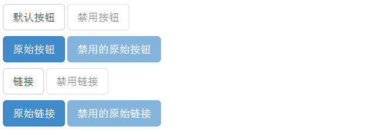

# Bootstrap 按钮

本章将通过实例讲解如何使用 Bootstrap 按钮。任何带有 class **.btn** 的元素都会继承圆角灰色按钮的默认外观。但是 Bootstrap 提供了一些选项来定义按钮的样式，具体如下表所示：

| Class | 描述 |
| --- | --- |
| btn | 默认的/标准的按钮。 |
| btn-primary | 提供额外的视觉效果，标识一组按钮中的原始动作。 |
| btn-success | 表示一个成功的或积极的动作。 |
| btn-info | 信息警告消息的上下文按钮。 |
| btn-warning | 表示应谨慎采取的动作。 |
| btn-danger | 表示一个危险的或潜在的负面动作。 |
| btn-link | 并不强调是一个按钮，看起来像一个链接，但同时保持按钮的行为。 |

下面的实例演示了上面所有的按钮 class：

```
<!DOCTYPE html>
<html>
<head>
   <title>Bootstrap 实例 - 按钮选项</title>
   <link href="/bootstrap/css/bootstrap.min.css" rel="stylesheet">
   <script src="/scripts/jquery.min.js"></script>
   <script src="/bootstrap/js/bootstrap.min.js"></script>
</head>
<body>

<!-- 标准的按钮 -->
<button type="button" class="btn btn-default">默认按钮</button>

<!-- 提供额外的视觉效果，标识一组按钮中的原始动作 -->
<button type="button" class="btn btn-primary">原始按钮</button>

<!-- 表示一个成功的或积极的动作 -->
<button type="button" class="btn btn-success">成功按钮</button>

<!-- 信息警告消息的上下文按钮 -->
<button type="button" class="btn btn-info">信息按钮</button>

<!-- 表示应谨慎采取的动作 -->
<button type="button" class="btn btn-warning">警告按钮</button>

<!-- 表示一个危险的或潜在的负面动作 -->
<button type="button" class="btn btn-danger">危险按钮</button>

<!-- 并不强调是一个按钮，看起来像一个链接，但同时保持按钮的行为 -->
<button type="button" class="btn btn-link">链接按钮</button>

</body>
</html>

```

[](/try/tryit.php?filename=bootstrap3-button-options)

结果如下所示：


## 按钮大小

下表列出了获得各种大小按钮的 class：

| Class | 描述 |
| --- | --- |
| .btn-lg | 这会让按钮看起来比较大。 |
| .btn-sm | 这会让按钮看起来比较小。 |
| .btn-xs | 这会让按钮看起来特别小。 |
| .btn-block | 这会创建块级的按钮，会横跨父元素的全部宽度。 |

下面的实例演示了上面所有的按钮 class：

```
<!DOCTYPE html>
<html>
<head>
   <title>Bootstrap 实例 - 按钮大小</title>
   <link href="/bootstrap/css/bootstrap.min.css" rel="stylesheet">
   <script src="/scripts/jquery.min.js"></script>
   <script src="/bootstrap/js/bootstrap.min.js"></script>
</head>
<body>

<p>
   <button type="button" class="btn btn-primary btn-lg">
      大的原始按钮
   </button>
   <button type="button" class="btn btn-default btn-lg">
      大的按钮
   </button>
</p>
<p>
   <button type="button" class="btn btn-primary">
      默认大小的原始按钮
   </button>
   <button type="button" class="btn btn-default">
      默认大小的按钮
   </button>
</p>
<p>
   <button type="button" class="btn btn-primary btn-sm">
      小的原始按钮
   </button>
   <button type="button" class="btn btn-default btn-sm">
      小的按钮
   </button>
</p>
<p>
   <button type="button" class="btn btn-primary btn-xs">
      特别小的原始按钮
   </button>
   <button type="button" class="btn btn-default btn-xs">
      特别小的按钮
   </button>
</p>
<p>
   <button type="button" class="btn btn-primary btn-lg btn-block">
      块级的原始按钮
   </button>
   <button type="button" class="btn btn-default btn-lg btn-block">
      块级的按钮
   </button>
</p>

</body>
</html>

```

[](/try/tryit.php?filename=bootstrap3-button-size)

结果如下所示：


## 按钮状态

Bootstrap 提供了激活、禁用等按钮状态的 class，下面将进行详细讲解。

### 激活状态

按钮在激活时将呈现为被按压的外观（深色的背景、深色的边框、阴影）。

下表列出了让按钮元素和锚元素呈激活状态的 class：

| 元素 | Class |
| --- | --- |
| 按钮元素 | 添加 **.active** class 来显示它是激活的。 |
| 锚元素 | 添加 **.active** class 到 &lt;a&gt; 按钮来显示它是激活的。 |

下面的实例演示了这点：

```
<!DOCTYPE html>
<html>
<head>
   <title>Bootstrap 实例 - 按钮激活状态</title>
   <link href="/bootstrap/css/bootstrap.min.css" rel="stylesheet">
   <script src="/scripts/jquery.min.js"></script>
   <script src="/bootstrap/js/bootstrap.min.js"></script>
</head>
<body>

<p>
   <button type="button" class="btn btn-default btn-lg ">
      默认按钮
   </button>
   <button type="button" class="btn btn-default btn-lg active">
      激活按钮
   </button>
</p>
<p>
   <button type="button" class="btn btn-primary btn-lg ">
      原始按钮
   </button>
   <button type="button" class="btn btn-primary btn-lg active">
      激活的原始按钮
   </button>
</p>

</body>
</html>

```

[](/try/tryit.php?filename=bootstrap3-button-activestate)

结果如下所示：


### 禁用状态

当您禁用一个按钮时，它的颜色会变淡 50%，并失去渐变。

下表列出了让按钮元素和锚元素呈禁用状态的 class：

| 元素 | Class |
| --- | --- |
| 按钮元素 | 添加 **disabled** _属性_ 到 &lt;button&gt; 按钮。 |
| 锚元素 | 添加 **disabled** _class_ 到 &lt;a&gt; 按钮。 _注意：该 class 只会改变 &lt;a&gt; 的外观，不会改变它的功能。在这里，您需要使用自定义的 JavaScript 来禁用链接。_ |

下面的实例演示了这点：

```
<!DOCTYPE html>
<html>
<head>
   <title>Bootstrap 实例 - 按钮禁用状态</title>
   <link href="/bootstrap/css/bootstrap.min.css" rel="stylesheet">
   <script src="/scripts/jquery.min.js"></script>
   <script src="/bootstrap/js/bootstrap.min.js"></script>
</head>
<body>

<p>
   <button type="button" class="btn btn-default btn-lg">
      默认按钮
   </button>
   <button type="button" class="btn btn-default btn-lg" disabled="disabled">
      禁用按钮
   </button>
</p>
<p>
   <button type="button" class="btn btn-primary btn-lg ">
      原始按钮
   </button>
   <button type="button" class="btn btn-primary btn-lg" disabled="disabled">
      禁用的原始按钮
   </button>
</p>
<p>
   <a href="#" class="btn btn-default btn-lg" role="button">
      链接
   </a>
   <a href="#" class="btn btn-default btn-lg disabled" role="button">
      禁用链接
   </a>
</p>
<p>
   <a href="#" class="btn btn-primary btn-lg" role="button">
      原始链接
   </a>
   <a href="#" class="btn btn-primary btn-lg disabled" role="button">
      禁用的原始链接
   </a>
</p>

</body>
</html>

```

[](/try/tryit.php?filename=bootstrap3-button-disabledstate)

结果如下所示：



## 按钮标签

您可以在 &lt;a&gt;、&lt;button&gt; 或 &lt;input&gt; 元素上使用按钮 class。但是建议您在 &lt;button&gt; 元素上使用按钮 class，避免跨浏览器的不一致性问题。

下面的实例演示了这点：

```
<!DOCTYPE html>
<html>
<head>
   <title>Bootstrap 实例 - 按钮标签</title>
   <link href="/bootstrap/css/bootstrap.min.css" rel="stylesheet">
   <script src="/scripts/jquery.min.js"></script>
   <script src="/bootstrap/js/bootstrap.min.js"></script>
</head>
<body>

<a class="btn btn-default" href="#" role="button">链接</a>
<button class="btn btn-default" type="submit">按钮</button>
<input class="btn btn-default" type="button" value="输入">
<input class="btn btn-default" type="submit" value="提交">

</body>
</html>

```

[](/try/tryit.php?filename=bootstrap3-button-tags)

结果如下所示：


