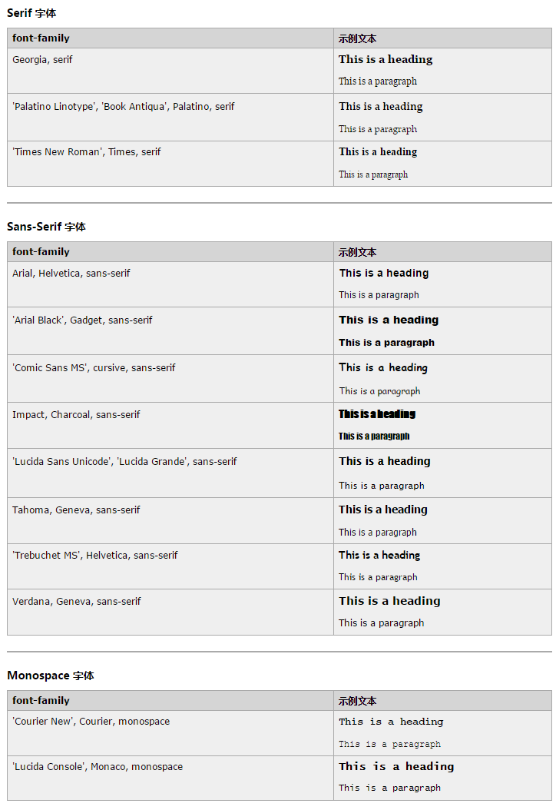

# CSS 网络安全字体组合

## 常用的字体组合

font-family 属性应该使用若干种字体名称作为回退系统，以确保浏览器/操作系统之间的最大兼容性。如果浏览器不支持第一个字体，则会尝试下一个。

请以您喜欢的字体开始，并以通用字体系列结束，以便使浏览器在通用系统中挑选相似的字体，如果没有其他字体可用的话：

### 实例

```
p{font-family:'Times New Roman', Times, serif}
```


下面是最常用的字体组合，根据通用系统进行汇总：


