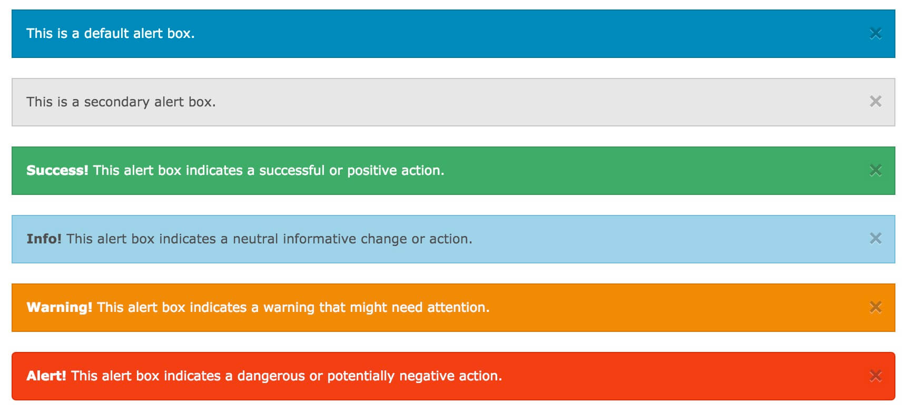

# Foundation 提醒框

Foundation 可以很简单的创建一个提醒框：



提醒框可以使用 `.alert-box` 类创建, 可以添加可选的类： `.secondary`, `.success`, `.info`, `.warning` 或 `.alert`:

### 实例

```
<div data-alert class="alert-box">
  This is a default alert box.
</div>

<div data-alert class="alert-box secondary">
  This is a secondary alert box.
</div>

<div data-alert class="alert-box success">
  <strong>Success!</strong> This alert box indicates a successful or positive action.
</div>

<div data-alert class="alert-box info">
  <strong>Info!</strong> This alert box indicates a neutral informative change or action.
</div>

<div data-alert class="alert-box warning">
  <strong>Warning!</strong> This alert box indicates a warning that might need attention.
</div>

<div data-alert class="alert-box alert">
  <strong>Alert!</strong> This alert box indicates a dangerous or potentially negative action.
</div>

```

> 

> 提醒框的宽度为容器的 100%。

## 圆角提醒框

`.radius` 和 `.round` 类用于为提醒框添加圆角：

### 实例

```
<div data-alert class="alert-box success radius">
  <strong>Success!</strong> Alert box with a radius.
</div>

<div data-alert class="alert-box info round">
  <strong>Info!</strong> Alert box that is rounded.
</div>
```

## 关闭提醒框

要关闭提醒框，可以在连接或按钮元素上添加 `class="close"` 类，并初始化 Foundation JS:

### 实例

```
<div data-alert class="alert-box">
  This is a default alert box with closing functionality.
  <a href="#" class="close">&times;</a>
</div>

<script>
// Initialize Foundation JS For Functionality
$(document).ready(function() {
    $(document).foundation();
})
</script>

```

> 

> &times; (×) 是一个 HTML 字符实体表示一个关闭按钮的图标，而不是字母 "x"。
