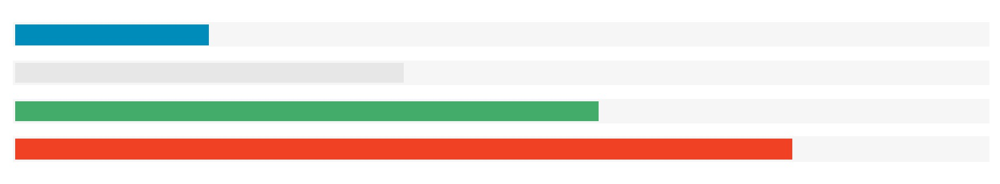

# Foundation 进度条

Foundation 进度条可以作为程序处理的程度来显示：



我们可以在 `&lt;div&gt;` 元素中使用 `.progress` 类来创建进度条， `.meter` 类用于子元素(&lt;span&gt;)。我们可以在 &lt;span&gt; 元素中设置进度百分比，如下所示：

### 实例

```
<div class="progress">
  <span class="meter" style="width:70%"></span>
</div>
```

## 进度条颜色

默认情况下，进度条颜色为蓝色。不同颜色的类为：`.secondary`, `.success`, 或 `.alert`:

### 实例

```
<div class="progress">
  <span class="meter" style="width:50%"></span>
</div>

<div class="progress secondary">
  <span class="meter" style="width:50%"></span>
</div>

<div class="progress success">
  <span class="meter" style="width:50%"></span>
</div>

<div class="progress alert">
  <span class="meter" style="width:50%"></span>
</div>
```

## 圆角进度条

`.radius` 和 `.round` 类用于为进度条添加圆角效果：

### 实例

```
<div class="progress">
  <span class="meter" style="width:50%"></span>
</div>

<div class="progress radius">
  <span class="meter" style="width:50%"></span>
</div>

<div class="progress rounded">
  <span class="meter" style="width:50%"></span>
</div>
```

## 进度条尺寸

可以使用 `.small-_num_` 或 `.large-_num_` 来修改进度条的宽度， _num_ 是一个数字在 1(8.33%) 和 12(default (100%)) 之间:

### 实例

```
<div class="progress large-1">
  <span class="meter" style="width:50%"></span>
</div>

<div class="progress large-6">
  <span class="meter" style="width:50%"></span>
</div>

<div class="progress large-9">
  <span class="meter" style="width:50%"></span>
</div>

<div class="progress large-11">
  <span class="meter" style="width:50%"></span>
</div>

<!-- Default width -->
<div class="progress large-12">
  <span class="meter" style="width:50%"></span>
</div>
```

## 进度条标签

可以使用 CSS 为进度条添加标签。以下实例中我们添加了&lt;span&gt; 元素来显示百分比：

### 实例

```
 <style>
.percentage {
  position: absolute;
  top: 50%;
  left: 50%;
  color: white;
  transform: translate(-50%, -50%);
  font-size: 12px;
}
</style>

<div class="progress">
  <span class="meter" style="position:relative;width:75%">
    <span class="percentage">75%</span>
  </span>
</div>

<div class="progress success">
  <span class="meter" style="position:relative;width:50%">
    <span class="percentage">50%</span>
  </span>
</div>

<div class="progress alert">
  <span class="meter" style="position:relative;width:25%">
    <span class="percentage">25%</span>
  </span>
</div>

```

 