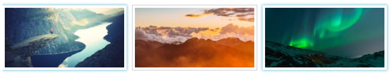

# Foundation 图片

Foundation 提供了响应式的图片，可以创建缩略图喝图片弹窗：



## 缩略图

在 `&lt;img&gt;` 元素外添加 `&lt;a&gt;` 元素将图片作为一个锚链接。

在 `&lt;a&gt;` 标签中添加 `.th` 类将图片设置为缩略图。 鼠标移动到上面会显示一个浅蓝色外框:

### 实例

```
<a href="paris.jpg" class="th">
  
</a>
```

> 

>  **响应式图片**

> Foundation 中图片默认是响应式的。我们可以在实例页面重置浏览器大小来查看图片缩放效果。

## 圆角图片

我们可以在 `.th` 类添加 `.radius` 类来设置圆角缩略图：

### 实例

```
<a href="paris.jpg" class="th radius">
  
</a>
```

## 简洁的弹窗

Foundation 可以很容易实现图片弹窗。

要创建一个弹窗可以在 `&lt;ul&gt;` 元素上添加 `.clearing-thumbs` 类及 `data-clearing` 属性。在 `&lt;ul&gt;` 内添加图片列表。

**注意:** 图片弹窗需要 JavaScript。所以使用它前需要初始化 Foundation JS。

### 实例

```
<ul class="clearing-thumbs" data-clearing>
  <li><a href="rock600x400.jpg" class="th"></a></li>
  <li><a href="skies600x400.jpg" class="th"></a></li>
  <li><a href="lights600x400.jpg" class="th"></a></li>
</ul>

<!-- Initialize Foundation JS -->
<script>
$(document).ready(function() {
    $(document).foundation();
})
</script>
```

## 图片文本描述

可以添加 `data-caption` 属性到每个图片来设置图片的描述:

### 实例

```
<ul class="clearing-thumbs" data-clearing>
  <li><a href="rock600x400.jpg" class="th"></a></li>
  <li><a href="skies600x400.jpg" class="th"></a></li>
  <li><a href="lights600x400.jpg" class="th"></a></li>
</ul>
```

> 

> **提示：** 你可以在 data-caption 属性中添加 HTML 元素，如 data-caption="&lt;h2&gt;Pulpit Rock&lt;/h2&gt;&lt;p&gt;Located in Norway&lt;/p&gt;"

## 只显示一张缩略图

当你需要实现只显示一张缩略图时你可以在 `&lt;ul&gt;` 中使用 `.clearing-feature` 类并在`&lt;li&gt;` 中使用 `.clearing-featured-img` 类。

### 实例

```
<ul class="clearing-thumbs clearing-feature" data-clearing>
  <li><a href="rock600x400.jpg" class="th"></a></li>
  <li><a href="skies600x400.jpg" class="th"></a></li>
  <li class="clearing-featured-img"><a href="lights600x400.jpg" class="th"></a></li>
</ul>
```
