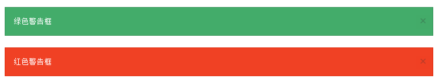

# Foundation 5 简介


Foundation 用于开发响应式的 HTML, CSS and JavaScript 框架。

Foundation 是一个易用、强大而且灵活的框架,用于构建基于任何设备上的 Web 应用。

Foundation 是一个以移动优先的流行框架。

## 在线实例

菜鸟教程包含了上百个 Foundation 实例。

你可以直接使用我们的在线编辑器，并点击"提交运行"按钮查看结果：

### Foundation 实例

```
<div class="row">
  <div class="medium-12 columns">
    <div class="panel">
      <h1>Foundation Page</h1>
      <p>Resize this responsive page to see the effect!</p>
      <button type="button" class="button small">I Like It!</button>
    </div>
  </div>
</div>

<div class="row">
  <div class="medium-4 columns">
    <h3>Column 1</h3>
    <p>Lorem ipsum..</p>
  </div>
  <div class="medium-4 columns">
    <h3>Column 2</h3>
    <p>Lorem ipsum..</p>
  </div>
  <div class="medium-4 columns">
    <h3>Column 3</h3>
    <p>Lorem ipsum..</p>
  </div>
</div>
```

点击"尝试一下"按钮查看在线实例。

## Foundation 特性

以下效果为在 iframe 标签中的演示，可以点击"尝试一下"查看在线实例：

### 按钮


### 表格:


### 图片弹窗:


### 警告:



### 网格:


### 进度条:


### 面板:


### 下拉菜单:


### 手风琴效果:

>

### 顶部导航:


### 模态框:


### 开关:


### 滑块:


