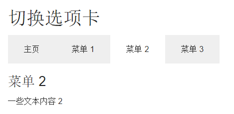

# Foundation 选项卡

选项卡导航可以很好的展示不同的内容，并可以对内容进行切换。



选项卡使用 `&lt;ul class="tabs" data-tab&gt;` 来创建, 各个选项使用 &lt;li&gt; 元素并加上 `.tab-title` 类来创建。

**提示:** 当前选中项可以使用 `.active` 类。

### 实例

```
<ul class="tabs" data-tab>
  <li class="tab-title active"><a href="#">Home</a></li>
  <li class="tab-title"><a href="#">Menu 1</a></li>
  <li class="tab-title"><a href="#">Menu 2</a></li>
  <li class="tab-title"><a href="#">Menu 3</a></li>
</ul>
```

## 垂直的选项卡

垂直选项卡可以使用 `.vertical` 类:

### 实例

```
<ul class="tabs vertical" data-tab>
```

## 切换选项卡

如果要设置切换标签，可以使用 &lt;div&gt; 元素加上 `.content` 类。每个选项卡上加上唯一的 ID, 并连接到列表项 (&lt;a href="#menu1" 将打开 id="menu1" 的选项内容)。最后将所有的选项内容放在 `&lt;div&gt;` 元素上，该 `&lt;div&gt;` 元素需要添加 `.tabs-content` 类，并初始化 Foundation JS。

注意 `.active` 类会自动添加到当前选中的选项卡上：

### 实例

```
<ul class="tabs" data-tab>
  <li class="tab-title active"><a href="#home">Home</a></li>
  <li class="tab-title"><a href="#menu1">Menu 1</a></li>
  <li class="tab-title"><a href="#menu2">Menu 2</a></li>
  <li class="tab-title"><a href="#menu3">Menu 3</a></li>
</ul>
<div class="tabs-content">
  <div class="content active" id="home">
    <h3>HOME</h3>
    <p>Home is where the heart is..</p>
  </div>
  <div class="content" id="menu1">
    <h3>Menu 1</h3>
    <p>Some text, blabla</p>
  </div>
  <div class="content" id="menu2">
    <h3>Menu 2</h3>
    <p>Some other text.</p>
  </div>
  <div class="content" id="menu3">
    <h3>Menu 3</h3>
    <p>Last tab.</p>
  </div>
</div>

<!-- Initialize Foundation JS -->
<script>
$(document).ready(function() {
    $(document).foundation();
})
</script>
```

## 选项卡淡入

使用 CSS 来自定义选项卡淡入的效果：

### 实例

```
.tabs-content > .content.active {
    -webkit-animation: fadeEffect 1s;
    animation: fadeEffect 1s;
}

@-webkit-keyframes fadeEffect {
    from {opacity: 0;}
    to {opacity: 1;}
}

@keyframes fadeEffect {
    from {opacity: 0;}
    to {opacity: 1;}
}
```
