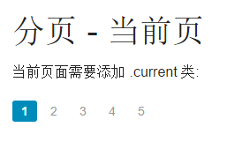

# Foundation 分页

如果你的网页有很多内容，就需要使用分页功能。



要创建一个基础的分页功能需要在 `&lt;ul&gt;` 元素上加上 `.pagination` 类:

### 实例

```
<ul class="pagination">
  <li><a href="#">1</a></li>
  <li><a href="#">2</a></li>
  <li><a href="#">3</a></li>
  <li><a href="#">4</a></li>
  <li><a href="#">5</a></li>
</ul>
```

## 当前页面

可以在 `&lt;li&gt;` 加上 `.current` 类来标注当前页面：

### 实例

```
<ul class="pagination">
  <li class="current"><a href="#">1</a></li>
  <li><a href="#">2</a></li>
  <li><a href="#">3</a></li>
  <li><a href="#">4</a></li>
  <li><a href="#">5</a></li>
</ul>
```

## 禁用分页

如果需要设置某个分页不可点击需要使用 `.unavailable` 类：

### 实例

```
<ul class="pagination">
  <li><a href="#">1</a></li>
  <li><a href="#">2</a></li>
  <li class="unavailable"><a href="#">3</a></li>
  <li><a href="#">4</a></li>
  <li><a href="#">5</a></li>
</ul>
```

## 分页方向

在第一个和最后一个 code&gt;&lt;li&gt; 元素上添加`.arrow` 类插入 HTML 实体符号 `&laquo;` 和 `&raquo;` 来创建分页方向符号：

### 实例

```
<ul class="pagination">
  <li class="arrow"><a href="#">&laquo;</a></li>
  <li><a href="#">1</a></li>
  <li><a href="#">2</a></li>
  <li><a href="#">3</a></li>
  <li><a href="#">4</a></li>
  <li><a href="#">5</a></li>
  <li class="arrow"><a href="#">&raquo;</a></li>
</ul>
```

## 分页居中显示

我们可以在 &lt;ul&gt; 外层添加 `&lt;div&gt;` 元素，并在 `&lt;div&gt;` 上添加`.pagination-centered` 类来实现分页居中显示 :

### 实例

```
<div class="pagination-centered">
  <ul class="pagination">
    <li class="arrow"><a href="#">&laquo;</a></li>
    <li class="current"><a href="#">1</a></li>
    <li><a href="#">2</a></li>
    <li><a href="#">3</a></li>
    <li><a href="#">4</a></li>
    <li><a href="#">5</a></li>
    <li class="arrow"><a href="#">&raquo;</a></li>
  </ul>
</div>
```

## 面包屑导航

面包屑导航用于展示当前页面的导航结构。

在 `&lt;ul&gt;` 元素上添加 `.breadcrumbs` 类来实现面包屑导航。你可以在 &lt;li&gt; 上添加 `.current` 或 `.unavailable` 类设置当前页与不可点击效果:

### 实例

```
<ul class="breadcrumbs">
  <li><a href="#">Home</a></li>
  <li><a href="#">Private</a></li>
  <li class="unavailable"><a href="#">Pictures</a></li>
  <li class="current">Vacation</li>
</ul>
```

## 子导航

在页面切换上，子导航是非常有用的。

在 `&lt;dl&gt;` 元素上添加 `.sub-nav` 类来创建子导航。在 `&lt;dt&gt;` 元素上添加标题，为选中的选项 `&lt;dd&gt;` 添加 `.active` 类:

### 实例

```
<ul class="sub-nav">
  <dt>Filter:</dt>
  <dd class="active"><a href="#">All</a></dd>
  <dd><a href="#">Active</a></dd>
  <dd><a href="#">Pending</a></dd>
  <dd><a href="#">Suspended</a></dd>
</ul>
```
