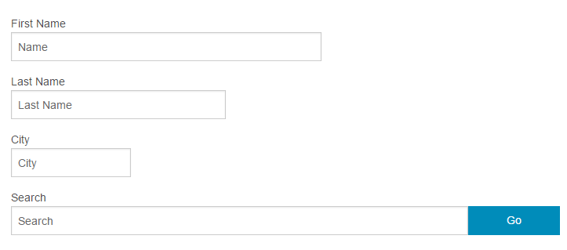

# Foundation 输入框尺寸



使用网格的列来设置输入框的大小，如 `.large-6`, `.medium-6`, 等。

更多网格系统知识，可以点击 [网格系统](foundation-grid-system.html) 教程。

### 实例

```
<form>
  <div class="row">
    <div class="large-10 medium-7 columns">
      <label>large-10 medium-7 (100% on small)
        <input type="text" placeholder="Name">
      </label>
    </div>
  </div>

  <div class="row">
    <div class="small-5 columns">
      <label>small-5
        <input type="text" placeholder="Name">
      </label>
    </div>
  </div>

  <div class="row">
    <div class="medium-3 columns">
      <label>medium-3 (100% on small)
        <input type="text" placeholder="Name">
      </label>
    </div>
  </div>
</form>
```

## 相等大小列

以下演示了相等大小列的实例:

### 实例

```
<form>
  <div class="row">
    <div class="medium-4 columns">
      <label>medium-4 (100% on small, stacked)
        <input type="text" placeholder="Name">
      </label>
    </div>

    <div class="medium-4 columns">
      <label>medium-4 (100% on small, stacked)
        <input type="text" placeholder="Name">
      </label>
    </div>

    <div class="medium-4 columns">
      <label>medium-4 (100% on small, stacked)
        <input type="text" placeholder="Name">
      </label>
    </div>
  </div>
</form>
```

## 内联标签

如果你希望你的标签内容显示在左边（不是上边），可以将标签元素 label 放在输入框左边的不同的列上，并使用 `.inline` 类来设置垂直居中:

### 实例

```
<form>
  <div class="row">
    <div class="small-8">
      <div class="row">
        <div class="small-3 columns">
          <label for="name" class="inline right">Name</label>
        </div>
        <div class="small-9 columns">
          <input type="text" id="name" placeholder="First Name..">
        </div>
      </div>
    </div>
  </div>
</form>
```

## 前置和后置标签

你可以在 `&lt;div class="row collapse"&gt;` 中添加前置和后置标签，元素为： `&lt;_element_ class="postfix"&gt;` 或 `&lt;_element_ class="prefix"&gt;`。可以使用网格系统来设置前置和后置标签的大小：

### 实例

```
<form>
  <div class="row">
    <div class="large-6 columns">
      <div class="row collapse prefix-radius">
        <div class="small-3 columns">
          <span class="prefix">Prefix</span>
        </div>
        <div class="small-9 columns">
          <input type="text" placeholder="Value">
        </div>
      </div>
    </div>
    <div class="large-6 columns">
      <div class="row collapse postfix-radius">
        <div class="small-9 columns">
          <input type="text" placeholder="Value">
        </div>
        <div class="small-3 columns">
          <span class="postfix">Postfix</span>
        </div>
      </div>
    </div>
  </div>
</form>
```

### 前置和后置标签按钮

可以使用 `&lt;a&gt;` 元素添加 `.button` 类来设置前置和后置按钮:

### 实例

```
<a href="#" class="postfix button">Go</a>
```

### 前置和后置标签圆角按钮

### 实例

```
<form>
  <div class="row">
    <div class="large-6 columns">
      <div class="row collapse prefix-radius">
        <div class="small-3 columns">
          <span class="prefix">Prefix</span>
        </div>
        <div class="small-9 columns">
          <input type="text" placeholder="Value">
        </div>
      </div>
    </div>
    <div class="large-6 columns">
      <div class="row collapse postfix-radius">
        <div class="small-9 columns">
          <input type="text" placeholder="Value">
        </div>
        <div class="small-3 columns">
          <span class="postfix">Postfix</span>
        </div>
      </div>
    </div>
  </div>
  <div class="row">
    <div class="large-6 columns">
      <div class="row collapse prefix-round">
        <div class="small-3 columns">
          <a href="#" class="button prefix">Go</a>
        </div>
        <div class="small-9 columns">
          <input type="text" placeholder="Value">
        </div>
      </div>
    </div>
    <div class="large-6 columns">
      <div class="row collapse postfix-round">
        <div class="small-9 columns">
          <input type="text" placeholder="Value">
        </div>
        <div class="small-3 columns">
          <a href="#" class="button postfix">Go</a>
        </div>
      </div>
    </div>
  </div>
</form>
```
