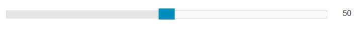

# Foundation 滑块

Foundation 滑块允许用户通过拖动来选取区间值:



滑块可以通过使用 `&lt;div class="range-slider" data-slider&gt;` 创建。在 `&lt;div&gt;` 内, 添加两个 `&lt;span&gt;` 元素: `&lt;span class="range-slider-handle"&gt;` 创建矩形滑块（蓝色背景）， `&lt;span class="range-slider-active-segment"&gt;` 是在滑块后的灰色横条，是滑块拖动区域。

**注意:** 滑块需要使用 JavaScript。所以你需要初始化 oundation JS:

### 实例

```
<div class="range-slider" data-slider>
  <span class="range-slider-handle"></span>
  <span class="range-slider-active-segment"></span>
</div>

<!-- Initialize Foundation JS -->
<script>
$(document).ready(function() {
    $(document).foundation();
})
</script>
```

## 圆角和禁用滑块

使用 `.radius` 和 `.round` 类来添加圆角滑块。使用 `.disabled` 类来禁用滑块：

### 实例

```
<div class="range-slider" data-slider>..</div>
<div class="range-slider radius" data-slider>...</div>
<div class="range-slider round" data-slider>...</div>
<div class="range-slider disabled" data-slider>...</div>

```

## 垂直滑块

使用 `.vertical-range` 类和 `data-options="vertical: true;"` 来创建垂直滑块:

### 实例

```
<div class="range-slider vertical-range" data-slider data-options="vertical: true;">
  <span class="range-slider-handle"></span>
  <span class="range-slider-active-segment"></span>
</div>

```

## 滑块值

默认情况下，滑块放在横条的中间 (数值为 "50")。可以通过添加 `data-options="initial: _num_"` 属性来修改默认值:

### 实例

```
<div class="range-slider" data-slider data-options="initial: 80;">
  <span class="range-slider-handle"></span>
  <span class="range-slider-active-segment"></span>
</div>

```

### 显示滑块值

如果我们需要在滑块拖动时实时显示值，可以通过在 `&lt;div&gt;` 中添加 `data-options="display_selector:#_id_"` 属性且元素 id 值与滑块的 id 匹配，如下实例：

### 实例

```
<!-- Display the slider value in this span -->
<span id="mySlider"></span>

<div class="range-slider" data-slider data-options="display_selector: #mySlider;">
  <span class="range-slider-handle"></span>
  <span class="range-slider-active-segment"></span>
</div>

```

### 组合数据选项

以下实例使用了 `display_selector` 和 `initial` 数据选项:

### 实例

```
<span id="mySlider"></span>
<div class="range-slider" data-slider data-options="display_selector: #mySlider; initial: 20;">
 <span class="range-slider-handle"></span>
  <span class="range-slider-active-segment"></span>
</div>

```

### 步长

默认情况下，滑块滑动的增加减少的数量为 "1"。可以通过添加 `data-options="step: _num_;"` 属性来修改步长值。实例中设置为 25:

### 实例

```
<span id="mySlider"></span>
<div class="range-slider" data-slider data-options="display_selector: #mySlider; step: 25;">
  <span class="range-slider-handle"></span>
  <span class="range-slider-active-segment"></span>
</div>

```

### 自定义区间

默认情况下，区间值在 "0" 到 "100"。可以通过添加 data-options `start` 和 `end` 来设置区间值。以下实例设置区间值为 "1" 到 "20":

### 实例

```
<span id="mySlider"></span>
<div class="range-slider" data-slider data-options="display_selector: #mySlider; start: 1; end: 20;">
  <span class="range-slider-handle"></span>
  <span class="range-slider-active-segment"></span>
</div>

```

### 使用网格

以下使用为在网格中使用滑块：

### 实例

```
<div class="row">
  <div class="small-10 columns">
    <div class="range-slider" data-slider data-options="display_selector: #mySlider;">
      <span class="range-slider-handle"></span>
      <span class="range-slider-active-segment"></span>
    </div>
  </div>
  <div class="small-2 columns">
    <!-- The display element (Tip: use CSS to perfectly position it) -->
    <span id="mySlider" style="display:block;margin-top:14px;"></span>
  </div>
</div>

```

### 使用 Input

以下实例使用 `&lt;input&gt;` 取代 `&lt;span&gt;` 来显示滑块的值:

### 实例

```
<div class="row">
  <div class="small-10 columns">
    <div class="range-slider" data-slider data-options="display_selector: #mySlider; initial: 72;">
      <span class="range-slider-handle"></span>
      <span class="range-slider-active-segment"></span>
    </div>
  </div>
  <div class="small-2 columns">
    <!-- The display element (Tip: use CSS to perfectly position it) -->
    <input type="number" id="mySlider" style="margin-top:7px;" value="72">
  </div>
</div>

```
