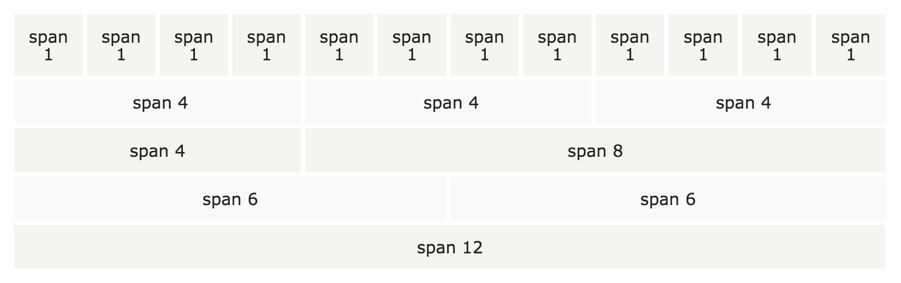

# Foundation 网格系统

Foundation 网格系统为 12 列。

如果你不需要 12 列，你可以合并一些列，创建一些更大宽度的列。



Foundation 的网格系统是响应式的。 列会根据屏幕尺寸自动调整大小。在大尺寸屏幕上，可能是三列，小屏幕尺寸就可能是三个单列，按顺序排列。

## 网格列

Foundation 网格系统有三个列：

*   `.small` (手机端)
*   `.medium` (平板设备)
*   `.large` (电脑设备：笔记本，台式机)

以上类可以结合使用，创建更灵活的布局

## 基本的网格结构

以下是基本的 Foundation 网格结构实例:

### 实例

```
<div class="row">
  <div class="small|medium|large-_num_ columns"></div>
</div>
<div class="row">
  <div class="small|medium|large-_num_ columns"></div>
  <div class="small|medium|large-_num_ columns"></div>
  <div class="small|medium|large-_num_ columns"></div>
</div>
<div class="row">
  ...
</div>
```

首先，创建一行 (`&lt;div class="row"&gt;`)。 这是一个水平的垂直列。然后添加列的数量说明 `small-_num_`, `medium-_num_` 及 `large-_num_` 类。注意：列的数量 `_num_` 加起来必须等于 12 :

### 实例

```
<div class="row">
  <div class="small-12 columns">.small-12 yellow</div>
</div>
<div class="row">
  <div class="small-8 columns">.small-8 beige</div>
  <div class="small-4 columns">.small-4 gray</div>
</div>
<div class="row">
  <div class="large-9 small-8 columns">.small-8 .large-9 pink</div>
  <div class="large-3 small-4 columns">.small-4 .large-3 orange</div>
</div>

```

实例中，第一行的 &lt;div&gt; 类为 `.small-12`, 这会创建 12 列（100%宽度）。

第二行创建了两个列， `.small-4` 的宽度为33.3% ，`.small-8` 的宽度为 66.6%。

第三行我们添加了额外的两个列 (`.large-3` 和 `.large-9`)。这意味着如果在大屏幕尺寸下，列就会变为 25% (`.large-3`) 和 75% (`.large-9`)的比例。同时我们也指定了小屏幕上列的比例 33% (`.small-4`) 和 66% (`.small-8`) 。这种组合的方式对于不同屏幕显示效果是非常有帮助的。

## 网格选项

下表总结了 Foundation 网格系统在多个设备上的说明：

| | 小型设备 | 中等设备 | 大设备 |
| --- | --- | --- | --- |
| | Phones (&lt;40.0625em (640px)) | Tablets (&gt;=40.0625em (640px)) | Laptops & Desktops (&gt;=64.0625em (1025px)) |
| **网格行为** | 一直是水平的 | 以折叠开始，断点以上是水平的 | 以折叠开始，断点以上是水平的 |
| **类前缀** | .small-* | .medium-* | .large-* |
| **类的数量** | 12 | 12 | 12 |
| **可内嵌** | Yes | Yes | Yes |
| **偏移量** | Yes | Yes | Yes |
| **列排序** | Yes | Yes | Yes |

## 宽屏

网格最大(`.row`) 宽度为 62.5rem。在宽屏上，当宽度大于 62.5rem, 列不会跨越页面的宽度， 即使宽度设定为 100%。但你可以通过 CSS 重新设置 max-width:

### 实例

```
<style>
.row {
    max-width: 100%;
}
</style>

```

如果你使用默认的 max-width, 但希望背景颜色跨越整个页面宽度，你可以使用 `.row` 包裹整个容器，并指定你需要的背景颜色:

### 实例

```
<div style="background-color:coral;padding:25px;">
  <div class="row">
    <div class="small-6 columns" style="background-color:yellow;">.small-6</div>
    <div class="small-6 columns" style="background-color:pink;">.small-6</div>
  </div>
</div>

```
