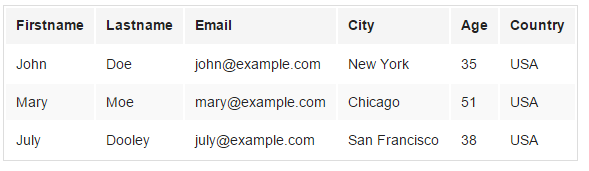

# Foundation 表格

Foundation 的 `&lt;table&gt;` 元素样式为灰色斑马条纹且包含四个边框：



### 实例

```
<table>
  <thead>
    <tr>
      <th>Firstname</th>
      <th>Lastname</th>
      <th>Email</th>
    </tr>
  </thead>
  <tbody>
    <tr>
      <td>John</td>
      <td>Doe</td>
      <td>john@example.com</td>
    </tr>
    <tr>
      <td>Mary</td>
      <td>Moe</td>
      <td>mary@example.com</td>
    </tr>
    <tr>
      <td>July</td>
      <td>Dooley</td>
      <td>july@example.com</td>
    </tr>
  </tbody>
</table>
```

## 响应式表格

使用 CSS 让表格支持响应式设计：在表格外添加 `&lt;div&gt;` 元素，样式为 `overflow-x:hidden`:

### 实例

```
<div style="overflow-x:hidden">
  <table>
    ...
  </table>
</div>
```
