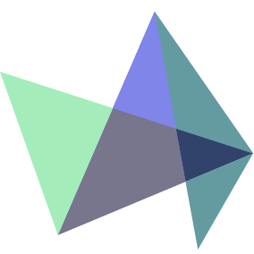

# Highcharts 简介

Highcharts 是一个用纯JavaScript编写的一个图表库。

Highcharts 能够很简单便捷的在web网站或是web应用程序添加有交互性的图表

Highcharts 免费提供给个人学习、个人网站和非商业用途使用。

## HighCharts 特性

*   **兼容性** - 支持所有主流浏览器和移动平台（android、iOS等）。
*   **多设备** - 支持多种设备，如手持设备 iPhone/iPad、平板等。
*   **免费使用** - 开源免费。
*   **轻量** - highcharts.js 内核库大小只有 35KB 左右。
*   **配置简单** - 使用 json 格式配置
*   **动态** - 可以在图表生成后修改。
*   **多维** - 支持多维图表
*   **配置提示工具** - 鼠标移动到图表的某一点上有提示信息。
*   **时间轴** - 可以精确到毫秒。
*   **导出** - 表格可导出为 PDF/ PNG/ JPG / SVG 格式
*   **输出** - 网页输出图表。
*   **可变焦** - 选中图表部分放大，近距离观察图表；
*   **外部数据** - 从服务器载入动态数据。
*   **文字旋转** - 支持在任意方向的标签旋转。

## 支持的图表类型

HighCharts支持的图表类型：

| 序号 | 图表类型 |
| --- | --- |
| 1 | **曲线图** |
| 2 | **区域图** |
| 3 | **饼图** |
| 4 | **散点图** |
| 5 | **气泡图** |
| 6 | **动态图表** |
| 7 | **组合图表** |
| 8 | **3D 图** |
| 9 | **测量图** |
| 10 | **热点图** |
| 11 | **树状图(Treemap)** |

接下来几个章节我们讲为大家具体介绍 Highcharts 的使用。
