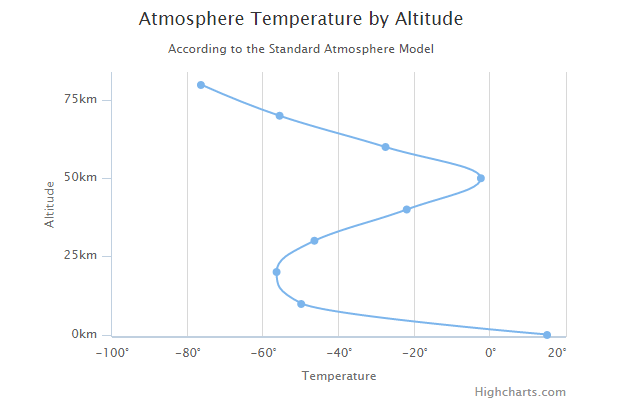

# Highcharts X 轴翻转曲线图

以下实例演示了 X 轴翻转曲线图。

我们在前面的章节已经了解了 Highcharts 配置语法。接下来让我们来看个完整实例：

## 配置

配置图表类型 type 为 spline。chart.type 默认为 "line"。

配置 X 轴翻转。inverted 设置为 true 即 X 轴翻转，默认为 false。

```
chart var chart =  { type:  'spline', inverted:  true  };
```

### 实例

文件名：highcharts_spline_inverted.htm

```
<html>  <head>  <title>Highcharts 教程 | 菜鸟教程(runoob.com)</title>  <script  src="http://apps.bdimg.com/libs/jquery/2.1.4/jquery.min.js"></script>  <script  src="/try/demo_source/highcharts.js"></script>  </head>  <body>  <div  id="container"  style="width:  550px; height:  400px; margin:  0  auto"></div>  <script  language="JavaScript"> $(document).ready(function()  {  var chart =  { type:  'spline', inverted:  true  };  var title =  { text:  'Atmosphere Temperature by Altitude'  };  var subtitle =  { text:  'According to the Standard Atmosphere Model'  };  var xAxis =  { reversed:  false, title:  { enabled:  true, text:  'Altitude'  }, labels:  { formatter:  function  ()  {  return  this.value +  'km';  }  }, maxPadding:  0.05, showLastLabel:  true  };  var yAxis =  { title:  { text:  'Temperature'  }, labels:  { formatter:  function  ()  {  return  this.value +  '\xB0';  }  }, lineWidth:  2  };  var legend =  { enabled:  false  };  var tooltip =  { headerFormat:  '<b>{series.name}</b><br/>', pointFormat:  '{point.x} km: {point.y}\xB0C'  };  var plotOptions =  { spline:  { marker:  { enable:  false  }  }  };  var series=  [{ name:  'Temperature', data:  [[0,  15],  [10,  -50],  [20,  -56.5],  [30,  -46.5],  [40,  -22.1],  [50,  -2.5],  [60,  -27.7],  [70,  -55.7],  [80,  -76.5]]  }];  var json =  {}; json.chart = chart; json.title = title; json.subtitle = subtitle; json.legend = legend; json.tooltip = tooltip; json.xAxis = xAxis; json.yAxis = yAxis; json.series = series; json.plotOptions = plotOptions; $('#container').highcharts(json);  });  </script>  </body>  </html>
```


以上实例输出结果为：


