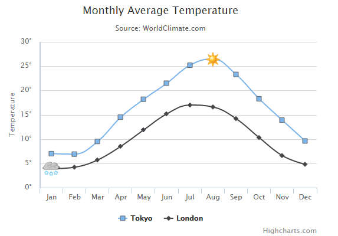

# Highcharts 带标记曲线图

以下实例演示了 带标记曲线图。

我们在前面的章节已经了解了 Highcharts 配置语法。接下来让我们来看下如何配置。

## 配置

我们使用 marker.symbol 属性来配置标记。标记可以是 'square', 'diamond' 或 图片 url。标记可以添加在任何的数据点上：

```
var series=  [{ name:  'Tokyo', marker:  { symbol:  'square'  }, data:  [7.0,  6.9,  9.5,  14.5,  18.2,  21.5,  25.2,  { y:  26.5, marker:  { symbol:  'url(http://www.highcharts.com/demo/gfx/sun.png)'  }  },  23.3,  18.3,  13.9,  9.6]  },  { name:  'London', marker:  { symbol:  'diamond'  }, data:  [{ y:  3.9, marker:  { symbol:  'url(http://www.highcharts.com/demo/gfx/snow.png)'  }  },  4.2,  5.7,  8.5,  11.9,  15.2,  17.0,  16.6,  14.2,  10.3,  6.6,  4.8]  }  ];  
```

### 实例

文件名：highcharts_spline_symbols.htm

```
<html>  <head>  <title>Highcharts 教程 | 菜鸟教程(runoob.com)</title>  <script  src="http://apps.bdimg.com/libs/jquery/2.1.4/jquery.min.js"></script>  <script  src="/try/demo_source/highcharts.js"></script>  </head>  <body>  <div  id="container"  style="width:  550px; height:  400px; margin:  0  auto"></div>  <script  language="JavaScript"> $(document).ready(function()  {  var chart =  { type:  'spline'  };  var title =  { text:  'Monthly Average Temperature'  };  var subtitle =  { text:  'Source: WorldClimate.com'  };  var xAxis =  { categories:  ['Jan',  'Feb',  'Mar',  'Apr',  'May',  'Jun',  'Jul',  'Aug',  'Sep',  'Oct',  'Nov',  'Dec']  };  var yAxis =  { title:  { text:  'Temperature'  }, labels:  { formatter:  function  ()  {  return  this.value +  '\xB0';  }  }, lineWidth:  2  };  var tooltip =  { crosshairs:  true, shared:  true  };  var plotOptions =  { spline:  { marker:  { radius:  4, lineColor:  '#666666', lineWidth:  1  }  }  };  var series=  [{ name:  'Tokyo', marker:  { symbol:  'square'  }, data:  [7.0,  6.9,  9.5,  14.5,  18.2,  21.5,  25.2,  { y:  26.5, marker:  { symbol:  'url(http://www.highcharts.com/demo/gfx/sun.png)'  }  },  23.3,  18.3,  13.9,  9.6]  },  { name:  'London', marker:  { symbol:  'diamond'  }, data:  [{ y:  3.9, marker:  { symbol:  'url(http://www.highcharts.com/demo/gfx/snow.png)'  }  },  4.2,  5.7,  8.5,  11.9,  15.2,  17.0,  16.6,  14.2,  10.3,  6.6,  4.8]  }  ];  var json =  {}; json.chart = chart; json.title = title; json.subtitle = subtitle; json.tooltip = tooltip; json.xAxis = xAxis; json.yAxis = yAxis; json.series = series; json.plotOptions = plotOptions; $('#container').highcharts(json);  });  </script>  </body>  </html>
```


以上实例输出结果为：


