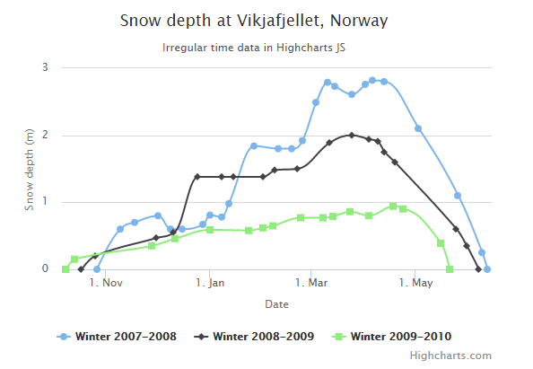

# Highcharts 时间间隔图表

以下实例演示了时间间隔图表。

我们在前面的章节已经了解了 Highcharts 配置语法。接下来让我们来看下如何配置。

### 实例

文件名：highcharts_spline_time.htm

```
<html>  <head>  <title>Highcharts 教程 | 菜鸟教程(runoob.com)</title>  <script  src="http://apps.bdimg.com/libs/jquery/2.1.4/jquery.min.js"></script>  <script  src="/try/demo_source/highcharts.js"></script>  </head>  <body>  <div  id="container"  style="width:  550px; height:  400px; margin:  0  auto"></div>  <script  language="JavaScript"> $(document).ready(function()  {  var chart =  { type:  'spline'  };  var title =  { text:  'Snow depth at Vikjafjellet, Norway'  };  var subtitle =  { text:  'Irregular time data in Highcharts JS'  };  var xAxis =  { type:  'datetime', dateTimeLabelFormats:  {  // don't display the dummy year month:  '%e. %b', year:  '%b'  }, title:  { text:  'Date'  }  };  var yAxis =  { title:  { text:  'Snow depth (m)'  }, min:  0  };  var tooltip =  { headerFormat:  '<b>{series.name}</b><br>', pointFormat:  '{point.x:%e. %b}: {point.y:.2f} m'  };  var plotOptions =  { spline:  { marker:  { enabled:  true  }  }  };  var series=  [{ name:  'Winter 2007-2008',  // Define the data points. All series have a dummy year  // of 1970/71 in order to be compared on the same x axis. Note  // that in JavaScript, months start at 0 for January, 1 for February etc. data:  [  [Date.UTC(1970,  9,  27),  0  ],  [Date.UTC(1970,  10,  10),  0.6  ],  [Date.UTC(1970,  10,  18),  0.7  ],  [Date.UTC(1970,  11,  2),  0.8  ],  [Date.UTC(1970,  11,  9),  0.6  ],  [Date.UTC(1970,  11,  16),  0.6  ],  [Date.UTC(1970,  11,  28),  0.67],  [Date.UTC(1971,  0,  1),  0.81],  [Date.UTC(1971,  0,  8),  0.78],  [Date.UTC(1971,  0,  12),  0.98],  [Date.UTC(1971,  0,  27),  1.84],  [Date.UTC(1971,  1,  10),  1.80],  [Date.UTC(1971,  1,  18),  1.80],  [Date.UTC(1971,  1,  24),  1.92],  [Date.UTC(1971,  2,  4),  2.49],  [Date.UTC(1971,  2,  11),  2.79],  [Date.UTC(1971,  2,  15),  2.73],  [Date.UTC(1971,  2,  25),  2.61],  [Date.UTC(1971,  3,  2),  2.76],  [Date.UTC(1971,  3,  6),  2.82],  [Date.UTC(1971,  3,  13),  2.8  ],  [Date.UTC(1971,  4,  3),  2.1  ],  [Date.UTC(1971,  4,  26),  1.1  ],  [Date.UTC(1971,  5,  9),  0.25],  [Date.UTC(1971,  5,  12),  0  ]  ]  },  { name:  'Winter 2008-2009', data:  [  [Date.UTC(1970,  9,  18),  0  ],  [Date.UTC(1970,  9,  26),  0.2  ],  [Date.UTC(1970,  11,  1),  0.47],  [Date.UTC(1970,  11,  11),  0.55],  [Date.UTC(1970,  11,  25),  1.38],  [Date.UTC(1971,  0,  8),  1.38],  [Date.UTC(1971,  0,  15),  1.38],  [Date.UTC(1971,  1,  1),  1.38],  [Date.UTC(1971,  1,  8),  1.48],  [Date.UTC(1971,  1,  21),  1.5  ],  [Date.UTC(1971,  2,  12),  1.89],  [Date.UTC(1971,  2,  25),  2.0  ],  [Date.UTC(1971,  3,  4),  1.94],  [Date.UTC(1971,  3,  9),  1.91],  [Date.UTC(1971,  3,  13),  1.75],  [Date.UTC(1971,  3,  19),  1.6  ],  [Date.UTC(1971,  4,  25),  0.6  ],  [Date.UTC(1971,  4,  31),  0.35],  [Date.UTC(1971,  5,  7),  0  ]  ]  },  { name:  'Winter 2009-2010', data:  [  [Date.UTC(1970,  9,  9),  0  ],  [Date.UTC(1970,  9,  14),  0.15],  [Date.UTC(1970,  10,  28),  0.35],  [Date.UTC(1970,  11,  12),  0.46],  [Date.UTC(1971,  0,  1),  0.59],  [Date.UTC(1971,  0,  24),  0.58],  [Date.UTC(1971,  1,  1),  0.62],  [Date.UTC(1971,  1,  7),  0.65],  [Date.UTC(1971,  1,  23),  0.77],  [Date.UTC(1971,  2,  8),  0.77],  [Date.UTC(1971,  2,  14),  0.79],  [Date.UTC(1971,  2,  24),  0.86],  [Date.UTC(1971,  3,  4),  0.8  ],  [Date.UTC(1971,  3,  18),  0.94],  [Date.UTC(1971,  3,  24),  0.9  ],  [Date.UTC(1971,  4,  16),  0.39],  [Date.UTC(1971,  4,  21),  0  ]  ]  }  ];  var json =  {}; json.chart = chart; json.title = title; json.subtitle = subtitle; json.tooltip = tooltip; json.xAxis = xAxis; json.yAxis = yAxis; json.series = series; json.plotOptions = plotOptions; $('#container').highcharts(json);  });  </script>  </body>  </html>
```


以上实例输出结果为：


