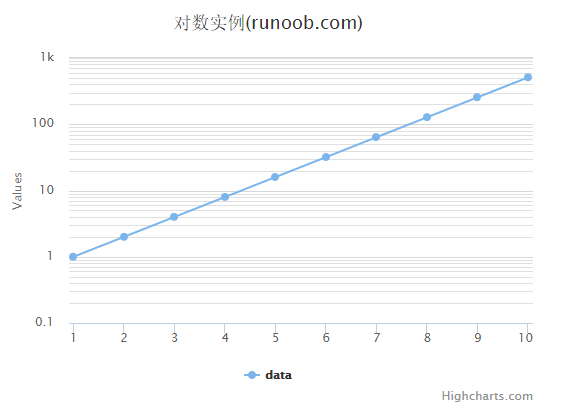

# Highcharts 对数图表

以下实例演示了对数图表。

我们在前面的章节已经了解了 Highcharts 配置语法。接下来让我们来看下如何配置。

## 配置

配置 yAxis.type 为 'logarithmic'。它定义了 x 轴类型。可选值有 "linear", "logarithmic", "datetime" 或 "category"。默认值为linear。

```
yAxis var yAxis =  { type:  'logarithmic', minorTickInterval:  0.1  };
```

### 实例

文件名：highcharts_line_logarithmic.htm

```
<html>  <head>  <title>Highcharts 教程 | 菜鸟教程(runoob.com)</title>  <script  src="http://apps.bdimg.com/libs/jquery/2.1.4/jquery.min.js"></script>  <script  src="/try/demo_source/highcharts.js"></script>  </head>  <body>  <div  id="container"  style="width:  550px; height:  400px; margin:  0  auto"></div>  <script  language="JavaScript"> $(document).ready(function()  {  var title =  { text:  '对数实例(runoob.com)'  };  var xAxis =  { tickInterval:  1  };  var yAxis =  { type:  'logarithmic', minorTickInterval:  0.1  };  var tooltip =  { headerFormat:  '<b>{series.name}</b><br>', pointFormat:  'x = {point.x}, y = {point.y}'  };  var plotOptions =  { spline:  { marker:  { enabled:  true  }  }  };  var series=  [{ name:  'data', data:  [1,  2,  4,  8,  16,  32,  64,  128,  256,  512], pointStart:  1  }  ];  var json =  {}; json.title = title; json.tooltip = tooltip; json.xAxis = xAxis; json.yAxis = yAxis; json.series = series; json.plotOptions = plotOptions; $('#container').highcharts(json);  });  </script>  </body>  </html>
```


以上实例输出结果为：


