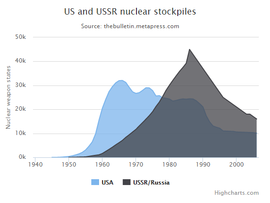

# Highcharts 基本区域图

以下实例演示了基础区域图。

我们在前面的章节已经了解了 Highcharts 基本配置语法。接下来让我们来看下其他的配置：

## 配置

### chart

chart.type 配置项用于设定图表类型，默认为 "line"，本章节我们使用 'area'。

```
var chart =  { type:  'area'  };
```

### 实例

文件名：highcharts_area_basic.htm

```
<html>  <head>  <title>Highcharts 教程 | 菜鸟教程(runoob.com)</title>  <script  src="http://apps.bdimg.com/libs/jquery/2.1.4/jquery.min.js"></script>  <script  src="/try/demo_source/highcharts.js"></script>  </head>  <body>  <div  id="container"  style="width:  550px; height:  400px; margin:  0  auto"></div>  <script  language="JavaScript"> $(document).ready(function()  {  var chart =  { type:  'area'  };  var title =  { text:  'US and USSR nuclear stockpiles'  };  var subtitle =  { text:  'Source: <a href="http://thebulletin.metapress.com/content/c4120650912x74k7/fulltext.pdf">'  +  'thebulletin.metapress.com</a>'  };  var xAxis =  { allowDecimals:  false, labels:  { formatter:  function  ()  {  return  this.value;  // clean, unformatted number for year  }  }  };  var yAxis =  { title:  { text:  'Nuclear weapon states'  }, labels:  { formatter:  function  ()  {  return  this.value /  1000  +  'k';  }  }  };  var tooltip =  { pointFormat:  '{series.name} produced <b>{point.y:,.0f}</b><br/>warheads in {point.x}'  };  var plotOptions =  { area:  { pointStart:  1940, marker:  { enabled:  false, symbol:  'circle', radius:  2, states:  { hover:  { enabled:  true  }  }  }  }  };  var series=  [{ name:  'USA', data:  [null,  null,  null,  null,  null,  6,  11,  32,  110,  235,  369,  640,  1005,  1436,  2063,  3057,  4618,  6444,  9822,  15468,  20434,  24126,  27387,  29459,  31056,  31982,  32040,  31233,  29224,  27342,  26662,  26956,  27912,  28999,  28965,  27826,  25579,  25722,  24826,  24605,  24304,  23464,  23708,  24099,  24357,  24237,  24401,  24344,  23586,  22380,  21004,  17287,  14747,  13076,  12555,  12144,  11009,  10950,  10871,  10824,  10577,  10527,  10475,  10421,  10358,  10295,  10104]  },  { name:  'USSR/Russia', data:  [null,  null,  null,  null,  null,  null,  null,  null,  null,  null,  5,  25,  50,  120,  150,  200,  426,  660,  869,  1060,  1605,  2471,  3322,  4238,  5221,  6129,  7089,  8339,  9399,  10538,  11643,  13092,  14478,  15915,  17385,  19055,  21205,  23044,  25393,  27935,  30062,  32049,  33952,  35804,  37431,  39197,  45000,  43000,  41000,  39000,  37000,  35000,  33000,  31000,  29000,  27000,  25000,  24000,  23000,  22000,  21000,  20000,  19000,  18000,  18000,  17000,  16000]  }  ];  var json =  {}; json.chart = chart; json.title = title; json.subtitle = subtitle; json.tooltip = tooltip; json.xAxis = xAxis; json.yAxis = yAxis; json.series = series; json.plotOptions = plotOptions; $('#container').highcharts(json);  });  </script>  </body>  </html>
```


以上实例输出结果为：


