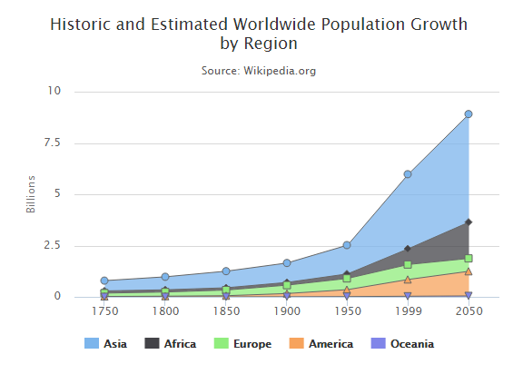

# Highcharts 堆叠区域图

以下实例演示了堆叠区域图。

我们在前面的章节已经了解了 Highcharts 基本配置语法。接下来让我们来看下其他的配置。在 plotOptions 中添加 stacking 属性：

## 配置

### plotOptions：数据点选项

plotOptions用于设置图表中的数据点相关属性。plotOptions根据各种图表类型，其属性设置略微有些差异。

配置图表堆叠设置 plotOptions.area.stacking 为 "normal"。如果禁用堆叠使用 null。 如果值为 "percent" 堆叠则按百分比。

```
var plotOptions =  { area:  { stacking:  'normal', lineColor:  '#666666', lineWidth:  1, marker:  { lineWidth:  1, lineColor:  '#666666'  }  }  };
```

### 实例

文件名：highcharts_area_stacked.htm

```
<html>  <head>  <title>Highcharts 教程 | 菜鸟教程(runoob.com)</title>  <script  src="http://apps.bdimg.com/libs/jquery/2.1.4/jquery.min.js"></script>  <script  src="/try/demo_source/highcharts.js"></script>  </head>  <body>  <div  id="container"  style="width:  550px; height:  400px; margin:  0  auto"></div>  <script  language="JavaScript"> $(document).ready(function()  {  var chart =  { type:  'area'  };  var title =  { text:  'Historic and Estimated Worldwide Population Growth by Region'  };  var subtitle =  { text:  'Source: Wikipedia.org'  };  var xAxis =  { categories:  ['1750',  '1800',  '1850',  '1900',  '1950',  '1999',  '2050'], tickmarkPlacement:  'on', title:  { enabled:  false  }  };  var yAxis =  { title:  { text:  'Billions'  }, labels:  { formatter:  function  ()  {  return  this.value /  1000;  }  }  };  var tooltip =  { shared:  true, valueSuffix:  ' millions'  };  var plotOptions =  { area:  { stacking:  'normal', lineColor:  '#666666', lineWidth:  1, marker:  { lineWidth:  1, lineColor:  '#666666'  }  }  };  var credits =  { enabled:  false  };  var series=  [{ name:  'Asia', data:  [502,  635,  809,  947,  1402,  3634,  5268]  },  { name:  'Africa', data:  [106,  107,  111,  133,  221,  767,  1766]  },  { name:  'Europe', data:  [163,  203,  276,  408,  547,  729,  628]  },  { name:  'America', data:  [18,  31,  54,  156,  339,  818,  1201]  },  { name:  'Oceania', data:  [2,  2,  2,  6,  13,  30,  46]  }  ];  var json =  {}; json.chart = chart; json.title = title; json.subtitle = subtitle; json.xAxis = xAxis; json.yAxis = yAxis; json.tooltip = tooltip; json.plotOptions = plotOptions; json.credits = credits; json.series = series; $('#container').highcharts(json);  });  </script>  </body>  </html>
```


以上实例输出结果为：


