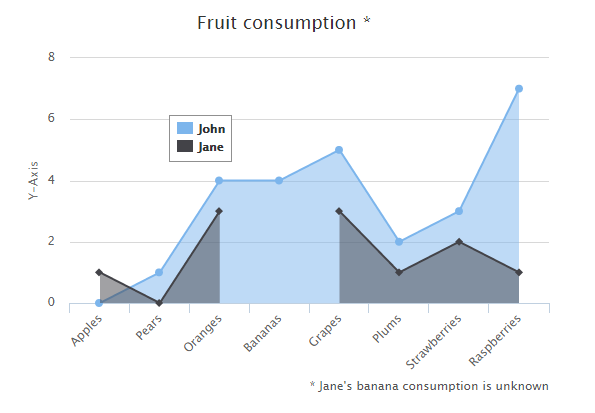

# Highcharts 丢失值区域图

以下实例演示了丢失值区域图。

我们在前面的章节已经了解了 Highcharts 基本配置语法。接下来让我们来看下其他的配置。在 chart 中添加 spacingBottom 属性。

### chart 配置

将 chart 的 spacingBottom 属性设置为 30。表示图表间的间隔区间。

```
var chart =  { type:  'area', spacingBottom:  30  };
```

### 实例

文件名：highcharts_area_missing.htm

```
<html>  <head>  <title>Highcharts 教程 | 菜鸟教程(runoob.com)</title>  <script  src="http://apps.bdimg.com/libs/jquery/2.1.4/jquery.min.js"></script>  <script  src="/try/demo_source/highcharts.js"></script>  </head>  <body>  <div  id="container"  style="width:  550px; height:  400px; margin:  0  auto"></div>  <script  language="JavaScript"> $(document).ready(function()  {  var chart =  { type:  'area', spacingBottom:  30  };  var title =  { text:  'Fruit consumption *'  };  var subtitle =  { text:  '* Jane\'s banana consumption is unknown', floating:  true, align:  'right', verticalAlign:  'bottom', y:  15  };  var legend =  { layout:  'vertical', align:  'left', verticalAlign:  'top', x:  150, y:  100, floating:  true, borderWidth:  1, backgroundColor:  (Highcharts.theme &&  Highcharts.theme.legendBackgroundColor)  ||  '#FFFFFF'  };  var xAxis =  { categories:  ['Apples',  'Pears',  'Oranges',  'Bananas',  'Grapes',  'Plums',  'Strawberries',  'Raspberries']  };  var yAxis =  { title:  { text:  'Y-Axis'  }, labels:  { formatter:  function  ()  {  return  this.value;  }  }  };  var tooltip =  { formatter:  function  ()  {  return  '<b>'  +  this.series.name +  '</b><br/>'  +  this.x +  ': '  +  this.y;  }  };  var plotOptions =  { area:  { fillOpacity:  0.5  }  };  var credits =  { enabled:  false  };  var series=  [{ name:  'John', data:  [0,  1,  4,  4,  5,  2,  3,  7]  },  { name:  'Jane', data:  [1,  0,  3,  null,  3,  1,  2,  1]  }  ];  var json =  {}; json.chart = chart; json.title = title; json.subtitle = subtitle; json.xAxis = xAxis; json.yAxis = yAxis; json.legend = legend; json.tooltip = tooltip; json.plotOptions = plotOptions; json.credits = credits; json.series = series; $('#container').highcharts(json);  });  </script>  </body>  </html>
```


以上实例输出结果为：


