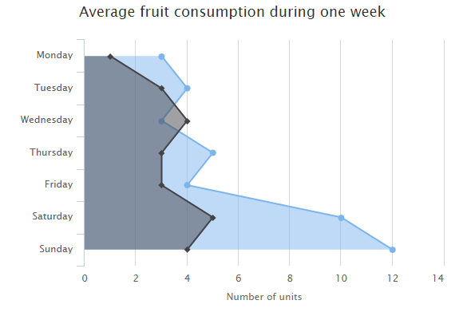

# Highcharts 反转x轴与y轴

以下实例演示了反转x轴与y轴区域图。

我们在前面的章节已经了解了 Highcharts 基本配置语法。接下来让我们来看下其他的配置。在 chart 中添加 inverted 属性。

### chart 配置

将 chart 的 inverted 属性设置为 true，X轴为垂直，Y轴为水平的。

```
var chart =  { type:  'area', inverted:  true  };
```

### 实例

文件名：highcharts_area_inverted.htm

```
<html>  <head>  <title>Highcharts 教程 | 菜鸟教程(runoob.com)</title>  <script  src="http://apps.bdimg.com/libs/jquery/2.1.4/jquery.min.js"></script>  <script  src="/try/demo_source/highcharts.js"></script>  </head>  <body>  <div  id="container"  style="width:  550px; height:  400px; margin:  0  auto"></div>  <script  language="JavaScript"> $(document).ready(function()  {  var chart =  { type:  'area', inverted:  true  };  var title =  { text:  'Average fruit consumption during one week'  };  var subtitle =  { style:  { position:  'absolute', right:  '0px', bottom:  '10px'  }  };  var legend =  { layout:  'vertical', align:  'left', verticalAlign:  'top', x:  -150, y:  100, floating:  true, borderWidth:  1, backgroundColor:  (Highcharts.theme &&  Highcharts.theme.legendBackgroundColor)  ||  '#FFFFFF'  };  var xAxis =  { categories:  ['Monday','Tuesday','Wednesday','Thursday','Friday','Saturday','Sunday']  };  var yAxis =  { title:  { text:  'Number of units'  }, labels:  { formatter:  function  ()  {  return  this.value;  }  }, min:  0  };  var plotOptions =  { area:  { fillOpacity:  0.5  }  };  var credits =  { enabled:  false  };  var series=  [{ name:  'John', data:  [3,  4,  3,  5,  4,  10,  12]  },  { name:  'Jane', data:  [1,  3,  4,  3,  3,  5,  4]  }  ];  var json =  {}; json.chart = chart; json.title = title; json.subtitle = subtitle; json.xAxis = xAxis; json.yAxis = yAxis; json.legend = legend; json.plotOptions = plotOptions; json.credits = credits; json.series = series; $('#container').highcharts(json);  });  </script>  </body>  </html>
```


以上实例输出结果为：


