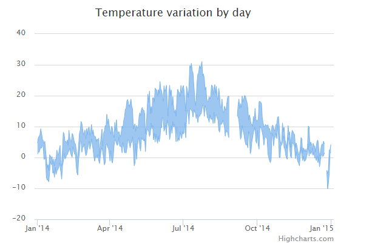

# Highcharts 区间区域图

以下实例演示了区间区域图。

我们在前面的章节已经了解了 Highcharts 基本配置语法。接下来让我们来看下其他的配置。在 chart 中修改 type 属性。

### chart 配置

将 chart 的 type 属性设置为 arearange，chart.type 描述了图表类型。默认值为 "line"。

```
var chart =  { type:  'arearange'  };
```

### 实例

文件名：highcharts_area_range.htm

```
<html>  <head>  <title>Highcharts 教程 | 菜鸟教程(runoob.com)</title>  <script  src="http://apps.bdimg.com/libs/jquery/2.1.4/jquery.min.js"></script>  <script  src="http://code.highcharts.com/highcharts.js"></script>  <script  src="http://code.highcharts.com/highcharts-more.js"></script>  <script  src="http://code.highcharts.com/modules/data.js"></script>  </head>  <body>  <div  id="container"  style="width:  550px; height:  400px; margin:  0  auto"></div>  <script  language="JavaScript"> $(document).ready(function()  {  var chart =  { type:  'arearange', zoomType:  'x'  };  var title =  { text:  'Temperature variation by day'  };  var xAxis =  { type:  'datetime'  };  var yAxis =  { title:  { text:  null  }  };  var tooltip =  { shared:  true, crosshairs:  true, valueSuffix:  '\xB0C'  };  var legend =  { enabled:  false  }  var json =  {}; json.chart = chart; json.title = title; json.xAxis = xAxis; json.yAxis = yAxis; json.legend = legend; $.getJSON('http://www.highcharts.com/samples/data/jsonp.php?filename=range.json&callback=?',  function  (data)  {  var series=  [{ name:  'Temperatures', data: data }  ]; json.series = series; $('#container').highcharts(json);  });  });  </script>  </body>  </html>
```


以上实例输出结果为：


