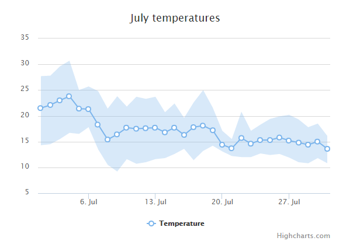

# Highcharts 使用区间和线的区域图

以下实例演示了使用区间和线的区域图。

我们在前面的章节已经了解了 Highcharts 基本配置语法。接下来让我们来看下其他的配置。在 chart 中修改 type 属性。

### chart 配置

将 chart 的 type 属性设置为 arearange，chart.type 描述了图表类型。默认值为 "line"。

```
var chart =  { type:  'arearange'  };
```

### 实例

文件名：highcharts_area_rangeline.htm

```
<html>  <head>  <title>Highcharts 教程 | 菜鸟教程(runoob.com)</title>  <script  src="http://apps.bdimg.com/libs/jquery/2.1.4/jquery.min.js"></script>  <script  src="http://code.highcharts.com/highcharts.js"></script>  <script  src="http://code.highcharts.com/highcharts-more.js"></script>  </head>  <body>  <div  id="container"  style="width:  550px; height:  400px; margin:  0  auto"></div>  <script  language="JavaScript"> $(document).ready(function()  {  var ranges =  [  [1246406400000,  14.3,  27.7],  [1246492800000,  14.5,  27.8],  [1246579200000,  15.5,  29.6],  [1246665600000,  16.7,  30.7],  [1246752000000,  16.5,  25.0],  [1246838400000,  17.8,  25.7],  [1246924800000,  13.5,  24.8],  [1247011200000,  10.5,  21.4],  [1247097600000,  9.2,  23.8],  [1247184000000,  11.6,  21.8],  [1247270400000,  10.7,  23.7],  [1247356800000,  11.0,  23.3],  [1247443200000,  11.6,  23.7],  [1247529600000,  11.8,  20.7],  [1247616000000,  12.6,  22.4],  [1247702400000,  13.6,  19.6],  [1247788800000,  11.4,  22.6],  [1247875200000,  13.2,  25.0],  [1247961600000,  14.2,  21.6],  [1248048000000,  13.1,  17.1],  [1248134400000,  12.2,  15.5],  [1248220800000,  12.0,  20.8],  [1248307200000,  12.0,  17.1],  [1248393600000,  12.7,  18.3],  [1248480000000,  12.4,  19.4],  [1248566400000,  12.6,  19.9],  [1248652800000,  11.9,  20.2],  [1248739200000,  11.0,  19.3],  [1248825600000,  10.8,  17.8],  [1248912000000,  11.8,  18.5],  [1248998400000,  10.8,  16.1]  ];  var averages =  [  [1246406400000,  21.5],  [1246492800000,  22.1],  [1246579200000,  23],  [1246665600000,  23.8],  [1246752000000,  21.4],  [1246838400000,  21.3],  [1246924800000,  18.3],  [1247011200000,  15.4],  [1247097600000,  16.4],  [1247184000000,  17.7],  [1247270400000,  17.5],  [1247356800000,  17.6],  [1247443200000,  17.7],  [1247529600000,  16.8],  [1247616000000,  17.7],  [1247702400000,  16.3],  [1247788800000,  17.8],  [1247875200000,  18.1],  [1247961600000,  17.2],  [1248048000000,  14.4],  [1248134400000,  13.7],  [1248220800000,  15.7],  [1248307200000,  14.6],  [1248393600000,  15.3],  [1248480000000,  15.3],  [1248566400000,  15.8],  [1248652800000,  15.2],  [1248739200000,  14.8],  [1248825600000,  14.4],  [1248912000000,  15],  [1248998400000,  13.6]  ];  var title =  { text:  'July temperatures'  };  var xAxis =  { type:  'datetime'  };  var yAxis =  { title:  { text:  null  }  };  var tooltip =  { shared:  true, crosshairs:  true, valueSuffix:  '\xB0C'  };  var legend =  {  }  var series=  [{ name:  'Temperature', data: averages, zIndex:  1, marker:  { fillColor:  'white', lineWidth:  2, lineColor:  Highcharts.getOptions().colors[0]  }  },  { name:  'Range', data: ranges, type:  'arearange', lineWidth:  0, linkedTo:  ':previous', color:  Highcharts.getOptions().colors[0], fillOpacity:  0.3, zIndex:  0  }  ];  var json =  {}; json.title = title; json.xAxis = xAxis; json.yAxis = yAxis; json.tooltip = tooltip; json.legend = legend; json.series = series; $('#container').highcharts(json);  });  </script>  </body>  </html>
```


以上实例输出结果为：


