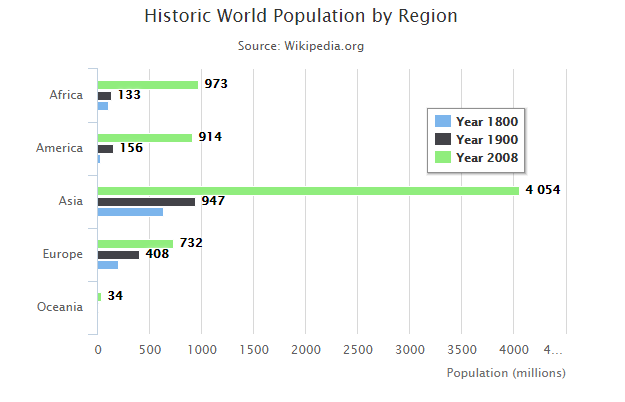

# Highcharts 基本条形图

以下实例演示了基本条形图。

我们在前面的章节已经了解了 Highcharts 基本配置语法。接下来让我们来看下其他的配置。

## 配置

### chart 配置

设置 chart 的 type 属性 为 bar ，chart.type 描述了图表类型。默认值为 "line"。

```
var chart =  { type:  'bar'  };
```

### 实例

文件名：highcharts_bar_basic.htm

```
<html>  <head>  <title>Highcharts 教程 | 菜鸟教程(runoob.com)</title>  <script  src="http://apps.bdimg.com/libs/jquery/2.1.4/jquery.min.js"></script>  <script  src="/try/demo_source/highcharts.js"></script>  </head>  <body>  <div  id="container"  style="width:  550px; height:  400px; margin:  0  auto"></div>  <script  language="JavaScript"> $(document).ready(function()  {  var chart =  { type:  'bar'  };  var title =  { text:  'Historic World Population by Region'  };  var subtitle =  { text:  'Source: Wikipedia.org'  };  var xAxis =  { categories:  ['Africa',  'America',  'Asia',  'Europe',  'Oceania'], title:  { text:  null  }  };  var yAxis =  { min:  0, title:  { text:  'Population (millions)', align:  'high'  }, labels:  { overflow:  'justify'  }  };  var tooltip =  { valueSuffix:  ' millions'  };  var plotOptions =  { bar:  { dataLabels:  { enabled:  true  }  }  };  var legend =  { layout:  'vertical', align:  'right', verticalAlign:  'top', x:  -40, y:  100, floating:  true, borderWidth:  1, backgroundColor:  ((Highcharts.theme &&  Highcharts.theme.legendBackgroundColor)  ||  '#FFFFFF'), shadow:  true  };  var credits =  { enabled:  false  };  var series=  [{ name:  'Year 1800', data:  [107,  31,  635,  203,  2]  },  { name:  'Year 1900', data:  [133,  156,  947,  408,  6]  },  { name:  'Year 2008', data:  [973,  914,  4054,  732,  34]  }  ];  var json =  {}; json.chart = chart; json.title = title; json.subtitle = subtitle; json.tooltip = tooltip; json.xAxis = xAxis; json.yAxis = yAxis; json.series = series; json.plotOptions = plotOptions; json.legend = legend; json.credits = credits; $('#container').highcharts(json);  });  </script>  </body>  </html>
```


以上实例输出结果为：


