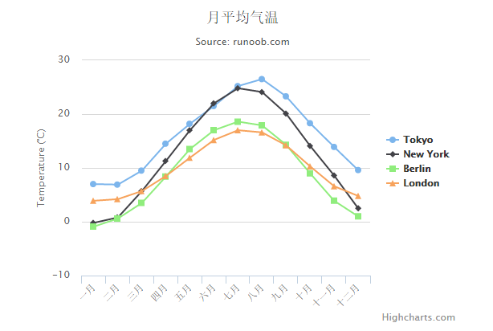

# Highcharts 配置语法

本章节我们将为大家介绍使用 Highcharts 生成图表的一些配置。

### 第一步：创建 HTML 页面

创建一个 HTML 页面，引入 jQuery 和 Highcharts 库：

文件名：HighchartsTest.htm

```
<html>
<head>
<title>Highcharts 教程 | 菜鸟教程</title>
    <script src="http://apps.bdimg.com/libs/jquery/2.1.4/jquery.min.js"></script>
   <script src="/try/demo_source/highcharts.js"></script>
</head>
<body>
<div id="container" style="width: 550px; height: 400px; margin: 0 auto"></div>
<script language="JavaScript">
$(document).ready(function() {

});
</script>
</body>
</html>

```

实例中 id 为 container 的 div 用于包含 Highcharts 绘制的图表。

### 第二步: 创建配置文件

Highcharts 库使用 json 格式来配置。

```
$('#container').highcharts(json);

```

这里 json 表示使用 json 数据格式和 json 格式的配置来绘制图表。步骤如下：

#### 标题

为图表配置标题：

```
var title = {
  text: '月平均气温'   
};

```

#### 副标题

为图表配置副标题：

```
var subtitle = {
  text: 'Source: runoob.com'
};

```

### X 轴

配置要在 X 轴显示的项。

```
var xAxis = {
   categories: ['一月', '二月', '三月', '四月', '五月', '六月'
      ,'七月', '八月', '九月', '十月', '十一月', '十二月']
};

```

### X 轴

配置要在 Y 轴显示的项。

```
var yAxis = {
   title: {
      text: 'Temperature (\xB0C)'
   },
   plotLines: [{
      value: 0,
      width: 1,
      color: '#808080'
   }]
};

```

### 提示信息

配置提示信息：

```
var tooltip = {
   valueSuffix: '\xB0C'
}

```

### 展示方式

配置图表向右对齐：

```
var legend = {
   layout: 'vertical',
   align: 'right',
   verticalAlign: 'middle',
   borderWidth: 0
};

```

### 数据

配置图表要展示的数据。每个系列是个数组，每一项在图片中都会生成一条曲线。

```
var series =  [
   {
      name: 'Tokyo',
      data: [7.0, 6.9, 9.5, 14.5, 18.2, 21.5, 25.2,
         26.5, 23.3, 18.3, 13.9, 9.6]
   },
   {
      name: 'New York',
      data: [-0.2, 0.8, 5.7, 11.3, 17.0, 22.0, 24.8,
         24.1, 20.1, 14.1, 8.6, 2.5]
   },
   {
      name: 'Berlin',
      data: [-0.9, 0.6, 3.5, 8.4, 13.5, 17.0, 18.6,
         17.9, 14.3, 9.0, 3.9, 1.0]
   },
   {
      name: 'London',
      data: [3.9, 4.2, 5.7, 8.5, 11.9, 15.2, 17.0,
         16.6, 14.2, 10.3, 6.6, 4.8]
   }
];

```

### 第三步: 创建 json 数据

组合是由配置信息:

```
var json = {};

json.title = title;
json.subtitle = subtitle;
json.xAxis = xAxis;
json.yAxis = yAxis;
json.tooltip = tooltip;
json.legend = legend;
json.series = series;
Step 4: Draw the chart
$('#container').highcharts(json);

```

### 实例

以下为完整的实例(HighchartsTest.htm)：

```
<html>
<head>
<title>Highcharts Tutorial</title>
   <script src="http://apps.bdimg.com/libs/jquery/2.1.4/jquery.min.js"></script>
   <script src="/try/demo_source/highcharts.js"></script>
</head>
<body>
<div id="container" style="width: 550px; height: 400px; margin: 0 auto"></div>
<script language="JavaScript">
$(document).ready(function() {
   var title = {
       text: '月平均气温'   
   };
   var subtitle = {
        text: 'Source: runoob.com'
   };
   var xAxis = {
       categories: ['一月', '二月', '三月', '四月', '五月', '六月'
              ,'七月', '八月', '九月', '十月', '十一月', '十二月']
   };
   var yAxis = {
      title: {
         text: 'Temperature (\xB0C)'
      },
      plotLines: [{
         value: 0,
         width: 1,
         color: '#808080'
      }]
   };   

   var tooltip = {
      valueSuffix: '\xB0C'
   }

   var legend = {
      layout: 'vertical',
      align: 'right',
      verticalAlign: 'middle',
      borderWidth: 0
   };

   var series =  [
      {
         name: 'Tokyo',
         data: [7.0, 6.9, 9.5, 14.5, 18.2, 21.5, 25.2,
            26.5, 23.3, 18.3, 13.9, 9.6]
      },
      {
         name: 'New York',
         data: [-0.2, 0.8, 5.7, 11.3, 17.0, 22.0, 24.8,
            24.1, 20.1, 14.1, 8.6, 2.5]
      },
      {
         name: 'Berlin',
         data: [-0.9, 0.6, 3.5, 8.4, 13.5, 17.0, 18.6,
            17.9, 14.3, 9.0, 3.9, 1.0]
      },
      {
         name: 'London',
         data: [3.9, 4.2, 5.7, 8.5, 11.9, 15.2, 17.0,
            16.6, 14.2, 10.3, 6.6, 4.8]
      }
   ];

   var json = {};

   json.title = title;
   json.subtitle = subtitle;
   json.xAxis = xAxis;
   json.yAxis = yAxis;
   json.tooltip = tooltip;
   json.legend = legend;
   json.series = series;

   $('#container').highcharts(json);
});
</script>
</body>
</html>

```


以上实例输出结果为：


