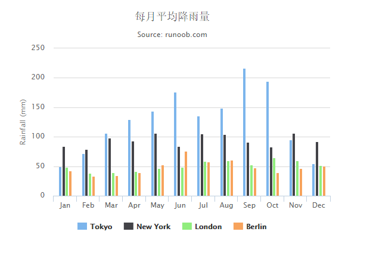

# Highcharts 基本柱形图

以下实例演示了基本柱形图。

我们在前面的章节已经了解了 Highcharts 基本配置语法。接下来让我们来看下其他的配置。

## 配置

### chart 配置

设置 chart 的 type 属性 为 column ，chart.type 描述了图表类型。默认值为 "line"。

```
var chart =  { type:  'column'  };
```

### 实例

文件名：highcharts_column_basic.htm

```
<html>  <head>  <title>Highcharts 教程 | 菜鸟教程(runoob.com)</title>  <script  src="http://apps.bdimg.com/libs/jquery/2.1.4/jquery.min.js"></script>  <script  src="/try/demo_source/highcharts.js"></script>  </head>  <body>  <div  id="container"  style="width:  550px; height:  400px; margin:  0  auto"></div>  <script  language="JavaScript"> $(document).ready(function()  {  var chart =  { type:  'column'  };  var title =  { text:  '每月平均降雨量'  };  var subtitle =  { text:  'Source: runoob.com'  };  var xAxis =  { categories:  ['Jan','Feb','Mar','Apr','May','Jun','Jul','Aug','Sep','Oct','Nov','Dec'], crosshair:  true  };  var yAxis =  { min:  0, title:  { text:  '降雨量 (mm)'  }  };  var tooltip =  { headerFormat:  '<span style="font-size:10px">{point.key}</span><table>', pointFormat:  '<tr><td style="color:{series.color};padding:0">{series.name}: </td>'  +  '<td style="padding:0"><b>{point.y:.1f} mm</b></td></tr>', footerFormat:  '</table>', shared:  true, useHTML:  true  };  var plotOptions =  { column:  { pointPadding:  0.2, borderWidth:  0  }  };  var credits =  { enabled:  false  };  var series=  [{ name:  'Tokyo', data:  [49.9,  71.5,  106.4,  129.2,  144.0,  176.0,  135.6,  148.5,  216.4,  194.1,  95.6,  54.4]  },  { name:  'New York', data:  [83.6,  78.8,  98.5,  93.4,  106.0,  84.5,  105.0,  104.3,  91.2,  83.5,  106.6,  92.3]  },  { name:  'London', data:  [48.9,  38.8,  39.3,  41.4,  47.0,  48.3,  59.0,  59.6,  52.4,  65.2,  59.3,  51.2]  },  { name:  'Berlin', data:  [42.4,  33.2,  34.5,  39.7,  52.6,  75.5,  57.4,  60.4,  47.6,  39.1,  46.8,  51.1]  }];  var json =  {}; json.chart = chart; json.title = title; json.subtitle = subtitle; json.tooltip = tooltip; json.xAxis = xAxis; json.yAxis = yAxis; json.series = series; json.plotOptions = plotOptions; json.credits = credits; $('#container').highcharts(json);  });  </script>  </body>  </html>
```


以上实例输出结果为：


