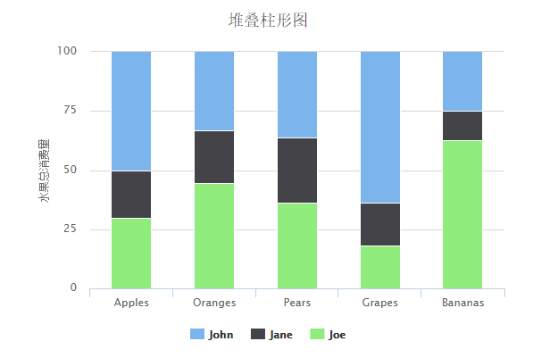

# Highcharts 使用百分比的堆叠柱形图

以下实例演示了使用百分比的堆叠柱形图。

我们在前面的章节已经了解了 Highcharts 基本配置语法。接下来让我们来看下其他的配置。在 plotOptions 中添加 stacking 属性：

## 配置

### plotOptions：数据点选项

plotOptions用于设置图表中的数据点相关属性。plotOptions根据各种图表类型，其属性设置略微有些差异。

配置图表堆叠设置 plotOptions.area.stacking 为 "percent"。如果禁用堆叠使用 null。

```
var plotOptions =  { column:  { stacking:  'percent'  }  };
```

### 实例

文件名：highcharts_column_percentage.htm

```
<html>  <head>  <title>Highcharts 教程 | 菜鸟教程(runoob.com)</title>  <script  src="http://apps.bdimg.com/libs/jquery/2.1.4/jquery.min.js"></script>  <script  src="/try/demo_source/highcharts.js"></script>  </head>  <body>  <div  id="container"  style="width:  550px; height:  400px; margin:  0  auto"></div>  <script  language="JavaScript"> $(document).ready(function()  {  var chart =  { type:  'column'  };  var title =  { text:  '堆叠柱形图'  };  var xAxis =  { categories:  ['Apples',  'Oranges',  'Pears',  'Grapes',  'Bananas']  };  var yAxis ={ min:  0, title:  { text:  '水果总消费量'  }  };  var tooltip =  { pointFormat:  '<span style="color:{series.color}">{series.name}</span>: <b>{point.y}</b> ({point.percentage:.0f}%)<br/>', shared:  true  };  var plotOptions =  { column:  { stacking:  'percent'  }  };  var credits =  { enabled:  false  };  var series=  [{ name:  'John', data:  [5,  3,  4,  7,  2]  },  { name:  'Jane', data:  [2,  2,  3,  2,  1]  },  { name:  'Joe', data:  [3,  4,  4,  2,  5]  }];  var json =  {}; json.chart = chart; json.title = title; json.xAxis = xAxis; json.yAxis = yAxis; json.tooltip = tooltip; json.plotOptions = plotOptions; json.credits = credits; json.series = series; $('#container').highcharts(json);  });  </script>  </body>  </html>
```


以上实例输出结果为：


