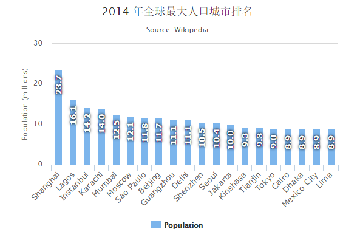

# Highcharts 标签旋转柱形图

以下实例演示了标签旋转柱形图。

我们在前面的章节已经了解了 Highcharts 基本配置语法。接下来让我们来看下其他的配置。在 dataLabels 中添加 rotation 属性：

## 配置

### dataLabels : 数据标签

dataLabels 定义图上是否显示数据标签。

文本旋转程度由 rotation 属性决定。我们还可以通过其他属性来定义文本标签的背景，间隔，边框等。

```
dataLabels =  { enabled:  true, rotation:  -90, color:  '#FFFFFF', align:  'right', format:  '{point.y:.1f}',  // 一个小数 y:  10,  // 从上到下 10 像素 style:  { fontSize:  '13px', fontFamily:  'Verdana, sans-serif'  }  }
```

### 实例

文件名：highcharts_column_rotated.htm

```
<html>  <head>  <title>Highcharts 教程 | 菜鸟教程(runoob.com)</title>  <script  src="http://apps.bdimg.com/libs/jquery/2.1.4/jquery.min.js"></script>  <script  src="/try/demo_source/highcharts.js"></script>  </head>  <body>  <div  id="container"  style="width:  550px; height:  400px; margin:  0  auto"></div>  <script  language="JavaScript"> $(document).ready(function()  {  var chart =  { type:  'column'  };  var title =  { text:  '2014 年全球最大人口城市排名'  };  var subtitle =  { text:  'Source: <a href="http://en.wikipedia.org/wiki/List_of_cities_proper_by_population">Wikipedia</a>'  };  var xAxis =  { type:  'category', labels:  { rotation:  -45, style:  { fontSize:  '13px', fontFamily:  'Verdana, sans-serif'  }  }  };  var yAxis ={ min:  0, title:  { text:  'Population (millions)'  }  };  var tooltip =  { pointFormat:  '2008 年人口: <b>{point.y:.1f} 百万</b>'  };  var credits =  { enabled:  false  };  var series=  [{ name:  'Population', data:  [  ['Shanghai',  23.7],  ['Lagos',  16.1],  ['Instanbul',  14.2],  ['Karachi',  14.0],  ['Mumbai',  12.5],  ['Moscow',  12.1],  ['Sao Paulo',  11.8],  ['Beijing',  11.7],  ['Guangzhou',  11.1],  ['Delhi',  11.1],  ['Shenzhen',  10.5],  ['Seoul',  10.4],  ['Jakarta',  10.0],  ['Kinshasa',  9.3],  ['Tianjin',  9.3],  ['Tokyo',  9.0],  ['Cairo',  8.9],  ['Dhaka',  8.9],  ['Mexico City',  8.9],  ['Lima',  8.9]  ], dataLabels:  { enabled:  true, rotation:  -90, color:  '#FFFFFF', align:  'right', format:  '{point.y:.1f}',  // one decimal y:  10,  // 10 pixels down from the top style:  { fontSize:  '13px', fontFamily:  'Verdana, sans-serif'  }  }  }];  var json =  {}; json.chart = chart; json.title = title; json.subtitle = subtitle; json.xAxis = xAxis; json.yAxis = yAxis; json.tooltip = tooltip; json.credits = credits; json.series = series; $('#container').highcharts(json);  });  </script>  </body>  </html>
```


以上实例输出结果为：


