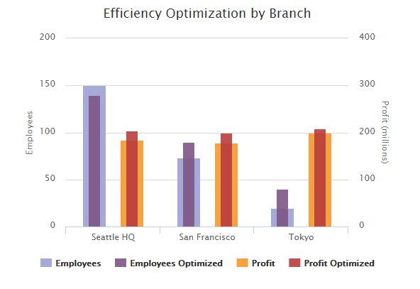

# Highcharts 固定布局柱形图

以下实例演示了固定布局柱形图。

我们在前面的章节已经了解了 Highcharts 基本配置语法。接下来让我们来看下其他的配置。在 series 下添加 pointPlacement 和 pointPadding 配置。

### series.pointPadding

控制每列之间的距离值，当highcharts图表宽度固定的情况下，此值越大，柱子宽度越小，反之相反。默认此值为0.1

### series.pointPlacement

在柱形图中，当 pointPlacement 设置为 "on" 时, X轴上的点没有间隔。如果 pointPlacement 设置为 "between", 列之间按刻度进行布局。

在 Highcharts 3.0.2 后的版本, pointPlacement 可以支持数字，0 为轴上的值， -0.5 为当前值与前面一个值的间隔， 0.5 为 当前值与下一个值的间隔。 不同与文字设置选项，数字设置不影响轴之间的间隔。

```
series:  { name:  'Employees', color:  'rgba(165,170,217,1)', data:  [150,  73,  20], pointPadding:  0.3, pointPlacement:  -0.2  }
```

### 实例

文件名：highcharts_column_fixed.htm

```
<html>  <head>  <title>Highcharts 教程 | 菜鸟教程(runoob.com)</title>  <script  src="http://apps.bdimg.com/libs/jquery/2.1.4/jquery.min.js"></script>  <script  src="http://code.highcharts.com/highcharts.js"></script>  </head>  <body>  <div  id="container"  style="width:  550px; height:  400px; margin:  0  auto"></div>  <script  language="JavaScript"> $(document).ready(function()  {  var chart =  { type:  'column'  };  var title =  { text:  'Efficiency Optimization by Branch'  };  var xAxis =  { categories:  ['Seattle HQ',  'San Francisco',  'Tokyo']  };  var yAxis =  [{ min:  0, title:  { text:  'Employees'  }  },  { title:  { text:  'Profit (millions)'  }, opposite:  true  }];  var legend =  { shadow:  false  };  var tooltip =  { shared:  true  };  var credits =  { enabled:  false  };  var plotOptions =  { column:  { grouping:  false, shadow:  false, borderWidth:  0  }  };  var series=  [{ name:  'Employees', color:  'rgba(165,170,217,1)', data:  [150,  73,  20], pointPadding:  0.3, pointPlacement:  -0.2  },  { name:  'Employees Optimized', color:  'rgba(126,86,134,.9)', data:  [140,  90,  40], pointPadding:  0.4, pointPlacement:  -0.2  },  { name:  'Profit', color:  'rgba(248,161,63,1)', data:  [183.6,  178.8,  198.5], tooltip:  { valuePrefix:  '$', valueSuffix:  ' M'  }, pointPadding:  0.3, pointPlacement:  0.2, yAxis:  1  },  { name:  'Profit Optimized', color:  'rgba(186,60,61,.9)', data:  [203.6,  198.8,  208.5], tooltip:  { valuePrefix:  '$', valueSuffix:  ' M'  }, pointPadding:  0.4, pointPlacement:  0.2, yAxis:  1  }];  var json =  {}; json.chart = chart; json.title = title; json.xAxis = xAxis; json.yAxis = yAxis; json.credits = credits; json.legend = legend; json.tooltip = tooltip; json.plotOptions = plotOptions; json.series = series; $('#container').highcharts(json);  });  </script>  </body>  </html>
```


以上实例输出结果为：


