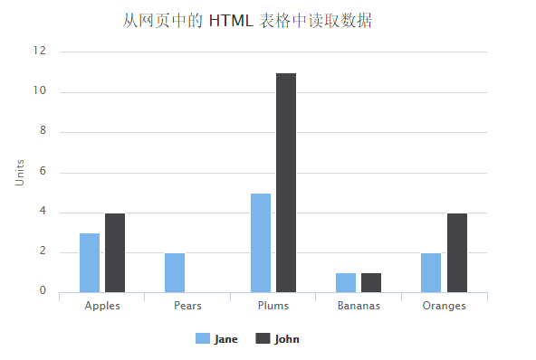

# Highcharts 使用 HTML 表格数据的柱形图

以下实例演示了使用 HTML 表格数据的柱形图。

我们在前面的章节已经了解了 Highcharts 基本配置语法。接下来让我们来看下其他的配置。在 data 下添加 table 配置。

### data

数据模块提供了一些简单的接口用于添加数据，我们可以使用例如 CVS, HTML 表格或者网格视图中的数据。

### data.table

Html 表格中设置id，并对应参数 data.table 即能解析数据。相关设置选项有 startRow, endRow, startColumn 和 endColumn 。

```
data:  { table:  'dataTable'  }
```

### 实例

文件名：highcharts_column_table.htm

```
<html>  <head>  <title>Highcharts 教程 | 菜鸟教程(runoob.com)</title>  <script  src="http://apps.bdimg.com/libs/jquery/2.1.4/jquery.min.js"></script>  <script  src="http://code.highcharts.com/highcharts.js"></script>  <script  src="http://code.highcharts.com/modules/data.js"></script>  </head>  <body>  <div  id="container"  style="width:  550px; height:  400px; margin:  0  auto"></div>  <script  language="JavaScript"> $(document).ready(function()  {  var data =  { table:  'datatable'  };  var chart =  { type:  'column'  };  var title =  { text:  '从网页中的 HTML 表格中读取数据'  };  var yAxis =  { allowDecimals:  false, title:  { text:  'Units'  }  };  var tooltip =  { formatter:  function  ()  {  return  '<b>'  +  this.series.name +  '</b><br/>'  +  this.point.y +  ' '  +  this.point.name.toLowerCase();  }  };  var credits =  { enabled:  false  };  var json =  {}; json.chart = chart; json.title = title; json.data = data; json.yAxis = yAxis; json.credits = credits; json.tooltip = tooltip; $('#container').highcharts(json);  });  </script>  <table  id="datatable">  <thead>  <tr><th></th><th>Jane</th><th>John</th></tr>  </thead>  <tbody>  <tr><th>Apples</th><td>3</td><td>4</td></tr>  <tr><th>Pears</th><td>2</td><td>0</td></tr>  <tr><th>Plums</th><td>5</td><td>11</td></tr>  <tr><th>Bananas</th><td>1</td><td>1</td></tr>  <tr><th>Oranges</th><td>2</td><td>4</td></tr>  </tbody>  </table>  </body>  </html>
```


以上实例输出结果为：


