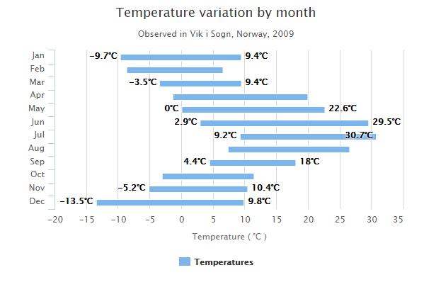

# Highcharts 区间柱形图

以下实例演示了区间柱形图。

我们在前面的章节已经了解了 Highcharts 基本配置语法。接下来让我们来看下其他的配置。

### chart 配置

配置 chart 的 type 为 'columnrange' 。chart.type 描述了图表类型。默认值为 "line"。

```
var chart =  { type:  'columnrange', inverted:  true  };
```

### 实例

文件名：highcharts_column_range.htm

```
<html>  <head>  <title>Highcharts 教程 | 菜鸟教程(runoob.com)</title>  <script  src="http://apps.bdimg.com/libs/jquery/2.1.4/jquery.min.js"></script>  <script  src="http://code.highcharts.com/highcharts.js"></script>  <script  src="http://code.highcharts.com/highcharts-more.js"></script>  </head>  <body>  <div  id="container"  style="width:  550px; height:  400px; margin:  0  auto"></div>  <script  language="JavaScript"> $(document).ready(function()  {  var chart =  { type:  'columnrange', inverted:true  };  var title =  { text:  'Temperature variation by month'  };  var subtitle =  { text:  'Observed in Vik i Sogn, Norway, 2009'  };  var xAxis =  { categories:  ['Jan','Feb','Mar','Apr','May','Jun','Jul','Aug','Sep','Oct','Nov','Dec']  };  var yAxis =  { title:  { text:  'Temperature ( \xB0C )'  }  };  var tooltip =  { headerFormat:  '<span style="font-size:10px">{point.key}</span><table>', pointFormat:  '<tr><td style="color:{series.color};padding:0">{series.name}: </td>'  +  '<td style="padding:0"><b>{point.y:.1f} mm</b></td></tr>', footerFormat:  '</table>', shared:  true, useHTML:  true  };  var plotOptions =  { columnrange:  { dataLabels:  { enabled:  true, formatter:  function  ()  {  return  this.y +  '\xB0C';  }  }  }  };  var credits =  { enabled:  false  };  var series=  [{ name:  'Temperatures', data:  [  [-9.7,  9.4],  [-8.7,  6.5],  [-3.5,  9.4],  [-1.4,  19.9],  [0.0,  22.6],  [2.9,  29.5],  [9.2,  30.7],  [7.3,  26.5],  [4.4,  18.0],  [-3.1,  11.4],  [-5.2,  10.4],  [-13.5,  9.8]  ]  }];  var json =  {}; json.chart = chart; json.title = title; json.subtitle = subtitle; json.tooltip = tooltip; json.xAxis = xAxis; json.yAxis = yAxis; json.series = series; json.plotOptions = plotOptions; json.credits = credits; $('#container').highcharts(json);  });  </script>  </body>  </html>
```


以上实例输出结果为：


