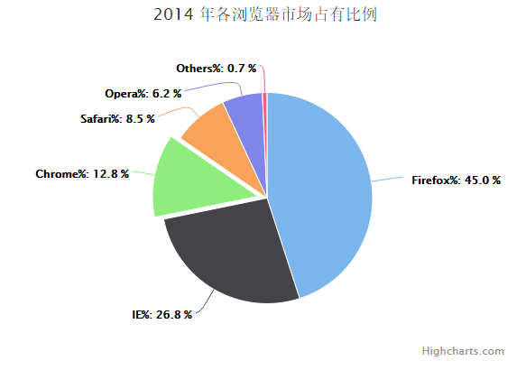

# Highcharts 基本饼图

以下实例演示了基本饼图。

我们在前面的章节已经了解了 Highcharts 基本配置语法。接下来让我们来看下其他的配置。

## 配置

### series 配置

设置 series 的 type 属性为 pie ，series.type 描述了数据列类型。默认值为 "line"。

```
var series =  { type:  'pie'  };
```

### 实例

文件名：highcharts_pie_basic.htm

```
<html>  <head>  <title>Highcharts 教程 | 菜鸟教程(runoob.com)</title>  <script  src="http://apps.bdimg.com/libs/jquery/2.1.4/jquery.min.js"></script>  <script  src="/try/demo_source/highcharts.js"></script>  </head>  <body>  <div  id="container"  style="width:  550px; height:  400px; margin:  0  auto"></div>  <script  language="JavaScript"> $(document).ready(function()  {  var chart =  { plotBackgroundColor:  null, plotBorderWidth:  null, plotShadow:  false  };  var title =  { text:  '2014 年各浏览器市场占有比例'  };  var tooltip =  { pointFormat:  '{series.name}: <b>{point.percentage:.1f}%</b>'  };  var plotOptions =  { pie:  { allowPointSelect:  true, cursor:  'pointer', dataLabels:  { enabled:  true, format:  '<b>{point.name}%</b>: {point.percentage:.1f} %', style:  { color:  (Highcharts.theme &&  Highcharts.theme.contrastTextColor)  ||  'black'  }  }  }  };  var series=  [{ type:  'pie', name:  'Browser share', data:  [  ['Firefox',  45.0],  ['IE',  26.8],  { name:  'Chrome', y:  12.8, sliced:  true, selected:  true  },  ['Safari',  8.5],  ['Opera',  6.2],  ['Others',  0.7]  ]  }];  var json =  {}; json.chart = chart; json.title = title; json.tooltip = tooltip; json.series = series; json.plotOptions = plotOptions; $('#container').highcharts(json);  });  </script>  </body>  </html>
```


以上实例输出结果为：


