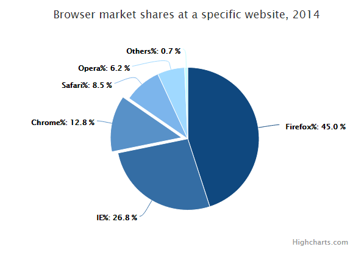

# Highcharts 单色饼图

以下实例演示了单色饼图。

我们在前面的章节已经了解了 Highcharts 基本配置语法。接下来让我们来看下其他的配置。

## 配置

### colors 配置

使用 Highcharts.getOptions().plotOptions.pie.colors 属性来配置每个饼的颜色。

```
// 设置单色并为所有饼设置默认主题  Highcharts.getOptions().plotOptions.pie.colors =  (function  ()  {  var colors =  [];  var  base  =  Highcharts.getOptions().colors[0];  var i;  for  (i =  0; i <  10; i +=  1)  {  // 以一暗色开始并以亮色结束 colors.push(Highcharts.Color(base).brighten((i -  3)  /  7).get());  }  return colors;  }());
```

### 实例

文件名：highcharts_pie_monochrome.htm

```
<html>  <head>  <title>Highcharts 教程 | 菜鸟教程(runoob.com)</title>  <script  src="http://apps.bdimg.com/libs/jquery/2.1.4/jquery.min.js"></script>  <script  src="/try/demo_source/highcharts.js"></script>  </head>  <body>  <div  id="container"  style="width:  550px; height:  400px; margin:  0  auto"></div>  <script  language="JavaScript"> $(document).ready(function()  {  var chart =  { plotBackgroundColor:  null, plotBorderWidth:  null, plotShadow:  false  };  var title =  { text:  'Browser market shares at a specific website, 2014'  };  var tooltip =  { pointFormat:  '{series.name}: <b>{point.percentage:.1f}%</b>'  };  var plotOptions =  { pie:  { allowPointSelect:  true, cursor:  'pointer', dataLabels:  { enabled:  true, format:  '<b>{point.name}%</b>: {point.percentage:.1f} %', style:  { color:  (Highcharts.theme &&  Highcharts.theme.contrastTextColor)  ||  'black'  }  }  }  };  var series=  [{ type:  'pie', name:  'Browser share', data:  [  ['Firefox',  45.0],  ['IE',  26.8],  { name:  'Chrome', y:  12.8, sliced:  true, selected:  true  },  ['Safari',  8.5],  ['Opera',  6.2],  ['Others',  0.7]  ]  }];  // Make monochrome colors and set them as default for all pies  Highcharts.getOptions().plotOptions.pie.colors =  (function  ()  {  var colors =  [];  var base =  Highcharts.getOptions().colors[0];  var i;  for  (i =  0; i <  10; i +=  1)  {  // Start out with a darkened base color (negative brighten), and end  // up with a much brighter color colors.push(Highcharts.Color(base).brighten((i -  3)  /  7).get());  }  return colors;  }());  var json =  {}; json.chart = chart; json.title = title; json.tooltip = tooltip; json.series = series; json.plotOptions = plotOptions; $('#container').highcharts(json);  });  </script>  </body>  </html>
```


以上实例输出结果为：


