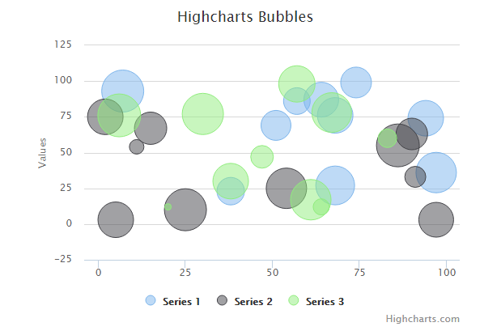
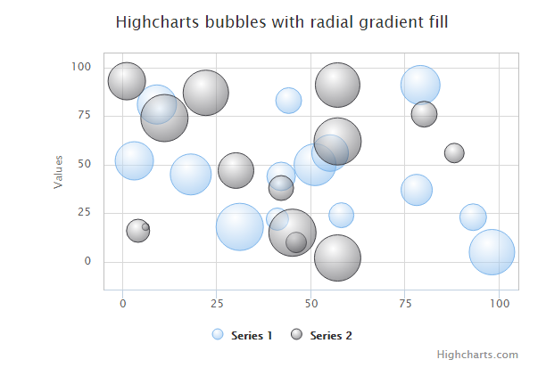

# Highcharts 气泡图

本章节我们将为大家介绍 Highcharts 的气泡图。

我们在前面的章节已经了解了 Highcharts 配置语法。接下来让我们来看下 Highcharts 的其他配置。

## 配置

### chart 配置

配置 chart 的 type 为 'bubble' 。chart.type 描述了图表类型。默认值为 "line"。

chart.zoomType 属性可配置图表放大 ，通过拖动鼠标进行缩放，沿x轴或y轴进行缩放，可以设置为：'x','y','xy'。

```
var chart = {
   type: 'bubble',
   zoomType: 'xy'
};

```

### 实例

文件名：highcharts_bubble_basic.htm

```
<html>
<head>
<title>Highcharts 教程 | 菜鸟教程(runoob.com)</title>
   <script src="http://apps.bdimg.com/libs/jquery/2.1.4/jquery.min.js"></script>
   <script src="/try/demo_source/highcharts.js"></script>
   <script src="http://code.highcharts.com/highcharts-more.js"></script>
</head>
<body>
<div id="container" style="width: 550px; height: 400px; margin: 0 auto"></div>
<script language="JavaScript">
$(document).ready(function() {  
   var chart = {
      type: 'bubble',
      zoomType: 'xy'
   };
   var title = {
      text: 'Highcharts Bubbles'   
   };   
   var series= [{
            data: [[97, 36, 79], [94, 74, 60], [68, 76, 58], [64, 87, 56], [68, 27, 73], [74, 99, 42], [7, 93, 87], [51, 69, 40], [38, 23, 33], [57, 86, 31]]
        }, {
            data: [[25, 10, 87], [2, 75, 59], [11, 54, 8], [86, 55, 93], [5, 3, 58], [90, 63, 44], [91, 33, 17], [97, 3, 56], [15, 67, 48], [54, 25, 81]]
        }, {
            data: [[47, 47, 21], [20, 12, 4], [6, 76, 91], [38, 30, 60], [57, 98, 64], [61, 17, 80], [83, 60, 13], [67, 78, 75], [64, 12, 10], [30, 77, 82]]
      }
   ];     

   var json = {};   
   json.chart = chart;
   json.title = title;     
   json.series = series;   
   $('#container').highcharts(json);

});
</script>
</body>
</html>

```


以上实例输出结果为：




## 3D 气泡图

### series.marker

设置 series.marker 渐变让其看起来有 3D 的效果。

```
marker: {
   fillColor: {
      radialGradient: { cx: 0.4, cy: 0.3, r: 0.7 },
      stops: [
         [0, 'rgba(255,255,255,0.5)'],
         [1, Highcharts.Color(Highcharts.getOptions().colors[0]).setOpacity(0.5).get('rgba')]
      ]
   }
}

```

### 实例

文件名：highcharts_bubble_3d.htm

```
<html>
<head>
<title>Highcharts 教程 | 菜鸟教程(runoob.com)</title>
   <script src="http://apps.bdimg.com/libs/jquery/2.1.4/jquery.min.js"></script>
   <script src="/try/demo_source/highcharts.js"></script>
   <script src="http://code.highcharts.com/highcharts-more.js"></script>
</head>
<body>
<div id="container" style="width: 550px; height: 400px; margin: 0 auto"></div>
<script language="JavaScript">
$(document).ready(function() {  
   var chart = {
      type: 'bubble',
	  plotBorderWidth: 1,
      zoomType: 'xy'
   };
   var title = {
      text: 'Highcharts bubbles with radial gradient fill'   
   };   
   var xAxis = {
      gridLineWidth: 1
   };

   var yAxis = {
      startOnTick: false,
      endOnTick: false
   };

   var series= [{
           data: [
                [9, 81, 63],
                [98, 5, 89],
                [51, 50, 73],
                [41, 22, 14],
                [58, 24, 20],
                [78, 37, 34],
                [55, 56, 53],
                [18, 45, 70],
                [42, 44, 28],
                [3, 52, 59],
                [31, 18, 97],
                [79, 91, 63],
                [93, 23, 23],
                [44, 83, 22]
            ],
            marker: {
                fillColor: {
                    radialGradient: { cx: 0.4, cy: 0.3, r: 0.7 },
                    stops: [
                        [0, 'rgba(255,255,255,0.5)'],
                        [1, Highcharts.Color(Highcharts.getOptions().colors[0]).setOpacity(0.5).get('rgba')]
                    ]
                }
            }
        }, {
            data: [
                [42, 38, 20],
                [6, 18, 1],
                [1, 93, 55],
                [57, 2, 90],
                [80, 76, 22],
                [11, 74, 96],
                [88, 56, 10],
                [30, 47, 49],
                [57, 62, 98],
                [4, 16, 16],
                [46, 10, 11],
                [22, 87, 89],
                [57, 91, 82],
                [45, 15, 98]
            ],
            marker: {
                fillColor: {
                    radialGradient: { cx: 0.4, cy: 0.3, r: 0.7 },
                    stops: [
                        [0, 'rgba(255,255,255,0.5)'],
                        [1, Highcharts.Color(Highcharts.getOptions().colors[1]).setOpacity(0.5).get('rgba')]
                    ]
                }
            }
      }
   ];     

   var json = {};   
   json.chart = chart;
   json.title = title;   
   json.xAxis = xAxis;   
   json.yAxis = yAxis;      
   json.series = series;   
   $('#container').highcharts(json);

});
</script>
</body>
</html>

```


以上实例输出结果为：


