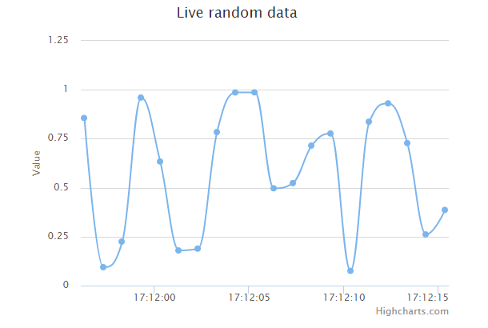
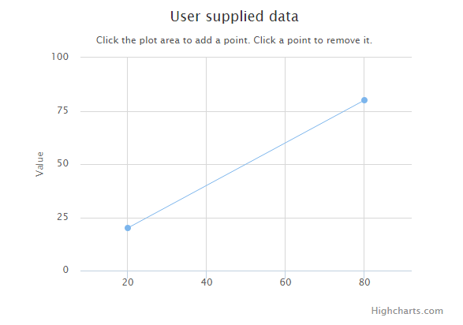

# Highcharts 动态图

本章节我们将为大家介绍 Highcharts 的动态图。

我们在前面的章节已经了解了 Highcharts 配置语法。接下来让我们来看下 Highcharts 的其他配置。

## 每秒更新曲线图

### chart.events

chart.event 属性中添加 load 方法（图表加载事件）。在 1000 毫秒内随机产生数据点并生成图表。

```
chart: {
   events: {
      load: function () {
         // 图表每秒更新一次
         var series = this.series[0];
         setInterval(function () {
            var x = (new Date()).getTime(), // 当期时间
            y = Math.random();
            series.addPoint([x, y], true, true);
         }, 1000);
      }
   }
}

```

### 实例

文件名：highcharts_dynamic_spline.htm

```
<html>
<head>
<title>Highcharts 教程 | 菜鸟教程(runoob.com)</title>
   <script src="http://apps.bdimg.com/libs/jquery/2.1.4/jquery.min.js"></script>
   <script src="/try/demo_source/highcharts.js"></script>
</head>
<body>
<div id="container" style="width: 550px; height: 400px; margin: 0 auto"></div>
<script language="JavaScript">
$(document).ready(function() {  
   var chart = {
      type: 'spline',
	  animation: Highcharts.svg, // don't animate in IE < IE 10.
      marginRight: 10,
	  events: {
         load: function () {
            // set up the updating of the chart each second
            var series = this.series[0];
            setInterval(function () {
               var x = (new Date()).getTime(), // current time
               y = Math.random();
               series.addPoint([x, y], true, true);
            }, 1000);
         }
      }
   };
   var title = {
      text: 'Live random data'   
   };   
   var xAxis = {
      type: 'datetime',
      tickPixelInterval: 150
   };
   var yAxis = {
      title: {
         text: 'Value'
      },
      plotLines: [{
         value: 0,
         width: 1,
         color: '#808080'
      }]
   };
   var tooltip = {
      formatter: function () {
      return '<b>' + this.series.name + '</b><br/>' +
         Highcharts.dateFormat('%Y-%m-%d %H:%M:%S', this.x) + '<br/>' +
         Highcharts.numberFormat(this.y, 2);
      }
   };
   var plotOptions = {
      area: {
         pointStart: 1940,
         marker: {
            enabled: false,
            symbol: 'circle',
            radius: 2,
            states: {
               hover: {
                 enabled: true
               }
            }
         }
      }
   };
   var legend = {
      enabled: false
   };
   var exporting = {
      enabled: false
   };
   var series= [{
      name: 'Random data',
      data: (function () {
         // generate an array of random data
         var data = [],time = (new Date()).getTime(),i;
         for (i = -19; i <= 0; i += 1) {
            data.push({
               x: time + i * 1000,
               y: Math.random()
            });
         }
         return data;
      }())    
   }];     

   var json = {};   
   json.chart = chart;
   json.title = title;     
   json.tooltip = tooltip;
   json.xAxis = xAxis;
   json.yAxis = yAxis;
   json.legend = legend;  
   json.exporting = exporting;   
   json.series = series;
   json.plotOptions = plotOptions;

   Highcharts.setOptions({
      global: {
         useUTC: false
      }
   });
   $('#container').highcharts(json);

});
</script>
</body>
</html>

```


以上实例输出结果为：




## 通过点击添加数据

### chart.events

在 chart.event 属性中添加 click 方法（整个图表的绘图区上所发生的点击事件）。该方法在图表绘图区上发生点击时会添加新的数据点。

```
chart: {
   events: {
      click: function (e) {
         // 获取点击坐标和数据项
         var x = e.xAxis[0].value,
         y = e.yAxis[0].value,
         series = this.series[0];
         // 添加点击的坐标
         series.addPoint([x, y]);
      }
   }
}

```

### 实例

文件名：highcharts_dynamic_click.htm

```
<html>
<head>
<title>Highcharts 教程 | 菜鸟教程(runoob.com)</title>
   <script src="http://apps.bdimg.com/libs/jquery/2.1.4/jquery.min.js"></script>
   <script src="/try/demo_source/highcharts.js"></script>
</head>
<body>
<div id="container" style="width: 550px; height: 400px; margin: 0 auto"></div>
<script language="JavaScript">
$(document).ready(function() {  
   var chart = {
      type: 'scatter',
	  margin: [70, 50, 60, 80],      
	  events: {
         click: function (e) {
            // find the clicked values and the series
            var x = e.xAxis[0].value,
            y = e.yAxis[0].value,
            series = this.series[0];
            // Add it
            series.addPoint([x, y]);
         }
      }
   };
   var title = {
      text: 'User supplied data'   
   };   
   var subtitle = {
      text: 'Click the plot area to add a point. Click a point to remove it.'
   };
   var xAxis = {
      gridLineWidth: 1,
      minPadding: 0.2,
      maxPadding: 0.2,
      maxZoom: 60
   };
   var yAxis = {
      title: {
         text: 'Value'
      },
	  minPadding: 0.2,
      maxPadding: 0.2,
      maxZoom: 60,
      plotLines: [{
         value: 0,
         width: 1,
         color: '#808080'
      }]
   };   
   var legend = {
      enabled: false
   };
   var exporting = {
      enabled: false
   };
   var plotOptions = {
      series: {
         lineWidth: 1,
         point: {
            events: {
               'click': function () {
                  if (this.series.data.length > 1) {
                     this.remove();
                  }
               }
            }
         }
      }
   };

   var series= [{
      data: [[20, 20], [80, 80]]
   }];     

   var json = {};   
   json.chart = chart;
   json.title = title;     
   json.subtitle = subtitle;
   json.xAxis = xAxis;
   json.yAxis = yAxis;
   json.legend = legend;  
   json.exporting = exporting;  
   json.series = series;    
   json.plotOptions = plotOptions;    
   $('#container').highcharts(json);

});
</script>
</body>
</html>

```


以上实例输出结果为：


