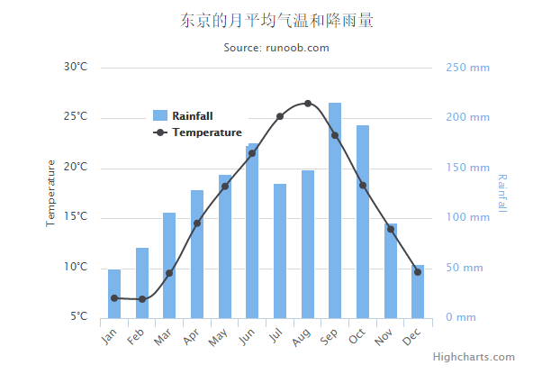

# Highcharts 双Y轴, 柱形图，线条图组合


以下实例演示了双Y轴, 柱形图，线条图组合。

我们在前面的章节已经了解了 Highcharts 基本配置语法。接下来让我们来看下其他的配置。

## 配置

### yAxis 配置

在 yAxis 属性中添加两条Y轴的值 。

```
var yAxis =  [{  // 第一条Y轴  },  {  // 第二条Y轴  }  }]
```

### 实例

文件名：highcharts_combinations_dualaxes.htm

```
<html>  <head>  <title>Highcharts 教程 | 菜鸟教程(runoob.com)</title>  <script  src="http://apps.bdimg.com/libs/jquery/2.1.4/jquery.min.js"></script>  <script  src="/try/demo_source/highcharts.js"></script>  </head>  <body>  <div  id="container"  style="width:  550px; height:  400px; margin:  0  auto"></div>  <script  language="JavaScript"> $(document).ready(function()  {  var chart =  { zoomType:  'xy'  };  var subtitle =  { text:  'Source: runoob.com'  };  var title =  { text:  '东京的月平均气温和降雨量'  };  var xAxis =  { categories:  ['Jan',  'Feb',  'Mar',  'Apr',  'May',  'Jun','Jul',  'Aug',  'Sep',  'Oct',  'Nov',  'Dec'], crosshair:  true  };  var yAxis=  [{  // 第一条Y轴 labels:  { format:  '{value}\xB0C', style:  { color:  Highcharts.getOptions().colors[1]  }  }, title:  { text:  'Temperature', style:  { color:  Highcharts.getOptions().colors[1]  }  }  },  {  // 第二条Y轴 title:  { text:  'Rainfall', style:  { color:  Highcharts.getOptions().colors[0]  }  }, labels:  { format:  '{value} mm', style:  { color:  Highcharts.getOptions().colors[0]  }  }, opposite:  true  }];  var tooltip =  { shared:  true  };  var legend =  { layout:  'vertical', align:  'left', x:  120, verticalAlign:  'top', y:  100, floating:  true, backgroundColor:  (Highcharts.theme &&  Highcharts.theme.legendBackgroundColor)  ||  '#FFFFFF'  };  var series=  [{ name:  'Rainfall', type:  'column', yAxis:  1, data:  [49.9,  71.5,  106.4,  129.2,  144.0,  176.0,  135.6,  148.5,  216.4,  194.1,  95.6,  54.4], tooltip:  { valueSuffix:  ' mm'  }  },  { name:  'Temperature', type:  'spline', data:  [7.0,  6.9,  9.5,  14.5,  18.2,  21.5,  25.2,  26.5,  23.3,  18.3,  13.9,  9.6], tooltip:  { valueSuffix:  '\xB0C'  }  }  ];  var json =  {}; json.chart = chart; json.title = title; json.subtitle = subtitle; json.xAxis = xAxis; json.yAxis = yAxis; json.tooltip = tooltip; json.legend = legend; json.series = series; $('#container').highcharts(json);  });  </script>  </body>  </html>
```


以上实例输出结果为：


