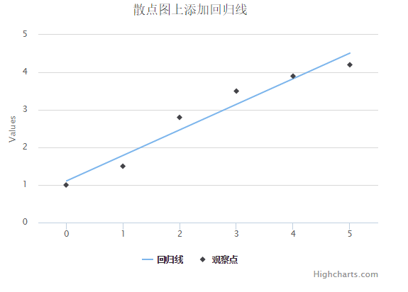

# Highcharts 散点图上添加回归线


以下实例演示了散点图上添加回归线。

我们在前面的章节已经了解了 Highcharts 基本配置语法。接下来让我们来看下其他的配置。

## 配置

### series 配置

设置 series 的 type 属性为 line/scatter ，series.type 描述了数据列类型。默认值为 "line"。

```
var series =  { type:  'scatter'  };
```

### 实例

文件名：highcharts_combinations_scatter.htm

```
<html>  <head>  <title>Highcharts 教程 | 菜鸟教程(runoob.com)</title>  <script  src="http://apps.bdimg.com/libs/jquery/2.1.4/jquery.min.js"></script>  <script  src="/try/demo_source/highcharts.js"></script>  </head>  <body>  <div  id="container"  style="width:  550px; height:  400px; margin:  0  auto"></div>  <script  language="JavaScript"> $(document).ready(function()  {  var title =  { text:  '散点图上添加回归线'  };  var xAxis =  { min:  -0.5, max:  5.5  };  var yAxis=  { min:  0  };  var series=  [{ type:  'line', name:  '回归线', data:  [[0,  1.11],  [5,  4.51]], marker:  { enabled:  false  }, states:  { hover:  { lineWidth:  0  }  }, enableMouseTracking:  false  },  { type:  'scatter', name:  '观察点', data:  [1,  1.5,  2.8,  3.5,  3.9,  4.2], marker:  { radius:  4  }  }  ];  var json =  {}; json.title = title; json.xAxis = xAxis; json.yAxis = yAxis; json.series = series; $('#container').highcharts(json);  });  </script>  </body>  </html>
```


以上实例输出结果为：


